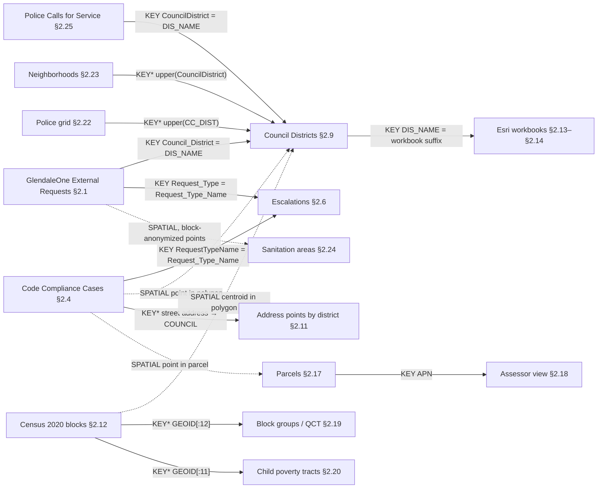

# Glendale Data Landscape

An inventory of every dataset the City of Glendale publishes that the GlendaleOne equity project could use, with schemas read from metadata endpoints only. No rows were downloaded.

- **Harvested:** 2026-09-16, by [`src/harvest_metadata.py`](../src/landscape/harvest_metadata.py). Running `python3 src/harvest_metadata.py` regenerates the Section 1 table, the Section 2 field tables and the join checks into `src/.cache/landscape_fragments.md`. `--offline` rebuilds them from the cache with byte-identical output. The prose, Sections 3–5 and the non-REST entries are hand-written in [`src/landscape_authored.md`](../src/landscape/landscape_authored.md), and `python3 src/build_landscape.py` merges them into this file.
- **Companion files:**
  - [`PROJECT.md`](PROJECT.md) (brief, gotchas)
  - [`DATA_DICTIONARY.md`](DATA_DICTIONARY.md) (the two local CSV extracts and the 12 Esri workbooks)
  - [`PORTAL_RECON.md`](PORTAL_RECON.md) (OpenBook and the GIS app gallery)

  None of what those files already document is repeated here; this document points to them instead.
- **Scope:** datasets that bear on service requests, demographics, geography, property, public safety or infrastructure. Survey123 artifacts, test layers and basemaps get one grouped line each, under "Excluded as noise" at the end of Section 1.

### Sources and harvest log

| Source | What was read | Result |
|---|---|---|
| ArcGIS Online org `9fVTQQSiODPjLUTa` (`cog-gis.maps.arcgis.com`) | Search API, all Feature and Map Services | ✅ 253 datasets cataloged, 184 fields documented |
| Open Data Hub `opendata.glendaleaz.com` | Catalog API: which AGOL items the public portal lists | ✅ 34 items cataloged (33 datasets and the Hub site), used as a cross-reference |
| ArcGIS Enterprise `gismaps.glendaleaz.com/gisserver` | Services directory, all folders | ✅ 147 datasets cataloged, 790 fields documented. FeatureServer/MapServer twins are collapsed into one dataset; 2 geocoding services were skipped. 12 folders are token-secured. |
| ArcGIS Enterprise `gismaps.glendaleaz.com/cseam` | Services directory, all folders | ✅ 7 datasets cataloged, 0 fields documented (none rated High or Medium); 5 folders token-secured |
| OpenBook `glendaleaz.openbook.questica.com` | Not re-harvested; rows carried from `PORTAL_RECON.md` | ⚠️ blocked: JavaScript app with an undocumented API, already covered by `PORTAL_RECON.md`. Its numbers are tagged `[unverified]`. |
| Power BI reports (GlendaleOne Public and Council Report, Code Compliance Public Dashboard) | Not opened | ⚠️ blocked: Power BI embeds with no metadata API |

The Enterprise REST services that `PORTAL_RECON.md` found through the GIS app gallery all appear in the Section 1 table. One exception: `School_Districts_Current`, a service from a different ArcGIS org, which was not harvested.

### How to read the evidence

- **Numbers from the API trace to a cached response.**
  - Row counts, date ranges, null counts, value lists and sums come from a raw response under `src/.cache/raw/`.
  - Section 2 prints the cache file next to each figure. [`src/.cache/index.tsv`](../src/landscape/.cache/index.tsv) maps every cache file to its URL and fetch time.
  - Errors are cached too. Deterministic errors (400/404/499) sit beside successful responses. Timeouts and other server errors are saved as `*.transient.json`.
- **Metadata calls only.** Every `/query` call carries `returnCountOnly=true` or `outStatistics`, and the script refuses anything else before sending it.
  - The log `src/.cache/fetch_log.jsonl` holds 2,213 fetches, including 1,322 `/query` calls: 970 counts and 352 statistics.
  - The largest response was a 4.8 MB layer schema, under the script's 5 MB stop.
- **Tags:**
  - `[unverified]`: not checked with a tool call in this harvest. `[unverified: FILE]` means the figure is carried from that project file.
  - `[inferred]`: my reading, not a publisher statement. Every field description without the tag is quoted from the publisher's layer schema or item metadata.
- **Empty strings are counted separately from nulls.** Several City layers store blank text as `''`, which ArcGIS's non-null count treats as populated. Section 2 reports "populated" only for values that are neither null nor empty.

### Relevance tiers

Tiers rate usefulness against the sponsor's five questions (Q1–Q5, `PROJECT.md` §2).

- **High:** needed to answer Q1–Q4 directly: the request populations, the district geography, population denominators and the request-type configuration. Copies of these on other hosts are also High, marked "mirror".
- **Medium:** a join key, covariate or finer geography that Q1–Q5 can use.
- **Low:** context for Q5, or a duplicate or broken copy of a relevant dataset.
- **None:** unrelated to the five questions.

### Corrections to the existing project docs, found by this harvest

`PROJECT.md` was updated with these on 2026-09-16; `DATA_DICTIONARY.md` was not.

- **Live Code Compliance count.** The live service has **56,431** cases through `RequestDate` 2026-09-09 (§2.4). The local extract has 56,294 through 2026-09-03 [unverified: DATA_DICTIONARY.md]. The live requests count still equals the extract, 107,646 (§2.1).
- **Unassigned requests are `'N/A'`, not null.** The 2,225 requests without a district hold the string `'N/A'` in the live service (§2.1). `DATA_DICTIONARY.md` records them as null.
- **Code Compliance `District` is empty strings.** It holds `''` on all 56,431 rows rather than NULL (§2.4).
- **The Census items in `PROJECT.md` §10 are dead.** The Census Tracts, Block Groups and Blocks items return `404 Service not found` (Section 1). A live Census 2020 block layer exists on the Enterprise server instead (§2.12).
- **The two request datasets look like one system.**
  - The publisher's field description calls `CodeCaseNumber` "the GlendaleOne Request ID" (§2.4).
  - 16 of the 24 Code Compliance request types appear in the GlendaleOne escalation table, covering 54,711 of 56,431 cases, while none appear in External Requests (Section 3 join checks).
  - This suggests both datasets are slices of one GlendaleOne request stream [inferred], which qualifies `PROJECT.md` §6.3 ("separate systems"). The IDs still cannot be joined.

## 1. Summary table

One row per dataset: 316 rows (**14 High**, **14 Medium**, 101 Low, 187 None). Rows are sorted by relevance, then theme, then name. 104 further services are excluded as noise and listed after the table.

**How to read the columns:**
- **Dataset:** Enterprise rows show the service path in backticks.
  - "also AGOL item …" means a portal item registers a layer of that service.
  - "registers …, layer named …" means a portal item that only points at one Enterprise layer; the layer's real name is quoted because several differ from the item title.
  - "mirror" marks a second copy of a High dataset.
- **Host:** where the data is served. "(via AGOL item)" means the portal item is only a pointer.
- **Access method:** "public/anonymous" means no login was needed. "on Open Data portal" means `opendata.glendaleaz.com` lists the item. A bold error is the service's own reply.
- **Row count:** for multi-layer services, the layers counted.
- **Date range / vintage:** the named date field's minimum → maximum where one was measured. Otherwise the layer's last data edit or the item's modified date. "not published" means the service exposes neither.
- **Council District:**
  - **Y:** a district field is present (named).
  - **N:** no district field, or the field is empty.
  - **Derivable (spatial):** needs a point-in-polygon or overlay against the district layer.
  - **Derivable (address match):** has address text only.
  - **N/A:** the dataset is not geographic.

| # | Dataset | Host | Access method | Row count | Date range / vintage | Council District | Relevance |
|---|---|---|---|---|---|---|---|
| 1 | Census 2020 block population points (`PopDensity/Census_Block_2020_pts`) | Enterprise `gismaps…/gisserver` | REST FeatureServer+MapServer, anonymous | 3,471 | Census 2020 (P.L. 94-171) | Derivable (spatial; block centroid points) | High |
| 2 | Address Points By Council Districts | AGOL hosted `services1.arcgis.com` | REST FeatureServer, public, on Open Data portal | 109,404 | `last_edited_date` 2024-08-29 → 2024-08-29 | Y (`COUNCIL`) | High |
| 3 | Council Districts (Enterprise AdminAreas) (`AdminAreas/Council_Districts`) · mirror | Enterprise `gismaps…/gisserver` | REST MapServer, anonymous | 6 | not published | Y (`DIS_NAME`; is the district layer) | High |
| 4 | Glendale Council Districts (Hosted) | AGOL hosted `services1.arcgis.com` | REST FeatureServer, public, on Open Data portal | 7 | `last_edited_date` 2024-12-09 → 2024-12-09 | Y (`DIS_NAME`; is the district layer) | High |
| 5 | Code Compliance Cases - GlendaleOne | AGOL hosted `services1.arcgis.com` | REST FeatureServer, public, on Open Data portal | 56,431 | `RequestDate` 2019-12-03 → 2026-09-09 | N (`District` is an empty string on every row); derivable (spatial or address) | High |
| 6 | GlendaleOne Escalations | AGOL hosted `services1.arcgis.com` | REST FeatureServer, public, on Open Data portal | 155 | `DateLoaded` 2026-09-10 → 2026-09-10 | N/A (lookup keyed by request type) | High |
| 7 | GlendaleOne Escalations (Enterprise layer) (`OpenData/GlendaleOne_Escalations`) · also AGOL item `8a440bea` · mirror | Enterprise `gismaps…/gisserver` | REST FeatureServer+MapServer, anonymous | 155 | `DateLoaded` 2026-09-10 → 2026-09-10 | N/A (lookup keyed by request type) | High |
| 8 | GlendaleOne Escalations (portal item → Enterprise) (registers `…/GlendaleOne_Escalations/FeatureServer/1`, layer named “GlendaleOne_Escalations”) · mirror | Enterprise `gismaps…/gisserver` (via AGOL item) | REST FeatureServer, public, on Open Data portal | 155 | `DateLoaded` 2026-09-10 → 2026-09-10 | N/A (lookup keyed by request type) | High |
| 9 | GlendaleOne External Requests | AGOL hosted `services1.arcgis.com` | REST FeatureServer, public, on Open Data portal | 107,646 | `Request_Date` 2019-12-02 → 2026-08-05 | Y (`Council_District`) | High |
| 10 | GlendaleOne External Requests (Enterprise layer) (`OpenData/GLENDALEONE_EXTERNAL_REQUESTS_PTS`) · mirror | Enterprise `gismaps…/gisserver` | REST MapServer, anonymous | 107,646 | `DateLoaded` 2026-08-06 → 2026-08-06 | Y (`Council_District`) | High |
| 11 | Esri BA `ACS_Population_Summary_<DISTRICT>.xlsx` (×6) | local `data/` (sponsor email) | Email attachment, formatted report | 373 rows × 6 cols each [unverified: DATA_DICTIONARY.md] | ACS 2020–2024 5-yr [unverified: DATA_DICTIONARY.md] | Y (one file per district) | High |
| 12 | Esri BA `Demographic_and_Income_Profile_<DISTRICT>.xlsx` (×6) | local `data/` (sponsor email) | Email attachment, formatted report | 222 rows × 7 cols each [unverified: DATA_DICTIONARY.md] | Census 2020 / Esri 2026 / 2031 [unverified: DATA_DICTIONARY.md] | Y (one file per district) | High |
| 13 | Local extract `data/Code_Compliance_Cases_GlendaleOne.csv` | local `data/` | CSV pulled 2026-09-05 from AGOL item 8026de93 | 56,294 [unverified: DATA_DICTIONARY.md] | `RequestDate` 2019-12-03 → 2026-09-03 [unverified: DATA_DICTIONARY.md] | N (`District` 100% null) | High |
| 14 | Local extract `data/GlendaleOne_External_Requests.csv` | local `data/` | CSV pulled 2026-09-05 from AGOL item 37a2cb9c | 107,646 [unverified: DATA_DICTIONARY.md] | `Request_Date` 2019-12-02 → 2026-08-05 [unverified: DATA_DICTIONARY.md] | Y (`Council_District`) | High |
| 15 | Block groups with Esri demographics and HUD QCT fields (`Community_Services/Glendale_qct_rates`) | Enterprise `gismaps…/gisserver` | REST MapServer, anonymous | 222 | not published | Derivable (spatial) | Medium |
| 16 | COG_Child_Poverty_Analysis | AGOL hosted `services1.arcgis.com` | REST FeatureServer, public, not on portal | 88 | data last edited 2021-12-29 | Derivable (spatial) | Medium |
| 17 | 100-block address points (`ADDRESS_100BLOCK`) | Enterprise `gismaps…/gisserver` | REST MapServer, anonymous | 2,703 | not published | Derivable (spatial) | Medium |
| 18 | Police grid with council district (`CC_DIST`) (`POLICE_GRID`) | Enterprise `gismaps…/gisserver` | REST MapServer, anonymous | 650 | `last_edited_date` 2023-04-19 → 2023-04-19 | Derivable (spatial) | Medium |
| 19 | Registered neighborhoods with HOA / management company (`NEIGHBORHOOD_P_w_MgmtCompany`) | Enterprise `gismaps…/gisserver` | REST FeatureServer+MapServer, anonymous | 255 | `DateEntered` 2002-08-20 → 2023-03-07 | Y (`CouncilDistrict`) | Medium |
| 20 | Sanitation day routes, routes and inspection areas (`Sanitation/Sanitation_Polys`) | Enterprise `gismaps…/gisserver` | REST FeatureServer+MapServer, anonymous | SANITATION_DAY_ROUTE_P: 7; SANITATION_ROUTE_P: 33; SANITATION_INSPECTION_AREA_P: 20 | `last_edited_date` 2025-05-14 → 2025-12-09 | Derivable (spatial) | Medium |
| 21 | Address points joined to APN (`LN_ADDRESS_PT_APN_JOIN`) | Enterprise `gismaps…/gisserver` | REST MapServer, anonymous | 125,686 | `last_edited_date` 2026-09-07 → 2026-09-07 | Y (`COUNCIL`) | Medium |
| 22 | Assessor parcel view (`ASSESSOR_PARCEL_VIEW`) | Enterprise `gismaps…/gisserver` | REST FeatureServer+MapServer, anonymous | 89,001 | `SALE_DATE` 1900-01-01 → 2026-08-01 | Derivable (spatial) | Medium |
| 23 | Parcels (city) (`Parcels`) | Enterprise `gismaps…/gisserver` | REST FeatureServer+MapServer, anonymous | 88,762 | not published | Y (`DIS_NAME`) | Medium |
| 24 | Police Calls for Service | AGOL hosted `services1.arcgis.com` | REST FeatureServer, public, on Open Data portal | 1,138,221 | `CallDatetime` 2020-01-01 → 2026-09-08 | Y (`CouncilDistrict`) | Medium |
| 25 | Glendale Code Compliance Sub Grid | AGOL hosted `services1.arcgis.com` | REST FeatureServer, public, not on portal | 72 | `last_edited_date` 2026-02-25 → 2026-02-25 | Derivable (spatial) | Medium |
| 26 | Water Distribution Service Requests (Survey123) | AGOL hosted `services1.arcgis.com` | REST FeatureServer, public, not on portal | 10,081 | `CreationDate` 2019-04-29 → 2025-06-02 | Derivable (spatial, if survey points are placed) [unverified] | Medium |
| 27 | Code Compliance Public Dashboard | Power BI `app.powerbigov.us` | Power BI embed; no API; not opened | — [unverified] | — [unverified] | — [unverified] | Medium |
| 28 | GlendaleOne Public and Council Report | Power BI `app.powerbigov.us` | Power BI embed; no API; not opened | — [unverified] | — [unverified] | — [unverified] | Medium |
| 29 | block_pop (`PopDensity/block_pop`) | Enterprise `gismaps…/gisserver` | REST FeatureServer+MapServer, anonymous — **500 Error handling service request :Wait timeout** | — (500 Error handling service request :Wait timeout for the req) | not published | — | Low |
| 30 | Glendale Census Block Groups (service removed) (registers `…/Census/MapServer/1`) | Enterprise `gismaps…/gisserver` (via AGOL item) | REST MapServer, public, not on portal — **404 Service not found** | — (404 Service not found) | item modified 2020-09-21 | — | Low |
| 31 | Glendale Census Blocks (service removed) (registers `…/Census/MapServer/0`) | Enterprise `gismaps…/gisserver` (via AGOL item) | REST MapServer, public, not on portal — **404 Service not found** | — (404 Service not found) | item modified 2020-09-18 | — | Low |
| 32 | Glendale Census Tracts (service removed) (registers `…/Census/MapServer/2`) | Enterprise `gismaps…/gisserver` (via AGOL item) | REST MapServer, public, not on portal — **404 Service not found** | — (404 Service not found) | item modified 2023-02-02 | — | Low |
| 33 | Glendale_HeatRelief_Locations | AGOL hosted `services1.arcgis.com` | REST FeatureServer, public, not on portal | 12 | data last edited 2024-05-08 | Derivable (spatial) | Low |
| 34 | Homeless_Encampmentsv1 (`Community_Services/Homeless_Encampmentsv1`) | Enterprise `gismaps…/gisserver` | REST FeatureServer+MapServer, anonymous — **499 Token Required** | — (499 Token Required) | not published | — | Low |
| 35 | Homeless_PIT_Zone (`Community_Services/Homeless_PIT_Zone`) | Enterprise `gismaps…/gisserver` | REST FeatureServer+MapServer, anonymous | 15 | not published | Derivable (spatial) | Low |
| 36 | CityLimits (`Glendale_Services/CityLimits`) · also AGOL item `ea92cbb5`, `fa232710`, `aa2e234f`, `268eb580` | Enterprise `gismaps…/gisserver` | REST MapServer, anonymous | 8 layers, 381 rows total | not published | Y (`DIS_NAME` in layer “Council Districts”) | Low |
| 37 | Council Districts fea | Enterprise `gismaps…/gisserver` (via AGOL item) | REST FeatureServer, public, not on portal | 6 | item modified 2024-11-27 | Y (`DIS_NAME`) | Low |
| 38 | Council_Districts (`Glendale_Services/Council_Districts`) | Enterprise `gismaps…/gisserver` | REST MapServer, anonymous | 6 | not published | Y (`DIS_NAME`) | Low |
| 39 | Council_Districts_fea (`AdminAreas/Council_Districts_fea`) · also AGOL item `27fc18be` | Enterprise `gismaps…/gisserver` | REST FeatureServer+MapServer, anonymous | 6 | not published | Y (`DIS_NAME`) | Low |
| 40 | Glendale Annexations (registers `…/CityLimits/MapServer/1`, layer named “Annexations”) | Enterprise `gismaps…/gisserver` (via AGOL item) | REST MapServer, public, on Open Data portal | 234 | item modified 2022-09-19 | Derivable (spatial) | Low |
| 41 | Glendale Council Districts (registers `…/CityLimits/MapServer/3`, layer named “Council Districts”) | Enterprise `gismaps…/gisserver` (via AGOL item) | REST MapServer, public, not on portal | 6 | item modified 2020-09-29 | Y (`DIS_NAME`) | Low |
| 42 | Glendale DMV (registers `…/GlendaleGovernmentServices/MapServer/5`, layer named “Council District”) | Enterprise `gismaps…/gisserver` (via AGOL item) | REST MapServer, public, on Open Data portal | 7 | item modified 2023-02-02 | Y (`DIS_NAME`) | Low |
| 43 | Glendale Neighborhood_r | Enterprise `gismaps…/gisserver` (via AGOL item) | REST FeatureServer, public, not on portal — **499 Token Required** | — (499 Token Required) | item modified 2020-12-18 | — | Low |
| 44 | Glendale Neighborhoods (registers `…/Neighborhood/MapServer/0`, layer named “Glendale Neighborhood”) | Enterprise `gismaps…/gisserver` (via AGOL item) | REST MapServer, public, on Open Data portal | 254 | item modified 2023-02-02 | Y (`CNCL_DIST`) | Low |
| 45 | Glendale Power Bi Layers | AGOL hosted `services1.arcgis.com` | REST FeatureServer, public, not on portal | 4 layers, 681 rows total | data last edited 2025-10-24 | Y (`DIS_NAME` in layer “Glendale Council Districts”) | Low |
| 46 | GLENDALE ZIPCODES | AGOL hosted `services1.arcgis.com` | REST FeatureServer, public, not on portal | 10 | data last edited 2025-07-22 | Derivable (spatial) | Low |
| 47 | Glendale, Arizona City Limits (registers `…/CityLimits/MapServer/0`, layer named “Glendale City Limits”) | Enterprise `gismaps…/gisserver` (via AGOL item) | REST MapServer, public, on Open Data portal | 1 | item modified 2025-01-02 | Derivable (spatial) | Low |
| 48 | Join_Features_to_Glendale_Neighborhoods_with_Organizations___Glendale_Neighborhood | AGOL hosted `services1.arcgis.com` | REST FeatureServer, public, not on portal | 257 | data last edited 2021-01-29 | Y (`CNCL_DIST`) | Low |
| 49 | Join_Features_to_Neighborhood___Glendale_Neighborhood | AGOL hosted `services1.arcgis.com` | REST FeatureServer, public, not on portal | 242 | data last edited 2020-12-16 | Y (`CNCL_DIST`) | Low |
| 50 | MC | AGOL hosted `services1.arcgis.com` | REST FeatureServer, public, not on portal | 1 | data last edited 2018-11-14 | Derivable (spatial) | Low |
| 51 | Misc_Glendale_Areas (`AdminAreas/Misc_Glendale_Areas`) | Enterprise `gismaps…/gisserver` | REST MapServer, anonymous | 10 layers, 246,983 rows total | not published | Y (`DIS_NAME` in layer “Council Districts”) | Low |
| 52 | Neighborhood (`Glendale_Services/Neighborhood`) · also AGOL item `819d484e` | Enterprise `gismaps…/gisserver` | REST MapServer, anonymous | 254 | not published | Y (`CNCL_DIST`) | Low |
| 53 | ZIPCODE_P (`ZIPCODE_P`) | Enterprise `gismaps…/gisserver` | REST MapServer, anonymous | 116 | not published | Derivable (spatial) | Low |
| 54 | CentralSquare_EAM_Production_Parks_FeatureService (`Parks/CentralSquare_EAM_Production_Parks_FeatureService`) | Enterprise `gismaps…/cseam` | REST FeatureServer+MapServer, anonymous | 49 layers, 28,142 rows total | not published | Derivable (spatial) | Low |
| 55 | CIP_PROJECTS_SMARTSHEET_Pv2 (`Planning/CIP_PROJECTS_SMARTSHEET_Pv2`) | Enterprise `gismaps…/gisserver` | REST FeatureServer+MapServer, anonymous | 6 layers, 6,060 rows total | not published | Derivable (spatial) | Low |
| 56 | CIP_PROJECTS_SMARTSHEET_Pv2 (`Planning/CIP_PROJECTS_SMARTSHEET_Pv2`) | Enterprise `gismaps…/cseam` | REST FeatureServer+MapServer, anonymous | 6 layers, 6,060 rows total | not published | Derivable (spatial) | Low |
| 57 | Completed_Pavement_Activities (`Transportation/Completed_Pavement_Activities`) | Enterprise `gismaps…/gisserver` | REST FeatureServer+MapServer, anonymous | 27,362 | not published | Derivable (spatial) | Low |
| 58 | Glendale Contract Spend Report | AGOL hosted `services1.arcgis.com` | REST FeatureServer, public, on Open Data portal | 9,958 | `ContractStartDate` 1993-05-03 → 2026-10-01 | N | Low |
| 59 | Glendale Garbage Pickup (registers `…/GlendaleGovernmentServices/MapServer/6`, layer named “Recycling Pickup”) | Enterprise `gismaps…/gisserver` (via AGOL item) | REST MapServer, public, on Open Data portal | 5 | item modified 2023-02-02 | Derivable (spatial) | Low |
| 60 | Glendale Recycling (registers `…/GlendaleGovernmentServices/MapServer/7`, layer named “Trash Pickup”) | Enterprise `gismaps…/gisserver` (via AGOL item) | REST MapServer, public, on Open Data portal | 5 | item modified 2023-02-02 | Derivable (spatial) | Low |
| 61 | Glendale_Contract_Spend_Report (`OpenData/Glendale_Contract_Spend_Report`) | Enterprise `gismaps…/gisserver` | REST FeatureServer+MapServer, anonymous | 9,958 | not published | N | Low |
| 62 | GlendaleGovernmentServices (`Glendale_Services/GlendaleGovernmentServices`) · also AGOL item `a1f98c33`, `e221ca56`, `419d2add`, `0014db9c` | Enterprise `gismaps…/gisserver` | REST FeatureServer+MapServer, anonymous | 6 layers, 24 rows total | not published | Derivable (spatial) | Low |
| 63 | Recycling_Routes (`Recycling_Routes`) | Enterprise `gismaps…/gisserver` | REST MapServer, anonymous | 45 | not published | Derivable (spatial) | Low |
| 64 | ROW_MAINT_CONT_AREAS_CONTRACTOR_DOWNLOAD (`Transportation/ROW_MAINT_CONT_AREAS_CONTRACTOR_DOWNLOAD`) | Enterprise `gismaps…/gisserver` | REST FeatureServer+MapServer, anonymous | 1,026 | not published | Derivable (spatial) | Low |
| 65 | ROW_Maintenance_Contract_Areas (`ROW_Maintenance_Contract_Areas`) | Enterprise `gismaps…/gisserver` | REST FeatureServer+MapServer, anonymous | 1,031 | not published | Y (`RestoProj_Council_District`) | Low |
| 66 | Sanitation_Bulk_Trash_Streets_Coverage (`Sanitation/Sanitation_Bulk_Trash_Streets_Coverage`) | Enterprise `gismaps…/gisserver` | REST MapServer, anonymous | 24,230 | not published | Derivable (spatial) | Low |
| 67 | SANITATION_SECTION_P (registers `…/SANITATION_SECTION_P/MapServer/0`, layer named “SANITATION_SECTION_P”) | Enterprise `gismaps…/gisserver` (via AGOL item) | REST MapServer, public, not on portal | 6 | item modified 2020-11-23 | Derivable (spatial) | Low |
| 68 | SANITATION_SECTION_P (`Sanitation/SANITATION_SECTION_P`) · also AGOL item `bcf1e735` | Enterprise `gismaps…/gisserver` | REST FeatureServer+MapServer, anonymous | 6 | not published | Derivable (spatial) | Low |
| 69 | Streetlight_Data_For_WebApps (`Streetlights/Streetlight_Data_For_WebApps`) | Enterprise `gismaps…/gisserver` | REST MapServer, anonymous | 5 layers, 28,013 rows total | not published | Derivable (spatial) | Low |
| 70 | Address_Points (`OpenData/Address_Points`) · also AGOL item `929f8dbb` | Enterprise `gismaps…/gisserver` | REST FeatureServer+MapServer, anonymous | 125,689 | not published | Y (`COUNCIL`) | Low |
| 71 | ADDRESS_ZIP_CHECK (`ADDRESS_ZIP_CHECK`) | Enterprise `gismaps…/gisserver` | REST MapServer, anonymous | 120,077 | not published | Y (`COUNCIL`) | Low |
| 72 | Business_Licenses (`OpenData/Business_Licenses`) | Enterprise `gismaps…/gisserver` | REST FeatureServer+MapServer, anonymous | 9,879 | not published | Unclear (`District` field; meaning [unverified]) | Low |
| 73 | City of Glendale Address Points | Enterprise `gismaps…/gisserver` (via AGOL item) | REST FeatureServer, public, on Open Data portal | 125,689 | `last_edited_date` 2024-05-31 → 2026-09-15 | Y (`COUNCIL`) | Low |
| 74 | Glendale Address Points (registers `…/Land/MapServer/0`, layer named “Address Points”) | Enterprise `gismaps…/gisserver` (via AGOL item) | REST MapServer, public, not on portal | 125,689 | item modified 2023-02-02 | Y (`COUNCIL`) | Low |
| 75 | Glendale Business Licenses | AGOL hosted `services1.arcgis.com` | REST FeatureServer, public, on Open Data portal | 9,879 | data last edited 2026-09-10 | Unclear (`District` field; meaning [unverified]) | Low |
| 76 | Glendale Parcels (registers `…/Land/MapServer/3`, layer named “Parcels”) | Enterprise `gismaps…/gisserver` (via AGOL item) | REST MapServer, public, on Open Data portal | 88,762 | item modified 2020-09-28 | Y (`DIS_NAME`) | Low |
| 77 | Glendale Zoning | AGOL hosted `services1.arcgis.com` | REST FeatureServer, public, on Open Data portal | 1,146 | data last edited 2024-08-28 | Derivable (spatial) | Low |
| 78 | Glendale, Arizona Address Points (registers `…/Land/MapServer/0`, layer named “Address Points”) | Enterprise `gismaps…/gisserver` (via AGOL item) | REST MapServer, public, not on portal | 125,689 | item modified 2020-08-12 | Y (`COUNCIL`) | Low |
| 79 | Glendale_Zoning (`Glendale_Services/Glendale_Zoning`) | Enterprise `gismaps…/gisserver` | REST FeatureServer+MapServer, anonymous | 1,165 | not published | Derivable (spatial) | Low |
| 80 | Land (`Glendale_Services/Land`) · also AGOL item `d8fdd961`, `46c809cf`, `55c190ce`, `dbf3db30` | Enterprise `gismaps…/gisserver` | REST MapServer, anonymous | 4 layers, 319,542 rows total | not published | Y (`COUNCIL` in layer “Address Points”) | Low |
| 81 | LN_ADDRESS_PT | AGOL hosted `services1.arcgis.com` | REST FeatureServer, public, not on portal | 125,682 | data last edited 2026-09-07 | Y (`COUNCIL`) | Low |
| 82 | LN_PARCEL_P (`Report_Tools/LN_PARCEL_P`) | Enterprise `gismaps…/gisserver` | REST FeatureServer+MapServer, anonymous | 88,762 | not published | Y (`DIS_NAME`) | Low |
| 83 | NG911_Glendale (`NG911_Glendale`) | Enterprise `gismaps…/gisserver` | REST FeatureServer+MapServer, anonymous | 6 layers, 158,231 rows total | not published | Y (`COUNCIL` in layer “SiteStructureAddressPoints”) | Low |
| 84 | PopDensity (`PopDensity/PopDensity`) | Enterprise `gismaps…/gisserver` | REST MapServer, anonymous | GIS_Land.GISADMIN.LN_ADDRESS_PT: 125,689; GIS_Admin.GISADMIN.CITY_BOUNDARY_P: 2 | not published | Y (`COUNCIL` in layer “GIS_Land.GISADMIN.LN_ADDRESS_PT”) | Low |
| 85 | Rental_Facilities (registers `…/Rental_Facilities/MapServer/0`) | Enterprise `gismaps…/gisserver` (via AGOL item) | REST MapServer, public, not on portal — **500 Service Glendale_Services/Rental_Facilities/** | — (500 Service Glendale_Services/Rental_Facilities/MapServer no) | item modified 2020-10-20 | — | Low |
| 86 | BEATS_GRIDS | AGOL hosted `services1.arcgis.com` | REST FeatureServer, public, not on portal | BEATS: 24; GRID: 650 | data last edited 2023-08-17 | Derivable (spatial) | Low |
| 87 | Fire_SOC_Dashboard (`Fire_SOC_Dashboard`) | Enterprise `gismaps…/gisserver` | REST FeatureServer+MapServer, anonymous | 9 | not published | Derivable (spatial) | Low |
| 88 | FireFirstDue_4min (`Fire/FireFirstDue_4min`) | Enterprise `gismaps…/gisserver` | REST MapServer, anonymous | 9 | not published | Derivable (spatial) | Low |
| 89 | Glendale Fire Incidents Historic | AGOL hosted `services1.arcgis.com` | REST FeatureServer, public, on Open Data portal | 518,974 | `INCIDENT_DATE` 2015-01-01 → 2026-08-03 | Y (`COUNCIL_DIST`) | Low |
| 90 | GPD CRIME DATA REDACTED | AGOL hosted `services1.arcgis.com` | REST FeatureServer, public, on Open Data portal | 159,507 | `Occurred_On_Date` 2022-07-01 → 2026-09-10 | Y (`COUNCIL_DISTRICT_GIS`) | Low |
| 91 | GPD_Crime_Data (`OpenData/GPD_Crime_Data`) | Enterprise `gismaps…/gisserver` | REST MapServer, anonymous | 159,507 | not published | Y (`COUNCIL_DISTRICT_GIS`) | Low |
| 92 | LawEnforcementDistricts_public | AGOL hosted `services1.arcgis.com` | REST FeatureServer, public, not on portal | 4 layers, 0 rows total | data last edited 2022-06-02 | Derivable (spatial) | Low |
| 93 | P1_CFS_REDACTED_PT_hosted | AGOL hosted `services1.arcgis.com` | REST FeatureServer, public, not on portal | 498,465 | data last edited 2026-09-16 | Y (`Council_District_GIS`) | Low |
| 94 | PD Dashboard Response Time | AGOL hosted `services1.arcgis.com` | REST FeatureServer, public, not on portal | 1,451,799 | `incident_date` 2018-01-01 → 2026-04-30 | N | Low |
| 95 | Police Calls for Service (Enterprise layer) (`OpenData/Police_Calls_for_Service`) | Enterprise `gismaps…/gisserver` | REST FeatureServer+MapServer, anonymous | 1,138,221 | not published | Y (`CouncilDistrict`) | Low |
| 96 | Police Incidents (registers `…/Police_Incidents_1/FeatureServer/1`, layer named “Police Incidents”) | Enterprise `gismaps…/gisserver` (via AGOL item) | REST FeatureServer, public, not on portal | 0 | item modified 2026-09-10 | Y (`Council_District`) | Low |
| 97 | POLICE_BEATS (`POLICE_BEATS`) | Enterprise `gismaps…/gisserver` | REST MapServer, anonymous | 24 | not published | Derivable (spatial) | Low |
| 98 | Police_Incidents_1 (`OpenData/Police_Incidents_1`) · also AGOL item `c5b87660` | Enterprise `gismaps…/gisserver` | REST FeatureServer+MapServer, anonymous | 0 | not published | Y (`Council_District`) | Low |
| 99 | Police_Polys (`Public_Safety/Police_Polys`) | Enterprise `gismaps…/gisserver` | REST MapServer, anonymous | 4 layers, 2,904 rows total | not published | Derivable (spatial) | Low |
| 100 | Police_Public_Export_Layers (`Public_Safety/Police_Public_Export_Layers`) | Enterprise `gismaps…/gisserver` | REST MapServer, anonymous | WEBRMS_INCIDENTS_REDACTED_PT: 172,419; WEBRMS_CFS_REDACTED_PT: 1,194,052 | not published | Y (`DIS_NAME` in layer “WEBRMS_INCIDENTS_REDACTED_PT”) | Low |
| 101 | Police_Public_Mapping_Layers (`Public_Safety/Police_Public_Mapping_Layers`) | Enterprise `gismaps…/gisserver` | REST MapServer, anonymous | WEBRMS_INCIDENTS_REDACTED_PT: 172,419; WEBRMS_CFS_REDACTED_PT: 1,194,052 | not published | Y (`DIS_NAME` in layer “WEBRMS_INCIDENTS_REDACTED_PT”) | Low |
| 102 | City of Glendale Code Compliance Assistance Request Survey_form | AGOL hosted `services1.arcgis.com` | REST FeatureServer, public, not on portal | — (count refused: 400 ) | data last edited 2026-07-09 | Derivable (spatial) | Low |
| 103 | Code Compliance Grids (`Code_Compliance/Code_Compliance_Grids`) | Enterprise `gismaps…/gisserver` | REST FeatureServer+MapServer, anonymous | 6 | `last_edited_date` 2026-07-08 → 2026-07-08 | Derivable (spatial) | Low |
| 104 | CODE_COMPLIANCE_SR_SUB_GRID_P (`CODE_COMPLIANCE_SR_SUB_GRID_P`) | Enterprise `gismaps…/gisserver` | REST FeatureServer+MapServer, anonymous | 31 | not published | Derivable (spatial) | Low |
| 105 | CODE_COMPLIANCE_SUB_GRID_P (`CODE_COMPLIANCE_SUB_GRID_P`) · also AGOL item `b5019079` | Enterprise `gismaps…/gisserver` | REST MapServer, anonymous | 54 | not published | Derivable (spatial) | Low |
| 106 | CODE_COMPLIANCE_SUB_GRID_P_TEMP4 | AGOL hosted `services1.arcgis.com` | REST FeatureServer, public, not on portal | 51 | data last edited 2026-07-22 | Derivable (spatial) | Low |
| 107 | CODE_COMPLIANCE_TERRITORIES_P (`Land/CODE_COMPLIANCE_TERRITORIES_P`) | Enterprise `gismaps…/gisserver` | REST FeatureServer+MapServer, anonymous | 10 | not published | Derivable (spatial) | Low |
| 108 | Environmental Resources Service Request | AGOL hosted `services1.arcgis.com` | REST FeatureServer, public, not on portal | 436 | `CreationDate` 2019-05-24 → 2025-05-30 | Derivable (spatial) | Low |
| 109 | GLENDALE_AZ_CODE_COMPLIANCE_SUB_GRID_P | AGOL hosted `services1.arcgis.com` | REST FeatureServer, public, not on portal | 54 | data last edited 2026-08-11 | Derivable (spatial) | Low |
| 110 | GLENDALE_CODE_COMPLIANCE_SUB_GRID_P | Enterprise `gismaps…/gisserver` (via AGOL item) | REST MapServer, public, not on portal | 54 | item modified 2026-02-25 | Derivable (spatial) | Low |
| 111 | GlendaleOne Customer Feedback Survey_fieldworker | AGOL hosted `services1.arcgis.com` | REST FeatureServer, public, not on portal | — (count refused: 400 ) | data last edited 2026-09-16 | Derivable (spatial) | Low |
| 112 | Park Work Requests Points (registers `…/Park_Work_Request_Points/FeatureServer/0`, layer named “Work Requests Points”) | Enterprise `gismaps…/cseam` (via AGOL item) | REST FeatureServer, public, not on portal | 565 | item modified 2026-04-27 | Derivable (spatial) | Low |
| 113 | Parks and Grounds Request_results | AGOL hosted `services1.arcgis.com` | REST FeatureServer, public, not on portal | 354 | `created_date` 2025-07-31 → 2026-09-10 | Derivable (spatial) | Low |
| 114 | Parks Work Assignments (registers `…/Park_Work_Assignments/FeatureServer/0`, layer named “Assignments”) | AGOL proxy `utility.arcgis.com` → Enterprise | REST FeatureServer, public, not on portal | 510 | item modified 2026-04-26 | Derivable (spatial) | Low |
| 115 | Parks work requests (CentralSquare EAM) (`Parks/Park_Work_Request_Points`) · also AGOL item `7d3c81ad` | Enterprise `gismaps…/cseam` | REST FeatureServer+MapServer, anonymous | 565 | `created_date` 2025-07-31 → 2026-09-16 | Derivable (spatial) | Low |
| 116 | Parks Work Requests Points (registers `…/Park_Work_Request_Points/FeatureServer/0`, layer named “Work Requests Points”) | AGOL proxy `utility.arcgis.com` → Enterprise | REST FeatureServer, public, not on portal | 565 | item modified 2026-04-12 | Derivable (spatial) | Low |
| 117 | Q_Alert_Escalation_Levels | Enterprise `gismaps…/gisserver` (via AGOL item) | REST MapServer, public, not on portal — **499 Token Required** | — (499 Token Required) | item modified 2021-06-18 | — | Low |
| 118 | Q_Alert_Escalation_Levels (registers `…/Q_Alert_Escalation_Levels/MapServer/1`) | Enterprise `gismaps…/gisserver` (via AGOL item) | REST MapServer, public, not on portal — **404 Service not found** | — (404 Service not found) | item modified 2021-07-06 | — | Low |
| 119 | Requests_park | AGOL hosted `services1.arcgis.com` | REST FeatureServer, public, not on portal | 241 | `created_date` 2025-09-12 → 2026-09-10 | Derivable (spatial) | Low |
| 120 | Requests_submit | AGOL hosted `services1.arcgis.com` | REST FeatureServer, public, not on portal | Requests: —; Comments: — | data last edited 2026-09-10 | Derivable (spatial) | Low |
| 121 | Senior_Code_Compliance_Grids (`Code_Compliance/Senior_Code_Compliance_Grids`) | Enterprise `gismaps…/gisserver` | REST FeatureServer+MapServer, anonymous | 5 | not published | Derivable (spatial) | Low |
| 122 | Vision Zero Public Comments Points | AGOL hosted `services1.arcgis.com` | REST FeatureServer, public, not on portal | 17 | data last edited 2026-05-19 | Derivable (spatial) | Low |
| 123 | Wastewater Collections Service Request | AGOL hosted `services1.arcgis.com` | REST FeatureServer, public, not on portal | 2,370 | `CreationDate` 2019-05-01 → 2025-06-02 | Derivable (spatial) | Low |
| 124 | Work Requests Points (registers `…/Park_Work_Request_Points/FeatureServer/0`, layer named “Work Requests Points”) | AGOL proxy `utility.arcgis.com` → Enterprise | REST FeatureServer, public, not on portal | 565 | item modified 2026-03-02 | Derivable (spatial) | Low |
| 125 | OpenBook — CIP Expenditures (budget hierarchy) | OpenBook `glendaleaz.openbook.questica.com` | JS app; budget drill-down API | — (hierarchy, no grid) | FY20-21 → FY26-27 [unverified: PORTAL_RECON.md] | N | Low |
| 126 | OpenBook — CIP Project Details, 10-Year Funding Plan | OpenBook `glendaleaz.openbook.questica.com` | JS app; undocumented JSON API | 2,525 [unverified: PORTAL_RECON.md] | FY20-21 → FY26-27 [unverified: PORTAL_RECON.md] | Derivable (project no. → CIP polygons, spatial) [unverified] | Low |
| 127 | OpenBook — Detailed Capital Project Spending Report | OpenBook `glendaleaz.openbook.questica.com` | JS app; undocumented JSON API; CSV export link | 29,561 [unverified: PORTAL_RECON.md] | Posting 2018-07-18 → 2026-09-14 [unverified: PORTAL_RECON.md] | Derivable (project no. → CIP polygons, spatial) [unverified] | Low |
| 128 | OpenBook — Operating Expenditures (budget hierarchy) | OpenBook `glendaleaz.openbook.questica.com` | JS app; budget drill-down API | — (hierarchy, no grid) | FY20-21 → FY26-27 [unverified: PORTAL_RECON.md] | N | Low |
| 129 | OpenBook — Operating transaction detail (vendor spend) | OpenBook `glendaleaz.openbook.questica.com` | JS app; undocumented JSON API; CSV export link | 562,730 [unverified: PORTAL_RECON.md] | FY20-21 → FY26-27; refresh date 2026-09-16 [unverified: PORTAL_RECON.md] | N | Low |
| 130 | Business_Districts (`AdminAreas/Business_Districts`) | Enterprise `gismaps…/gisserver` | REST MapServer, anonymous | 7 | not published | Derivable (spatial) | None |
| 131 | City Boundary (registers `…/CityBoundary/MapServer/0`, layer named “City Boundary”) | Enterprise `gismaps…/gisserver` (via AGOL item) | REST MapServer, public, not on portal | 2 | item modified 2022-11-29 | Derivable (spatial) | None |
| 132 | City of Glendale - Service Line (registers `…/City_of_Glendale_Open_Data_Service_Line/FeatureServer/2`, layer named “City of Glendale - Service Line”) | Enterprise `gismaps…/gisserver` (via AGOL item) | REST FeatureServer, public, on Open Data portal | 70,840 | item modified 2025-01-02 | Derivable (spatial) | None |
| 133 | CITY_BOUNDARY_P | AGOL hosted `services1.arcgis.com` | REST FeatureServer, public, not on portal | 2 | data last edited 2025-10-24 | Derivable (spatial) | None |
| 134 | CityBoundary (`Glendale_Services/CityBoundary`) · also AGOL item `fc582029`, `6ce020ff`, `56b54951`, `fca605e7` | Enterprise `gismaps…/gisserver` | REST MapServer, anonymous | 2 | not published | Derivable (spatial) | None |
| 135 | CityBoundary_add item (registers `…/CityBoundary/MapServer/0`, layer named “City Boundary”) | Enterprise `gismaps…/gisserver` (via AGOL item) | REST MapServer, public, not on portal | 2 | item modified 2021-06-28 | Derivable (spatial) | None |
| 136 | General Plan URBAN | AGOL hosted `services1.arcgis.com` | REST FeatureServer, public, not on portal | 742 | data last edited 2026-03-02 | Derivable (spatial) | None |
| 137 | Glendale Building Footprints (registers `…/Land/MapServer/2`, layer named “Building Footprints”) | Enterprise `gismaps…/gisserver` (via AGOL item) | REST MapServer, public, on Open Data portal | 77,281 | item modified 2023-02-02 | Derivable (spatial) | None |
| 138 | Glendale City Boundary (registers `…/CityBoundary/MapServer/0`, layer named “City Boundary”) | Enterprise `gismaps…/gisserver` (via AGOL item) | REST MapServer, public, not on portal | 2 | item modified 2020-09-28 | Derivable (spatial) | None |
| 139 | Glendale Special Districts (registers `…/CityLimits/MapServer/2`, layer named “Special Districts”) | Enterprise `gismaps…/gisserver` (via AGOL item) | REST MapServer, public, on Open Data portal | 3 | item modified 2020-09-18 | Derivable (spatial) | None |
| 140 | Glendale_Neighborhood_Features (`Glendale_Services/Glendale_Neighborhood_Features`) | Enterprise `gismaps…/gisserver` | REST FeatureServer+MapServer, anonymous — **499 Token Required** | — (499 Token Required) | not published | — | None |
| 141 | MC_JUSTICE_PRECINCTS_P (`MC_JUSTICE_PRECINCTS_P`) | Enterprise `gismaps…/gisserver` | REST MapServer, anonymous | 26 | not published | Derivable (spatial) | None |
| 142 | Parks_Landscape_Service_Contracts (`Parks/Parks_Landscape_Service_Contracts`) | Enterprise `gismaps…/cseam` | REST FeatureServer+MapServer, anonymous | 4 layers, 1,809 rows total | not published | Derivable (spatial) | None |
| 143 | RTCC_PHX_PRECINCT (`Public_Safety/RTCC_PHX_PRECINCT`) | Enterprise `gismaps…/gisserver` | REST MapServer, anonymous | LPR: 39; phx_police_precincts: 8 | not published | Derivable (spatial) | None |
| 144 | ADOPT_A_STREET_L (`Transportation/ADOPT_A_STREET_L`) | Enterprise `gismaps…/gisserver` | REST FeatureServer+MapServer, anonymous | 128 | not published | Derivable (spatial) | None |
| 145 | ADOPT_A_STREET_WORK_HISTORY (`Community_Services/ADOPT_A_STREET_WORK_HISTORY`) | Enterprise `gismaps…/gisserver` | REST FeatureServer+MapServer, anonymous | 0 | not published | Derivable (spatial) | None |
| 146 | AMI_Water_Meter_Replacement_Project_Points (`OpenData/AMI_Water_Meter_Replacement_Project_Points`) | Enterprise `gismaps…/gisserver` | REST MapServer, anonymous | 67,340 | not published | Derivable (spatial) | None |
| 147 | ArcGIS BA Dashboard | AGOL hosted `services1.arcgis.com` | REST FeatureServer, public, not on portal | Dashboard Source - Areas: 1; Dashboard Source - Areas - Infographics: 8 | data last edited 2022-05-24 | Derivable (spatial) | None |
| 148 | Area of Interest Watershed (registers `…/watershed_builder_layers/FeatureServer/2`) | Enterprise `gisapps.glendaleaz.com` (via AGOL item) | REST FeatureServer, public, not on portal — **499 Token Required** | — (499 Token Required) | item modified 2023-05-25 | — | None |
| 149 | begin_rpt_utility_cut_bethany_home | AGOL hosted `services1.arcgis.com` | REST FeatureServer, public, not on portal | 37 | data last edited 2025-12-22 | N | None |
| 150 | Bethany Home Utility Cut | AGOL hosted `services1.arcgis.com` | REST FeatureServer, public, not on portal | 1 | data last edited 2025-12-22 | Derivable (spatial) | None |
| 151 | CIP_UTILITY_CUT_SMARTSHEET (`Planning/CIP_UTILITY_CUT_SMARTSHEET`) | Enterprise `gismaps…/gisserver` | REST MapServer, anonymous | CIP_STEET_UTILITY_CUT_SMARTSHEET: 499; CIP_WATER_UTILITY_CUT_SMARTSHEET: 731 | not published | Y (`Council_District` in layer “CIP_STEET_UTILITY_CUT_SMARTSHEET”) | None |
| 152 | City of Glendale Streets (registers `…/City_of_Glendale_Streets/FeatureServer/0`, layer named “Glendale City Streets”) | Enterprise `gismaps…/gisserver` (via AGOL item) | REST FeatureServer, public, on Open Data portal | 27,810 | item modified 2023-04-19 | Derivable (spatial) | None |
| 153 | City_of_Glendale_Streets (`OpenData/City_of_Glendale_Streets`) · also AGOL item `9622f2bb` | Enterprise `gismaps…/gisserver` | REST FeatureServer+MapServer, anonymous | 27,810 | not published | Derivable (spatial) | None |
| 154 | CITY_STREETS_L (registers `…/CITY_STREETS_L/MapServer/0`, layer named “CITY_STREETS_L”) | Enterprise `gismaps…/gisserver` (via AGOL item) | REST MapServer, public, not on portal | 27,810 | item modified 2021-04-15 | Derivable (spatial) | None |
| 155 | CITY_STREETS_L (`Infra/CITY_STREETS_L`) · also AGOL item `82a1fbe6` | Enterprise `gismaps…/gisserver` | REST FeatureServer+MapServer, anonymous | 27,810 | not published | Derivable (spatial) | None |
| 156 | COG_Fluoresco_Streetlight_Pole_Wrapping_RO | AGOL hosted `services1.arcgis.com` | REST FeatureServer, public, not on portal | 20,219 | data last edited 2024-04-02 | Derivable (spatial) | None |
| 157 | COG_Fluoresco_Streetlight_Pole_Wrapping_RO_FULL | AGOL hosted `services1.arcgis.com` | REST FeatureServer, public, not on portal | 20,219 | data last edited 2024-04-02 | Derivable (spatial) | None |
| 158 | Economic Development Production | AGOL hosted `services1.arcgis.com` | REST FeatureServer, public, not on portal | 977 | data last edited 2024-10-28 | Derivable (spatial) | None |
| 159 | Fiber_Pegasus | AGOL hosted `services1.arcgis.com` | REST FeatureServer, public, not on portal | Point layer: 5; Line layer: 3; Polygon layer: 0 | data last edited 2021-10-21 | Derivable (spatial) | None |
| 160 | Glendale Parks (Poly) (registers `…/Parks/MapServer/0`, layer named “PARK_LOCATIONS_P”) | Enterprise `gismaps…/gisserver` (via AGOL item) | REST MapServer, public, on Open Data portal | 129 | item modified 2026-08-20 | Y (`Council_District`) | None |
| 161 | Glendale Parks Points (registers `…/ParkPoints/MapServer/0`, layer named “Parks and Recreation”) | Enterprise `gismaps…/gisserver` (via AGOL item) | REST MapServer, public, on Open Data portal | 95 | item modified 2023-02-02 | Derivable (spatial) | None |
| 162 | GOOGLE_STREET_VIEW_PT (`GOOGLE_STREET_VIEW_PT`) | Enterprise `gismaps…/gisserver` | REST MapServer, anonymous | 558,105 | not published | Derivable (spatial) | None |
| 163 | LIBRARY_eCARD_SURVEY (`Library/LIBRARY_eCARD_SURVEY`) | Enterprise `gismaps…/gisserver` | REST FeatureServer+MapServer, anonymous | 0 | not published | Derivable (spatial) | None |
| 164 | LIBRARY_INTERLIBRARY_LOAN_RENEWAL (`Library/LIBRARY_INTERLIBRARY_LOAN_RENEWAL`) | Enterprise `gismaps…/gisserver` | REST FeatureServer+MapServer, anonymous | 3 | not published | Derivable (spatial) | None |
| 165 | LIBRARY_INTERLIBRARY_LOAN_REQUEST (`Library/LIBRARY_INTERLIBRARY_LOAN_REQUEST`) | Enterprise `gismaps…/gisserver` | REST FeatureServer+MapServer, anonymous | 40 | not published | Derivable (spatial) | None |
| 166 | MUNICIPAL_COURTS (`MUNICIPAL_COURTS`) | Enterprise `gismaps…/gisserver` | REST MapServer, anonymous | 78 | not published | Derivable (spatial) | None |
| 167 | No Parking Voting Citizen Area | AGOL hosted `services1.arcgis.com` | REST FeatureServer, public, not on portal | 13 | data last edited 2024-06-29 | Derivable (spatial) | None |
| 168 | no_parking_distilled_layer | AGOL hosted `services1.arcgis.com` | REST FeatureServer, public, not on portal | 1 | data last edited 2023-07-11 | Derivable (spatial) | None |
| 169 | OSM_AZ_STREET_NETWORK_2024 (`OSM_AZ_STREET_NETWORK_2024`) | Enterprise `gismaps…/gisserver` | REST MapServer, anonymous | 996,579 | not published | Derivable (spatial) | None |
| 170 | Park_Retention_Basins (`Parks/Park_Retention_Basins`) | Enterprise `gismaps…/cseam` | REST MapServer, anonymous | 22 | not published | Derivable (spatial) | None |
| 171 | Parking | AGOL hosted `services1.arcgis.com` | REST FeatureServer, public, not on portal | Parking Spaces: 101,928; Parking Lot: 357 | data last edited 2023-01-10 | Derivable (spatial) | None |
| 172 | ParkPoints (`Glendale_Services/ParkPoints`) · also AGOL item `434ebce3` | Enterprise `gismaps…/gisserver` | REST MapServer, anonymous | 95 | not published | Derivable (spatial) | None |
| 173 | Parks (`Glendale_Services/Parks`) · also AGOL item `1cc05556` | Enterprise `gismaps…/gisserver` | REST FeatureServer+MapServer, anonymous | 129 | not published | Y (`Council_District`) | None |
| 174 | Parks Asset Managment Data | AGOL proxy `utility.arcgis.com` → Enterprise | REST FeatureServer, public, not on portal | 23 layers, 29,872 rows total | item modified 2025-09-12 | Y (`Council_District` in layer “Park Locations”) | None |
| 175 | Parks_Parkfinder_PT_Production (`Parks_Rec/Parks_Parkfinder_PT_Production`) | Enterprise `gismaps…/gisserver` | REST FeatureServer+MapServer, anonymous | 77 | not published | Derivable (spatial) | None |
| 176 | PAVEMENT_CONDITION_PHOTOS (`PAVEMENT_CONDITION_PHOTOS`) | Enterprise `gismaps…/gisserver` | REST MapServer, anonymous | 290,783 | not published | Derivable (spatial) | None |
| 177 | Public Facilities | AGOL hosted `services1.arcgis.com` | REST FeatureServer, public, not on portal | 13 layers, 13,510 rows total | data last edited 2021-08-09 | Derivable (spatial) | None |
| 178 | RAIL_ROAD_L (`Glendale_Services/RAIL_ROAD_L`) | Enterprise `gismaps…/gisserver` | REST MapServer, anonymous | 127 | not published | Derivable (spatial) | None |
| 179 | Road_Closures_For_ADOT (`Transportation/Road_Closures_For_ADOT`) | Enterprise `gismaps…/gisserver` | REST MapServer, anonymous | 8,039 | not published | Derivable (spatial) | None |
| 180 | Road_Closures_Public (`Transportation/Road_Closures_Public`) | Enterprise `gismaps…/gisserver` | REST MapServer, anonymous | Road Closures: 66; Detours: 0 | not published | Derivable (spatial) | None |
| 181 | Road_Closures_v2_Future (`Transportation/Road_Closures_v2_Future`) | Enterprise `gismaps…/gisserver` | REST MapServer, anonymous | Road_Closures_v2_Future: 4; Road_Closures_v2_ACTIVE: 63 | not published | Derivable (spatial) | None |
| 182 | Sanitation_Department_PickList | AGOL hosted `services1.arcgis.com` | REST FeatureServer, public, not on portal | 7 | data last edited 2026-08-31 | N | None |
| 183 | Sanitation_EmployeeName_PickList | AGOL hosted `services1.arcgis.com` | REST FeatureServer, public, not on portal | 72 | data last edited 2026-08-31 | N | None |
| 184 | Sanitation_Route_PickList | AGOL hosted `services1.arcgis.com` | REST FeatureServer, public, not on portal | 63 | data last edited 2026-09-11 | N | None |
| 185 | Sanitation_Sweeper_Routes (`Sanitation/Sanitation_Sweeper_Routes`) | Enterprise `gismaps…/gisserver` | REST FeatureServer+MapServer, anonymous | SANITATION_SWEEPER_VEHICLES_PT: 6,918; SANITATION_SWEEEPER_VEHICLES_LINES: 6; SANITATION_SECTION_P: 6 | not published | Derivable (spatial) | None |
| 186 | SANITATION_SWEEPER_STATUS_LINES (`Sanitation/SANITATION_SWEEPER_STATUS_LINES`) | Enterprise `gismaps…/gisserver` | REST FeatureServer+MapServer, anonymous — **499 Token Required** | — (499 Token Required) | not published | — | None |
| 187 | SANITATION_SWEEPER_STATUS_POINTS (`Sanitation/SANITATION_SWEEPER_STATUS_POINTS`) | Enterprise `gismaps…/gisserver` | REST FeatureServer+MapServer, anonymous | 1,506 | not published | Derivable (spatial) | None |
| 188 | Sanitation_TruckID_PickList | AGOL hosted `services1.arcgis.com` | REST FeatureServer, public, not on portal | 85 | data last edited 2026-08-26 | N | None |
| 189 | SANITATION_VEHICLES_ROUTES (`Solid_Waste/SANITATION_VEHICLES_ROUTES`) | Enterprise `gismaps…/gisserver` | REST FeatureServer+MapServer, anonymous | SANITATION_VEHICLES_PT: 44,041; SANITATION_VEHICLES_LINES: 6; SANITATION_VEHICLES_DISPOSAL: 918 | not published | Derivable (spatial) | None |
| 190 | SANITATION_VEHICLES_SNAP_LINES (`Sanitation/SANITATION_VEHICLES_SNAP_LINES`) | Enterprise `gismaps…/gisserver` | REST MapServer, anonymous | 17 | not published | Derivable (spatial) | None |
| 191 | SANITATION_VEHICLES_SNAP_LINES_cached_version (`Solid_Waste/SANITATION_VEHICLES_SNAP_LINES_cached_version`) | Enterprise `gismaps…/gisserver` | REST MapServer, anonymous | 17 | not published | Derivable (spatial) | None |
| 192 | sign_augeo | AGOL hosted `services1.arcgis.com` | REST FeatureServer, public, not on portal | 941 | data last edited 2021-10-21 | Y (`CouncilDistrict`) | None |
| 193 | SRP TO STORM | AGOL hosted `services1.arcgis.com` | REST FeatureServer, public, not on portal | 10 layers, 17,470 rows total | data last edited 2019-12-03 | Derivable (spatial) | None |
| 194 | Stadium Features | AGOL hosted `services1.arcgis.com` | REST FeatureServer, public, not on portal | StateFarmStadium_lightpoles: 123; StateFarmStadium_ParkingColors: 10 | data last edited 2022-08-24 | Derivable (spatial) | None |
| 195 | STADIUM_LIGHT_POLES (`STADIUM_LIGHT_POLES`) | Enterprise `gismaps…/gisserver` | REST MapServer, anonymous | 123 | not published | Derivable (spatial) | None |
| 196 | STADIUM_PARKING_LOTS (`STADIUM_PARKING_LOTS`) | Enterprise `gismaps…/gisserver` | REST MapServer, anonymous | 23 | not published | Derivable (spatial) | None |
| 197 | Street Names | Enterprise `gismaps…/gisserver` (via AGOL item) | REST MapServer, public, not on portal | — (no queryable layer) | item modified 2021-07-07 | — | None |
| 198 | Street_Annotation (`Glendale_Services/Street_Annotation`) · also AGOL item `ab35a196`, `88cf29db` | Enterprise `gismaps…/gisserver` | REST MapServer, anonymous | — (no queryable layer) | not published | — | None |
| 199 | Street_Annotation_additem | Enterprise `gismaps…/gisserver` (via AGOL item) | REST MapServer, public, not on portal | — (no queryable layer) | item modified 2021-06-28 | — | None |
| 200 | STREET_INDEX_AN (`STREET_INDEX_AN`) | Enterprise `gismaps…/gisserver` | REST MapServer, anonymous | — (no queryable layer) | not published | — | None |
| 201 | swEnvironmentalDocuments (`Water_Services/swEnvironmentalDocuments`) | Enterprise `gismaps…/gisserver` | REST FeatureServer+MapServer, anonymous — **499 Token Required** | — (499 Token Required) | not published | — | None |
| 202 | Transit_Bus_Stops_and_Routes (`Transportation/Transit_Bus_Stops_and_Routes`) | Enterprise `gismaps…/gisserver` | REST FeatureServer+MapServer, anonymous — **499 Token Required** | — (499 Token Required) | not published | — | None |
| 203 | Transportation and Roadways | AGOL hosted `services1.arcgis.com` | REST FeatureServer, public, not on portal | 10 layers, 13,306 rows total | data last edited 2021-08-09 | Derivable (spatial) | None |
| 204 | URBAN_TRAIL_L (`Parks_Rec/URBAN_TRAIL_L`) | Enterprise `gismaps…/gisserver` | REST MapServer, anonymous | 82 | not published | Derivable (spatial) | None |
| 205 | VALLEYMETRO_RIDERSHIP_PT | AGOL hosted `services1.arcgis.com` | REST FeatureServer, public, not on portal | 590,192 | data last edited 2025-11-04 | Derivable (spatial) | None |
| 206 | WATER_PROVIDERS_P (`WATER_PROVIDERS_P`) | Enterprise `gismaps…/gisserver` | REST MapServer, anonymous | 720 | not published | Derivable (spatial) | None |
| 207 | WAZE Traffic Jams_view | AGOL hosted `services1.arcgis.com` | REST FeatureServer, public, not on portal | 72 | data last edited 2021-11-23 | Derivable (spatial) | None |
| 208 | WAZE_traffic_alerts_view | AGOL hosted `services1.arcgis.com` | REST FeatureServer, public, not on portal | 73 | data last edited 2021-11-23 | Derivable (spatial) | None |
| 209 | wEnvironmentalDocuments (`Water_Services/wEnvironmentalDocuments`) | Enterprise `gismaps…/gisserver` | REST FeatureServer+MapServer, anonymous | 0 | not published | Derivable (spatial) | None |
| 210 | 11408 N 62ND AVE_DriveTime | AGOL hosted `services1.arcgis.com` | REST FeatureServer, public, not on portal | 180 | data last edited 2023-04-06 | Derivable (spatial) | None |
| 211 | AADT_L (`Transportation/AADT_L`) | Enterprise `gismaps…/gisserver` | REST MapServer, anonymous | 298 | not published | Derivable (spatial) | None |
| 212 | ABBCOJuly13 | AGOL hosted `services1.arcgis.com` | REST FeatureServer, public, not on portal | 255 | item modified 2022-09-27 | Derivable (spatial) | None |
| 213 | ADOT_MILE_MARKER_PT (`ADOT_MILE_MARKER_PT`) | Enterprise `gismaps…/gisserver` | REST MapServer, anonymous | 36,149 | not published | Derivable (spatial) | None |
| 214 | Applications | AGOL hosted `services1.arcgis.com` | REST FeatureServer, public, not on portal | 31 | data last edited 2015-05-14 | Derivable (spatial) | None |
| 215 | Art_Culture | AGOL hosted `services1.arcgis.com` | REST FeatureServer, public, not on portal | Art and Cultural Centers: 24; City Boundary: 1 | item modified 2022-09-13 | Derivable (spatial) | None |
| 216 | ARTERIAL_AADT (`Transportation/ARTERIAL_AADT`) | Enterprise `gismaps…/gisserver` | REST MapServer, anonymous | 132 | not published | Derivable (spatial) | None |
| 217 | asbuilt_polys (registers `…/asbuilt_polys/MapServer/2`) | AGOL proxy `utility.arcgis.com` → Enterprise | REST MapServer, public, not on portal — **500 Error invoking service** | — (500 Error invoking service) | item modified 2024-03-06 | — | None |
| 218 | AZ511_Events_Cameras (`Transportation/AZ511_Events_Cameras`) | Enterprise `gismaps…/gisserver` | REST MapServer, anonymous | AZ511_CAMERAS: 623; AZ511_EVENTS: 0 | not published | Derivable (spatial) | None |
| 219 | CentralSquare_Transportation_Production (`Transportation/CentralSquare_Transportation_Production`) | Enterprise `gismaps…/cseam` | REST FeatureServer+MapServer, anonymous — **499 Token Required** | — (499 Token Required) | not published | — | None |
| 220 | City of Glendale GeoForm | AGOL hosted `services1.arcgis.com` | REST FeatureServer, public, not on portal | 5 | data last edited 2021-06-16 | Derivable (spatial) | None |
| 221 | City of Glendale, AZ | AGOL hosted `services1.arcgis.com` | REST FeatureServer, public, not on portal | Dashboard Source - Areas: 1; Dashboard Source - Areas - Infographics: 7 | data last edited 2022-09-12 | Derivable (spatial) | None |
| 222 | CITY_ANNEX_P (`CITY_ANNEX_P`) | Enterprise `gismaps…/gisserver` | REST MapServer, anonymous | 249 | not published | Derivable (spatial) | None |
| 223 | CITY_COURTS_WEST_VALLEY (`CITY_COURTS_WEST_VALLEY`) | Enterprise `gismaps…/gisserver` | REST MapServer, anonymous | 11 | not published | Derivable (spatial) | None |
| 224 | City_of_Glendale_Open_Data_Service_Line (`OpenData/City_of_Glendale_Open_Data_Service_Line`) · also AGOL item `6c5b3672` | Enterprise `gismaps…/gisserver` | REST FeatureServer+MapServer, anonymous | 70,840 | not published | Derivable (spatial) | None |
| 225 | Civic_Live_DCRP (`Civic_Live_DCRP`) | Enterprise `gismaps…/gisserver` | REST MapServer, anonymous | 11 | not published | Derivable (spatial) | None |
| 226 | COG_DEPARTMENT_LIST (`IT/COG_DEPARTMENT_LIST`) | Enterprise `gismaps…/gisserver` | REST FeatureServer+MapServer, anonymous | 90 | not published | N | None |
| 227 | COG_DEPARTMENT_LOCATION_VIEW (`COG_DEPARTMENT_LOCATION_VIEW`) | Enterprise `gismaps…/gisserver` | REST MapServer, anonymous | 112 | not published | Derivable (spatial) | None |
| 228 | COG_DEPARTMENT_LOCATIONS (`IT/COG_DEPARTMENT_LOCATIONS`) | Enterprise `gismaps…/gisserver` | REST FeatureServer+MapServer, anonymous | 82 | not published | Derivable (spatial) | None |
| 229 | COLLECTOR_AADT (`Transportation/COLLECTOR_AADT`) | Enterprise `gismaps…/gisserver` | REST MapServer, anonymous | 159 | not published | Derivable (spatial) | None |
| 230 | CRASH_ANALYSIS_PROJECT_AREA (`CRASH_ANALYSIS_PROJECT_AREA`) | Enterprise `gismaps…/gisserver` | REST MapServer, anonymous | 1 | not published | Derivable (spatial) | None |
| 231 | GIS_Applications | Enterprise `gisapps.glendaleaz.com` (via AGOL item) | REST FeatureServer, public, not on portal — **499 Token Required** | — (499 Token Required) | item modified 2022-05-18 | — | None |
| 232 | GIS_Applications_Public (`GIS_Applications_Public`) | Enterprise `gismaps…/gisserver` | REST FeatureServer+MapServer, anonymous | 32 | not published | Derivable (spatial) | None |
| 233 | GIS_Land_GISADMIN_LN_EASEMENT_P (`GIS_Land_GISADMIN_LN_EASEMENT_P`) | Enterprise `gismaps…/gisserver` | REST FeatureServer+MapServer, anonymous | 2,965 | not published | Derivable (spatial) | None |
| 234 | GISADMIN_ELECTRICAL_TERRITORIES (`GISADMIN_ELECTRICAL_TERRITORIES`) | Enterprise `gismaps…/gisserver` | REST MapServer, anonymous | 19 | not published | Derivable (spatial) | None |
| 235 | GISADMIN_WEST_VALLEY_TASK_FOCUS_AREA_Survey (`GISADMIN_WEST_VALLEY_TASK_FOCUS_AREA_Survey`) | Enterprise `gismaps…/gisserver` | REST FeatureServer+MapServer, anonymous | 9 | not published | Derivable (address match) | None |
| 236 | Glendale Libraries (registers `…/GlendaleGovernmentServices/MapServer/1`, layer named “Libraries”) | Enterprise `gismaps…/gisserver` (via AGOL item) | REST MapServer, public, on Open Data portal | 3 | item modified 2025-01-02 | Derivable (spatial) | None |
| 237 | Glendale Post Offices (registers `…/GlendaleGovernmentServices/MapServer/3`, layer named “Fire Stations”) | Enterprise `gismaps…/gisserver` (via AGOL item) | REST MapServer, public, on Open Data portal | 9 | item modified 2023-02-02 | Derivable (spatial) | None |
| 238 | GlendaleTestGISDAY | AGOL hosted `services1.arcgis.com` | REST FeatureServer, public, not on portal | 25 layers, 127,510 rows total | data last edited 2022-11-16 | Derivable (spatial) | None |
| 239 | IGA_VIEW (`IGA_VIEW`) | Enterprise `gismaps…/gisserver` | REST MapServer, anonymous | 49 | not published | Derivable (spatial) | None |
| 240 | IT Photo Gallery | AGOL hosted `services1.arcgis.com` | REST FeatureServer, public, not on portal | 23 | data last edited 2026-06-17 | N | None |
| 241 | IT_SDP_EQUIPMENT_INVENTORY (`IT/IT_SDP_EQUIPMENT_INVENTORY`) | Enterprise `gismaps…/gisserver` | REST FeatureServer+MapServer, anonymous | 151 | not published | Derivable (spatial) | None |
| 242 | KPI 2_View | AGOL hosted `services1.arcgis.com` | REST FeatureServer, public, not on portal | 69 | data last edited 2025-01-18 | Derivable (spatial) | None |
| 243 | Layer_1 | AGOL hosted `services1.arcgis.com` | REST FeatureServer, public, not on portal | 2 | data last edited 2022-01-20 | Derivable (spatial) | None |
| 244 | LUKE_AFB_NOISE_CONTOUR_P_fea (`Planning/LUKE_AFB_NOISE_CONTOUR_P_fea`) · also AGOL item `0e3ba686` | Enterprise `gismaps…/gisserver` | REST FeatureServer+MapServer, anonymous | 4 | not published | Derivable (spatial) | None |
| 245 | LUKE_AFB_NOISE_CONTOUR_P_fea-additem (registers `…/LUKE_AFB_NOISE_CONTOUR_P_fea/FeatureServer/0`, layer named “GIS_Admin.GISADMIN.LUKE_AFB_NOISE_CONTOUR_P”) | Enterprise `gismaps…/gisserver` (via AGOL item) | REST FeatureServer, public, not on portal | 4 | item modified 2021-06-28 | Derivable (spatial) | None |
| 246 | Main and Lateral Verify | AGOL hosted `services1.arcgis.com` | REST FeatureServer, public, not on portal | 6 layers, 304,659 rows total | data last edited 2021-07-02 | Y (`COUNCIL` in layer “GIS_Land.GISADMIN.LN_ADDRESS_PT”) | None |
| 247 | Map_WTL1 | `tiles.arcgis.com` (via AGOL item) | REST MapServer, public, not on portal | — (count refused: 404 non-JSON response (HTTP 404)) | item modified 2024-01-03 | Derivable (spatial) | None |
| 248 | MC_AIRPORT_P (`Glendale_Services/MC_AIRPORT_P`) | Enterprise `gismaps…/gisserver` | REST MapServer, anonymous | 195 | not published | Derivable (spatial) | None |
| 249 | MC_City_P (`AdminAreas/MC_City_P`) | Enterprise `gismaps…/gisserver` | REST MapServer, anonymous | 595 | not published | Derivable (spatial) | None |
| 250 | MC_SUBDIVISION_P (`AdminAreas/MC_SUBDIVISION_P`) | Enterprise `gismaps…/gisserver` | REST MapServer, anonymous | 31,877 | not published | Derivable (spatial) | None |
| 251 | P1 CFS REDACTED PT hosted | AGOL hosted `services1.arcgis.com` | REST FeatureServer, public, not on portal | 498,465 | data last edited 2026-09-16 | Y (`Council_District_GIS`) | None |
| 252 | P1_CFS_REDACTED_PT_additem (registers `…/P1_CFS_REDACTED_PT/MapServer/40`, layer named “P1_CFS_REDACTED_PT”) | AGOL proxy `utility.arcgis.com` → Enterprise | REST MapServer, public, not on portal | 711,013 | item modified 2023-05-31 | Y (`Council_District_GIS`) | None |
| 253 | P1_CFS_REDACTED_PT_Buffer | AGOL hosted `services1.arcgis.com` | REST FeatureServer, public, not on portal | 163,306 | data last edited 2023-06-24 | Y (`Council_District_GIS`) | None |
| 254 | P1_CFS_REDACTED_PT_hosted 3 view | AGOL hosted `services1.arcgis.com` | REST FeatureServer, public, not on portal | — (count refused: 400 ) | data last edited 2026-09-16 | Y (`Council_District_GIS`) | None |
| 255 | P1_CFS_REDACTED_PT_hosted 4 view | AGOL hosted `services1.arcgis.com` | REST FeatureServer, public, not on portal | 498,465 | data last edited 2026-09-16 | Y (`Council_District_GIS`) | None |
| 256 | P1_CFS_REDACTED_PT_hosted_2_view | AGOL hosted `services1.arcgis.com` | REST FeatureServer, public, not on portal | 0 | data last edited 2023-08-09 | Y (`Council_District_GIS`) | None |
| 257 | P1_CFS_REDACTED_PT_hosted_view | AGOL hosted `services1.arcgis.com` | REST FeatureServer, public, not on portal | 0 | data last edited 2023-08-09 | Y (`Council_District_GIS`) | None |
| 258 | P1_CFS_REDACTED_TableOnly | AGOL hosted `services1.arcgis.com` | REST FeatureServer, public, not on portal | 329,167 | data last edited 2026-09-16 | Y (`Council_District`) | None |
| 259 | PaverAnalysis (`Transportation/PaverAnalysis`) | Enterprise `gismaps…/gisserver` | REST MapServer, anonymous | 10,141 | not published | Derivable (spatial) | None |
| 260 | PD_DASHBOARD_LAYERS | AGOL hosted `services1.arcgis.com` | REST FeatureServer, public, not on portal | PD Comm Phone Statistics: 91; Dashboard Clearance Rates: 127 | data last edited 2026-05-12 | Derivable (spatial) | None |
| 261 | PED_CRASH_ANALYSIS_VIEW (`PED_CRASH_ANALYSIS_VIEW`) | Enterprise `gismaps…/gisserver` | REST MapServer, anonymous | 71 | not published | Derivable (spatial) | None |
| 262 | Peoria_PD_Data_WestValleyTaskForce (`Peoria_PD_Data_WestValleyTaskForce`) | Enterprise `gismaps…/gisserver` | REST MapServer, anonymous | 4 layers, 75,205 rows total | not published | Derivable (spatial) | None |
| 263 | PerformanceManagement_dashboard | AGOL hosted `services1.arcgis.com` | REST FeatureServer, public, not on portal | Boundaries: 0; Metrics: 0 | data last edited 2020-11-30 | Derivable (spatial) | None |
| 264 | PerformanceManagement_dashboard | AGOL hosted `services1.arcgis.com` | REST FeatureServer, public, not on portal | Boundaries: 0; Metrics: 0 | data last edited 2020-12-02 | Derivable (spatial) | None |
| 265 | Petition v2 | AGOL hosted `services1.arcgis.com` | REST FeatureServer, public, not on portal | 386 | data last edited 2022-02-14 | Derivable (spatial) | None |
| 266 | Petition v4 Voting | AGOL hosted `services1.arcgis.com` | REST FeatureServer, public, not on portal | — (count refused: 400 ) | data last edited 2023-03-28 | Derivable (spatial) | None |
| 267 | Petition_Assets_P for Dashboards (registers `…/Petition_Assets_P/FeatureServer/0`) | AGOL proxy `utility.arcgis.com` → Enterprise | REST FeatureServer, public, not on portal — **500 Error invoking service** | — (500 Error invoking service) | item modified 2022-03-09 | — | None |
| 268 | Petition_v4_Voting_VIEW | AGOL hosted `services1.arcgis.com` | REST FeatureServer, public, not on portal | 12 | data last edited 2023-03-28 | Derivable (spatial) | None |
| 269 | Petitions for Dashboard | AGOL proxy `utility.arcgis.com` → Enterprise | REST FeatureServer, public, not on portal — **500 Error invoking service** | — (500 Error invoking service) | item modified 2022-03-09 | — | None |
| 270 | Planning (`Glendale_Services/Planning`) | Enterprise `gismaps…/gisserver` | REST MapServer, anonymous | 746 | not published | Derivable (spatial) | None |
| 271 | PLANNING_CENTERLINE_P (`Planning/PLANNING_CENTERLINE_P`) | Enterprise `gismaps…/gisserver` | REST MapServer, anonymous | 6 | not published | Derivable (spatial) | None |
| 272 | Planning_Development_Sites | AGOL hosted `services1.arcgis.com` | REST FeatureServer, public, not on portal | PLANNING_DEVELOPMENT_SITES_P: 1,526; PLANNING_DEVELOPMENT_SITES_PT: 1,526 | data last edited 2026-08-12 | Derivable (spatial) | None |
| 273 | Planning_Development_Sites (`Planning/Planning_Development_Sites`) | Enterprise `gismaps…/gisserver` | REST FeatureServer+MapServer, anonymous | PLANNING_DEVELOPMENT_SITES_P: 1,546; PLANNING_DEVELOPMENT_SITES_PT: 1,546 | not published | Derivable (spatial) | None |
| 274 | PMP_Field_Work (`PMP_Field_Work`) | Enterprise `gismaps…/gisserver` | REST FeatureServer+MapServer, anonymous | Paver Analysis: 1,337; PmpLocalizedRepairs: 30 | not published | Derivable (spatial) | None |
| 275 | PREPLAN_AED (`PREPLAN_AED`) | Enterprise `gismaps…/gisserver` | REST FeatureServer+MapServer, anonymous | 31 | not published | Derivable (spatial) | None |
| 276 | Propert_Records_Map_MIL1 (`Propert_Records_Map_MIL1`) | Enterprise `gismaps…/gisserver` | REST MapServer, anonymous | 16 layers, 151,583 rows total | not published | Y (`DIS_NAME` in layer “Parcel”) | None |
| 277 | PUBLIC_ART | Enterprise `gismaps…/gisserver` (via AGOL item) | REST FeatureServer, public, not on portal | 44 | item modified 2022-10-20 | Derivable (spatial) | None |
| 278 | PUBLIC_ART (`PUBLIC_ART`) · also AGOL item `b32b0298` | Enterprise `gismaps…/gisserver` | REST FeatureServer+MapServer, anonymous | 44 | not published | Derivable (spatial) | None |
| 279 | ROW Sites RFP 20 19 | AGOL hosted `services1.arcgis.com` | REST FeatureServer, public, not on portal | 7 layers, 1,840 rows total | data last edited 2020-12-10 | Derivable (spatial) | None |
| 280 | SH573 | AGOL hosted `services1.arcgis.com` | REST MapServer, public, not on portal | — (count refused: 400 Invalid URL) | item modified 2020-11-04 | Derivable (spatial) | None |
| 281 | SH573BobEdited | AGOL hosted `services1.arcgis.com` | REST FeatureServer, public, not on portal | 773 | item modified 2022-09-27 | Derivable (spatial) | None |
| 282 | SH608CORRECTED | AGOL hosted `services1.arcgis.com` | REST FeatureServer, public, not on portal | 1,776 | item modified 2022-09-27 | Derivable (spatial) | None |
| 283 | SPECIAL_EVENTS (`SPECIAL_EVENTS`) | Enterprise `gismaps…/gisserver` | REST FeatureServer+MapServer, anonymous | 125 | not published | Derivable (spatial) | None |
| 284 | SRP MAP | AGOL hosted `services1.arcgis.com` | REST FeatureServer, public, not on portal | 7 layers, 4,012 rows total | data last edited 2023-07-31 | Y (`CNCL_DIST` in layer “Glendale Neighborhood”) | None |
| 285 | STADIUM_GATES_PT (`Infra/STADIUM_GATES_PT`) | Enterprise `gismaps…/gisserver` | REST MapServer, anonymous | 5 | not published | Derivable (spatial) | None |
| 286 | TMC_INTERSECTIONS (`TMC_INTERSECTIONS`) | Enterprise `gismaps…/gisserver` | REST MapServer, anonymous | 34 | not published | Derivable (spatial) | None |
| 287 | TRANSPORTATION_TMC (`Transportation/TRANSPORTATION_TMC`) | Enterprise `gismaps…/gisserver` | REST MapServer, anonymous | 120 | not published | Derivable (spatial) | None |
| 288 | TreatmentPrograms_Commmunity_Services | AGOL hosted `services1.arcgis.com` | REST FeatureServer, public, not on portal | 68 | data last edited 2022-11-08 | Derivable (spatial) | None |
| 289 | TreeInvGlendaleAZ_CSEAM (`TreeInvGlendaleAZ_CSEAM`) | Enterprise `gismaps…/gisserver` | REST FeatureServer+MapServer, anonymous | 17,432 | not published | Derivable (spatial) | None |
| 290 | WSD Landscaping Sites RFQ 20 19 | AGOL hosted `services1.arcgis.com` | REST FeatureServer, public, not on portal | 46 | data last edited 2024-04-24 | Derivable (spatial) | None |
| 291 | Address Validated - City of Glendale (registers `…/CityBoundary/MapServer/0`, layer named “City Boundary”) | Enterprise `gismaps…/gisserver` (via AGOL item) | REST MapServer, public, not on portal | 2 | item modified 2020-12-02 | Derivable (spatial) | None |
| 292 | Building Footprints | AGOL hosted `services1.arcgis.com` | REST FeatureServer, public, not on portal | 75,602 | data last edited 2025-04-16 | Derivable (spatial) | None |
| 293 | BuildingPlan (`BuildingPlan`) | Enterprise `gismaps…/gisserver` | REST MapServer, anonymous | 655 | not published | Derivable (spatial) | None |
| 294 | Economic Development Areas | AGOL hosted `services1.arcgis.com` | REST FeatureServer, public, not on portal | 11 layers, 13,413 rows total | data last edited 2021-08-09 | Derivable (spatial) | None |
| 295 | General_Plan (`AdminAreas/General_Plan`) | Enterprise `gismaps…/gisserver` | REST MapServer, anonymous | 746 | not published | Derivable (spatial) | None |
| 296 | Glendale City Streets | AGOL hosted `services1.arcgis.com` | REST FeatureServer, public, on Open Data portal | 27,719 | data last edited 2024-12-09 | Derivable (spatial) | None |
| 297 | Glendale General Plan | AGOL hosted `services1.arcgis.com` | REST FeatureServer, public, on Open Data portal | 735 | data last edited 2024-08-29 | Derivable (spatial) | None |
| 298 | LN_BUILDING_P (`Infra/LN_BUILDING_P`) | Enterprise `gismaps…/gisserver` | REST MapServer, anonymous | 77,281 | not published | Derivable (spatial) | None |
| 299 | Updated Buildings and Street Network | AGOL hosted `services1.arcgis.com` | REST FeatureServer, public, not on portal | Glendale_Current_Street_Network: 27,586; Glendale_New_Buildings: 2,701 | data last edited 2023-03-03 | Derivable (spatial) | None |
| 300 | ZONING_P URBAN | AGOL hosted `services1.arcgis.com` | REST FeatureServer, public, not on portal | 1,158 | data last edited 2026-04-03 | Derivable (spatial) | None |
| 301 | Emergency Management Areas of Flooding | AGOL hosted `services1.arcgis.com` | REST FeatureServer, public, not on portal | EmergencyMgmt Areas of Flooding: 80; EmergencyMgmt Areas of Flooding Points: 51 | data last edited 2026-02-18 | Derivable (spatial) | None |
| 302 | FIRE_UNIT_RELIABILITY_DASHBOARD_PT_Query | AGOL hosted `services1.arcgis.com` | REST FeatureServer, public, not on portal | 289,869 | data last edited 2025-09-26 | Y (`Council_Dist`) | None |
| 303 | FireFirstDue_Administrative (`FireFirstDue_Administrative`) | Enterprise `gismaps…/gisserver` | REST MapServer, anonymous | 9 | not published | Derivable (spatial) | None |
| 304 | Glendale Fire Stations (registers `…/GlendaleGovernmentServices/MapServer/2`, layer named “Post Offices”) | Enterprise `gismaps…/gisserver` (via AGOL item) | REST MapServer, public, on Open Data portal | 3 | item modified 2020-09-18 | Derivable (spatial) | None |
| 305 | Glendale Hospitals (registers `…/GlendaleGovernmentServices/MapServer/0`, layer named “DMV”) | Enterprise `gismaps…/gisserver` (via AGOL item) | REST MapServer, public, on Open Data portal | 2 | item modified 2023-02-02 | Derivable (spatial) | None |
| 306 | Glendale Police Stations (registers `…/GlendaleGovernmentServices/MapServer/4`, layer named “Police Stations”) | Enterprise `gismaps…/gisserver` (via AGOL item) | REST MapServer, public, on Open Data portal | 3 | item modified 2023-02-02 | Derivable (spatial) | None |
| 307 | Indoors Scene Fire_WSL1 | AGOL hosted `services1.arcgis.com` | REST FeatureServer, public, not on portal | 651 | data last edited 2023-06-26 | Derivable (spatial) | None |
| 308 | Ira_A_Murphy_Elementary_School (`Police/Ira_A_Murphy_Elementary_School`) | Enterprise `gismaps…/gisserver` | REST MapServer, anonymous | 2,190 | not published | Derivable (spatial) | None |
| 309 | P1_CRIME_REDACTED_PT_and_Standalone_table (`Public_Safety/P1_CRIME_REDACTED_PT_and_Standalone_table`) | Enterprise `gismaps…/gisserver` | REST FeatureServer+MapServer, anonymous | P1_CRIME_REDACTED_PT: 161,485; P1_CRIME_REDACTED_STANDALONE_TABLE_VIEW3: 161,485 | not published | Y (`Council_District_GIS` in layer “P1_CRIME_REDACTED_PT”) | None |
| 310 | P1_CRIME_REDACTED_STANDALONE_TABLE_VIEW3_PT (`Public_Safety/P1_CRIME_REDACTED_STANDALONE_TABLE_VIEW3_PT`) | Enterprise `gismaps…/gisserver` | REST FeatureServer+MapServer, anonymous | 162,168 | not published | Y (`Council_District`) | None |
| 311 | Phoenix_Fire_Index_P (`Transportation/Phoenix_Fire_Index_P`) | Enterprise `gismaps…/gisserver` | REST FeatureServer+MapServer, anonymous | 101 | not published | Derivable (spatial) | None |
| 312 | STADIUM_POLICE_PTS (`Police/STADIUM_POLICE_PTS`) | Enterprise `gismaps…/gisserver` | REST MapServer, anonymous | 25 | not published | Derivable (spatial) | None |
| 313 | GIS_Requests | AGOL hosted `services1.arcgis.com` | REST FeatureServer, public, not on portal | GIS_Activities: —; Comments: —; Effort: — | data last edited 2025-05-30 | Derivable (spatial) | None |
| 314 | LucityAnnotation (`Lucity/LucityAnnotation`) | Enterprise `gismaps…/gisserver` | REST MapServer, anonymous | ssDimension: 21,401; wNodeDimension: 25,677; wDimension: 12,724 | not published | Derivable (spatial) | None |
| 315 | OpenBook — City Sales Tax / Major Funds Snapshot stories | OpenBook `glendaleaz.openbook.questica.com` | JS app; story visuals | — (charts) | updated 2026-07-07 / 2026-09-14 [unverified: PORTAL_RECON.md] | N | None |
| 316 | OpenBook — Revenue Budget vs Actuals | OpenBook `glendaleaz.openbook.questica.com` | JS app; budget API | ~150 funds [unverified: PORTAL_RECON.md] | FY20-21 → FY26-27 [unverified: PORTAL_RECON.md] | N | None |

### Excluded as noise (104 services)

- **agol — Survey123 artifact (93):** 2025 Risk Assessment_form, Ask Glendale Ambassador Sign Up_form, Ask Glendale Feedback Survey_form, Balanced Scorecard Training Survey_form, BUILD GENIUS TRAINING_form, Capital Improvement Process: Satisfaction Survey_form, City of Glendale (AZ) Department of Organizational Performance - Customer Service Survey_form, City of Glendale Arizona No Trespass Form, City of Glendale Community Services Text Message Opt In_form, City of Glendale Travel Liaison Survey – Process Improvement Initiative_form, Citywide Meeting Survey_form, Confined Space Entry Permit_fieldworker, Customer Service AMI_form, DANG Icebreaker May_form, DANG! 2026 Interest Survey_form, DANG! Sign Up_form, DARG Department Reporting Needs Survey_form, Data Cohort  Assessment_form, DOPe - Special Interest Survey for Field Operations_form, Economic Development Survey_results, email verification survey, email verification survey_form, email verification survey_results, Employee Focus Groups - High Performing Departments Question_form, Employee Focus Groups_form, Employee Groups - Interest Form_form, Environmental Resources Service Request_fieldworker, Environmental Resources Survey_form, Feedback on Guiding Principles and Vision Statements_form, Feedback on Guiding Principles and Vision Statements_results, GIS Public Feedback_fieldworker, GIS Suggestions, GIS Suggestions _fieldworker, GIS Suggestions _stakeholder, GlendaleViz Participant Sign-Up_form, Guiding Principles & Vision Statements Department Survey_form, Guiding Principles & Vision Statements Department Survey_results, HealthyCommunitiesPledge_public, High Performers Comments_form, Inclusion Network Interest Form_V2_form, Inclusion Network Juneteenth Event_form, Inclusion Network MLK Event Survey - 2024_form, Inclusion Network MLK Event Survey_form, Inclusion Network MLK Event Survey_results, Inclusion Network Programming Survey_form, Intergovernmental Relations Legistlative Session Survey_form, Internal Services Survey_form, IT Suggestion Box_form, Judicial Review Survey - Pritt - Self-Assessment_form, Kaizen Event Survey_form, Lean Academy Post-Project Survey_form, Lean Academy Training Survey_form, Lean Academy Workshop Survey_form, New Landscaping Installations, New Landscaping Installations_fieldworker, No Parking Sign Survey123, No Parking Sign Survey123_form, No Parking Sign Survey123_results, Non-Capital Asset Tracking Survey_V2_form, Open Data Feedback - Copy_fieldworker, Outfall Inspections_fieldworker, Outfall Inspections_stakeholder, Parks and Recreation_form, Parks Seasonal Employee Survey_form, Performance - City KPI Data Collection - Employee Surveys, Performance - City KPI feedback survey_form, Petition v1, Petition v1_fieldworker, Petition v1_stakeholder, Phase 1 - Environmental Site Assessment  _fieldworker, Pool Stock Request Form_form, Post-Audit Evaluation_form, Procurement Sole Source and Special Procurement Request_form, ROW Landscaping Sites - Inspection Form_fieldworker, ROW Landscaping Sites - Inspection Form_stakeholder, Satisfaction test_form, Stand-By Responder's Log - WSD, Stand-By Responder's Log - WSD_fieldworker, Stand-By Responder's Log - WSD_stakeholder, Surplus or Obsolete Property Disposal Form_form, Thermometer Stations, Thermometer Stations_fieldworker, Trespassing Enforcement Authorization Form_form, Untitled survey, Upload Deliverables_form, Vision Zero and Safety Action Plans: Survey OLD_form, Wastewater Collections Service Request_fieldworker, Wastewater Collections Service Request_stakeholder, Water Distribution Service Requests_fieldworker, Water Services Landscaping Sites - Inspection Form_fieldworker, Water Services Landscaping Sites - Inspection Form_stakeholder, WSD New Stock Inventory Addition Request_form, Your Data Stories_fieldworker
- **agol — test/copy layer (4):** ASSESSOR_PARCEL_VIEW_Test, COG_Lucity_Mapping_Services_Mobile_Storm_Test, Test Fiber, Thermometer Testing Stations
- **cseam — test/copy layer (1):** CentralSquare_EAM_Test_Parks_FeatureService
- **gisserver — Survey123 artifact (1):** ADOPT_A_STREET_INTEREST_FORM
- **gisserver — cartographic/basemap service (5):** AddressPoints_Labels, Aerial_Labels, community_basemaps, Streets, StreetsLabels

### Token-secured Enterprise folders (17)

These folders answered `499 Token Required`; their services could not be listed: `gisserver/Building_Safety`, `gisserver/CUES`, `gisserver/EMS`, `gisserver/EOC`, `gisserver/Fiber`, `gisserver/Finance`, `gisserver/Risk`, `gisserver/SmartGov`, `gisserver/Test`, `gisserver/The_Maps`, `gisserver/Utilities`, `gisserver/Well_Data`, `cseam/Facilities`, `cseam/Fire`, `cseam/Test`, `cseam/Utilities`, `cseam/Water`

## 2. Per-dataset detail

28 entries, High first, then Medium. Each copy (mirror) or local extract sits directly after its primary. Mirrors list only their differences from the primary.

**Field table conventions:**
- **Description:** quoted from the publisher's layer schema or item metadata where one exists; otherwise my reading, marked `[inferred]`.
- **Nulls / range / values:**
  - Populated share, counting nulls and empty strings separately.
  - Minimum → maximum for date fields.
  - Grouped value counts for categorical fields: the top 8, with the number of distinct values.
  - Notes on quirks.
  - Tags such as "[DATA_DICTIONARY.md, local extract]" mark notes carried from that file, not re-measured.
- **Cache files:** each table ends with a pointer to the cached statistics responses behind it.

### 2.1 GlendaleOne External Requests — High

- **Item:** `37a2cb9cf728424d8c0f5c1f64621939` (https://www.arcgis.com/home/item.html?id=37a2cb9cf728424d8c0f5c1f64621939), on Open Data portal: yes
- **Host / access:** AGOL hosted `services1.arcgis.com`; REST FeatureServer, public, on Open Data portal
- **Relevance:** High (Q1–Q5). The GlendaleOne 311 request population and the only request source that already carries Council District.
- **Council District:** Y (`Council_District`)
- **Update frequency:** not published in item metadata [unverified]; data last edited 2026-08-10
- **Portal description:** "GlendaleOne is the application that allows residents of Glendale to make requests about their service needs and issues they are experiencing. It serves as a single source for collecting resident feedback and allows us to meet our mission with residents. This dataset will include basic information about the request, including status, key dates, lat/long, and department responsible for request."

**Layer 0 `GLENDALEONE_EXTERNAL_REQUESTS_PTS`** · point · rows: 107,646 (`src/.cache/raw/services1.arcgis.com/9fVTQQSiODPjLUTa_arcgis_rest_services_GlendaleOne_External_Requests_FeatureServer_0_query__76588c06ea8b.json`)

Access URL: `https://services1.arcgis.com/9fVTQQSiODPjLUTa/arcgis/rest/services/GlendaleOne_External_Requests/FeatureServer/0`

| Field | Type | Alias | Description | Nulls / range / values |
|---|---|---|---|---|
| `OBJECTID` | OID |  | ArcGIS row id; not stable across reloads [inferred] |  |
| `DateLoaded` | Date |  | ETL timestamp of the nightly load that wrote the row [inferred] | 2026-08-06 → 2026-08-06 |
| `Request_Number` | Integer | Request Number | GlendaleOne request id; primary key [inferred] | independent id series from CodeCaseNumber; do not join on it [DATA_DICTIONARY.md, local extract] |
| `Status` | String |  | Current workflow status of the request [inferred] | 4 values: Closed 107,208, On Hold 253, In Progress 116, Open 69 |
| `Request_Date` | Date | Request Date | Date the request was opened [inferred] | 2019-12-02 → 2026-08-05; time component always 00:00 (date only) [DATA_DICTIONARY.md, local extract] |
| `Last_Action_Date` | Date | Last Action Date | Date of the most recent action on the request [inferred] | 2019-12-02 → 2026-08-05 |
| `Close_Date` | Date | Close Date | Date the request was closed; null while open [inferred] | 99.6% populated (392 null); 2019-12-02 → 2026-08-05 |
| `Request_Type_Group` | String | Request Type Group | Coarse request category (17 groups in the local extract) [inferred] | 17 distinct; top: Trash/Recycle Services 51,717, Streets/Sidewalks/Medians/Corners 10,936, Vehicle Issues 9,660, Traffic Signals/Signs 7,473, Water/Sewer Services 6,458, Street Lighting 5,217, Assistance Programs 4,088, Park & Recreation Facilities 3,862 … |
| `Request_Type` | String | Request Type | Fine request type [inferred] | 155 distinct; top: Residential - Container Damaged 34,129, Abandoned Vehicle - Roadway 5,303, Street Light or Pedestrian Light Issue 5,217, Traffic Sign - Repair 4,571, Parking Enforcement 4,346, Trash/Debris in Residential Areas 3,884, Residential - Missed Regular Collection 3,575, Residential - Container Missing 3,555 … |
| `Latitude` | Double |  | Latitude of the anonymized block location (WGS84) [inferred] | block-anonymized: few distinct values [DATA_DICTIONARY.md, local extract] |
| `Longitude` | Double |  | Longitude of the anonymized block location (WGS84) [inferred] |  |
| `Cross_Streets` | String | Cross Streets | Cross streets entered with the request [inferred] | **100% null** |
| `Council_District` | String | Council District | Council district name assigned to the request (BARREL … YUCCA, NONE) [inferred] | 8 values: SAHUARO 20,648, CHOLLA 19,538, OCOTILLO 17,923, YUCCA 17,889, BARREL 15,941, CACTUS 13,340, N/A 2,225, NONE 142; unassigned rows hold the string 'N/A' in the live service; DATA_DICTIONARY.md reports them as null in the CSV |
| `Responsible_Department_Name` | String | Responsible Department Name | City department the request is routed to [inferred] | 14 distinct; top: Field Operations 53,439, Transportation 25,241, Police Department 12,866, Customer Service Center 4,279, Community Services 4,229, Public Facilities, Recreation & Special Events 3,187, Water Services 2,576, Development Services 942 … |
| `ANON_BLOCK` | Integer |  | Hundred-block number used to anonymize the address [inferred] | 88.9% populated (11,968 null) |
| `FULL_ADDRESS` | String |  | Block-level address text, e.g. '7800 BLOCK W SOLANO DR' [inferred] |  |

Nulls/ranges/values from 10 cached statistics responses (e.g. `src/.cache/raw/services1.arcgis.com/9fVTQQSiODPjLUTa_arcgis_rest_services_GlendaleOne_External_Requests_FeatureServer_0_query__0302877115bd.json`); schema `src/.cache/raw/services1.arcgis.com/9fVTQQSiODPjLUTa_arcgis_rest_services_GlendaleOne_External_Requests_FeatureServer_0__bda1359bf287.json`.

### 2.2 GlendaleOne External Requests (Enterprise layer) — High

- **Host / access:** Enterprise `gismaps…/gisserver`; REST MapServer, anonymous
- **Relevance:** High (Q1–Q5). Enterprise layer that the AGOL hosted requests service carries the name of.
- **Council District:** Y (`Council_District`)
- **Mirror of:** GlendaleOne External Requests (`37a2cb9cf728424d8c0f5c1f64621939`); the full field list is documented there.

**Layer 0 `GLENDALEONE_EXTERNAL_REQUESTS_PTS`** · rows: 107,646 (`src/.cache/raw/gismaps.glendaleaz.com/gisserver_rest_services_OpenData_GLENDALEONE_EXTERNAL_REQUESTS_PTS_MapServer_0_query__f06a0f3d1839.json`) vs 107,646 in the primary · `DateLoaded` 2026-08-06 → 2026-08-06

Access URL: `https://gismaps.glendaleaz.com/gisserver/rest/services/OpenData/GLENDALEONE_EXTERNAL_REQUESTS_PTS/MapServer/0`

Fields only here: `Shape` · fields only in primary: none

### 2.3 Local extract `data/GlendaleOne_External_Requests.csv` — High

- **Host / access:** local file, pulled 2026-09-05 from AGOL item `37a2cb9c` (the live source is documented in §2.1).
- **Relevance:** High (Q1–Q5). This is the working copy of the request population.
- **Field list:** the 16 attribute columns of §2.1 (no geometry column). Column-level profiling is in `DATA_DICTIONARY.md` §1 and is not repeated here.
- **Drift against the live service on 2026-09-16:**
  - The row count is identical: 107,646 live (§2.1) vs 107,646 in the extract [unverified: DATA_DICTIONARY.md].
  - The live `Request_Date` range (2019-12-02 → 2026-08-05) matches the extract.
  - Unassigned districts are `'N/A'` live but null in the CSV.

### 2.4 Code Compliance Cases - GlendaleOne — High

- **Item:** `8026de93be8147d2aa2941c3e7ceed97` (https://www.arcgis.com/home/item.html?id=8026de93be8147d2aa2941c3e7ceed97), on Open Data portal: yes
- **Host / access:** AGOL hosted `services1.arcgis.com`; REST FeatureServer, public, on Open Data portal
- **Relevance:** High (Q1–Q5). The Code Compliance case population; district must be derived because `District` is empty.
- **Council District:** N (`District` is an empty string on every row); derivable (spatial or address)
- **Update frequency:** not published in item metadata [unverified]; data last edited 2026-09-10
- **Portal description:** "This dataset shows the cases that are worked by the Code Compliance Division in the City of Glendale. Each case either stems from a resident providing information about a potential code violation or a code inspector observing a violation. This data shows how Glendale is pro-actively working to reduce blight and improve our community."

**Layer 0 `GlendaleOne_Code_Compliance_Cases`** · point · rows: 56,431 (`src/.cache/raw/services1.arcgis.com/9fVTQQSiODPjLUTa_arcgis_rest_services_GlendaleOne_Code_Compliance_Cases_FeatureServer_0_query__2ee099baf6b2.json`)

Access URL: `https://services1.arcgis.com/9fVTQQSiODPjLUTa/arcgis/rest/services/GlendaleOne_Code_Compliance_Cases/FeatureServer/0`

| Field | Type | Alias | Description | Nulls / range / values |
|---|---|---|---|---|
| `ObjectID` | OID | Object ID | Unique system-generated identifier for each record in the dataset. |  |
| `DateLoaded` | Date | Date Loaded | The date and time when this case record was loaded into the system. | 2026-09-10 → 2026-09-10 |
| `CodeCaseNumber` | Integer | Code Case Number | This is the GlendaleOne Request ID, a unique identifier for each code case. |  |
| `RequestDate` | Date | Request Date | The date that the request was created by a code inspector or submitted to Glendale. | 2019-12-03 → 2026-09-09 |
| `CloseDate` | Date | Close Date | The date the case was completed. | 98.5% populated (869 null); 2019-12-04 → 2026-09-09 |
| `FirstInspectionDate` | Date | First Inspection Date | The date an inspector first reviewed the property in question for violations. | 67.6% populated (18,296 null); 2020-01-13 → 2026-11-24; includes future (scheduled) dates [DATA_DICTIONARY.md, local extract] |
| `NextScheduledInspectionDate` | Date | Next Scheduled Inspection Date | The next date the property is scheduled to be inspected. | **100% null** |
| `LastActionDate` | Date | Last Action Date | The date of the last action taken on this case. | 2019-12-04 → 2026-09-09 |
| `Proactive` | String | Proactive Case Indicator | Indicates if a case was submitted by a resident ('No') or was started proactively by a code inspector ('Yes'). | 88.5% populated (140 null, 6,353 empty string); 5 values: No 31,265, Yes 18,021, (empty string) 6,353, Expanded Audit 652, NULL 140 |
| `Latitude` | Double |  | Latitude coordinate for the location of the code compliance case. |  |
| `Longitude` | Double |  | Longitude coordinate for the location of the code compliance case. |  |
| `StreetNum` | String | Street Number | Street number of the case address; empty if cross streets are used instead. | 98.6% populated (782 null) |
| `StreetName` | String | Street Name | Street name of the case address; empty if cross streets are used instead. | 99.3% populated (0 null, 406 empty string) |
| `CityName` | String | City Name | City name of the case address; empty if cross streets are used instead. | 6 values: Glendale 55,502, Peoria 859, Phoenix 32, Litchfield Park 27, Waddell 9, Surprise 2 |
| `CrossStreetName` | String | Cross Street Name | Cross street name associated with the case address, if applicable. | 0.9% populated (0 null, 55,948 empty string) |
| `District` | String | Council District | Glendale Council District where the case is located. | **0% populated** (0 null, 56,431 empty string); 1 values: (empty string) 56,431; every row is an empty string, not NULL, so a non-null count reads as fully populated |
| `CodePropertyType` | String | Property Type | Indicates if the property involved is residential or commercial/business. | 69.8% populated (9,801 null, 7,256 empty string); 4 values: Residential 36,836, NULL 9,801, (empty string) 7,256, Commercial/Business 2,538 |
| `RequestStatus` | String | Request Status | Status of the request such as Open, Closed, In Progress, or On Hold. | 4 values: Closed 55,479, On Hold 761, In Progress 177, Open 14 |
| `RequestTypeName` | String | Request Type | High-level descriptor of the type of case request (e.g., Property Maintenance, Animal Complaint). | 24 distinct; top: Property Maintenance - Private Property 36,949, Vehicles/Parking - Private Residence 6,675, Business License Inspection 2,292, Code General Requests 2,148, Animal Complaint 1,249, Building Without A Permit 1,063, Signage - Advertising or Commercial 992, Residential Rental Violation 859 … |
| `PrimaryComplaintType` | String | Primary Complaint Type | Primary issue reported by a resident as a potential violation (e.g., Overgrown Weeds, Vehicles/Parking). | 63.8% populated (9,801 null, 10,630 empty string) |
| `SecondaryComplaintType` | String | Secondary Complaint Type | The secondary issue reported by a resident as a potential code violation. | 8.5% populated (9,801 null, 41,812 empty string) |
| `Violation1` | String | Primary Violation | The primary violation observed by the code inspector in the case. | 64.4% populated (20,071 null); 'C-NOVIO' means no violation found [DATA_DICTIONARY.md, local extract] |
| `Violation1Start` | Date | Violation 1 Start Date | Date when the primary violation was first observed. | 57.7% populated (23,898 null); 2019-08-28 → 2026-11-24 |
| `Violation1End` | Date | Violation 1 End Date | Date when the primary violation was remediated or no longer observed. | 49.7% populated (28,373 null); 2021-12-20 → 2026-09-09 |
| `Violation2` | String | Secondary Violation | The second violation observed by the code inspector in the case. | 21.5% populated (44,311 null) |
| `Violation2Start` | Date | Violation 2 Start Date | Date when the second violation was first observed. | 20.8% populated (44,667 null); 2019-08-28 → 2026-09-24 |
| `Violation2End` | Date | Violation 2 End Date | Date when the second violation was remediated or no longer observed. | 18.3% populated (46,102 null); 2021-12-20 → 2026-09-09 |
| `Violation3` | String | Third Violation | The third violation observed by the code inspector in the case. | 7.9% populated (51,957 null) |
| `Violation3Start` | Date | Violation 3 Start Date | Date when the third violation was first observed. | 7.7% populated (52,076 null); 2019-08-28 → 2026-09-09 |
| `Violation3End` | Date | Violation 3 End Date | Date when the third violation was remediated or no longer observed. | 6.7% populated (52,678 null); 2022-01-06 → 2026-09-09 |
| `Violation4` | String | Fourth Violation | The fourth violation observed by the code inspector in the case. | 2.9% populated (54,791 null) |
| `Violation4Start` | Date | Violation 4 Start Date | Date when the fourth violation was first observed. | 2.8% populated (54,834 null); 2019-08-28 → 2026-09-09 |
| `Violation4End` | Date | Violation 4 End Date | Date when the fourth violation was remediated or no longer observed. | 2.3% populated (55,111 null); 2020-01-10 → 2026-09-09 |
| `Violation5` | String | Fifth Violation | The fifth violation observed by the code inspector in the case. | 1.1% populated (55,791 null) |
| `Violation5Start` | Date | Violation 5 Start Date | Date when the fifth violation was first observed. | 1.1% populated (55,810 null); 2021-06-07 → 2026-09-08 |
| `Violation5End` | Date | Violation 5 End Date | Date when the fifth violation was remediated or no longer observed. | 0.9% populated (55,924 null); 2022-03-26 → 2026-09-09 |
| `Violation6` | String | Sixth Violation | The sixth violation observed by the code inspector in the case. | 0.5% populated (56,175 null) |
| `Violation6Start` | Date | Violation 6 Start Date | Date when the sixth violation was first observed. | 0.4% populated (56,184 null); 2021-11-03 → 2026-09-09 |
| `Violation6End` | Date | Violation 6 End Date | Date when the sixth violation was remediated or no longer observed. | 0.3% populated (56,238 null); 2022-05-31 → 2026-09-03 |
| `Violation7` | String | Seventh Violation | The seventh violation observed by the code inspector in the case. | 0.2% populated (56,328 null) |
| `Violation7Start` | Date | Violation 7 Start Date | The date when the seventh violation was initially observed for the case. | 0.2% populated (56,331 null); 2021-11-03 → 2026-09-09 |
| `Violation7End` | Date | Violation 7 End Date | The date when the seventh violation was confirmed to have been remediated or resolved. | 0.1% populated (56,353 null); 2022-07-01 → 2026-08-27 |
| `CleanandLien` | Date | Clean and Lien Date | The date on which Glendale initiated a clean and lien action related to the case. | 0.4% populated (56,208 null); 2022-02-25 → 2026-08-12 |
| `CriminalCitations` | Integer | Criminal Citation Number | The citation number assigned to the criminal citation issued to the property owner associated with the violation. | holds a reference number, not a count; never sum [DATA_DICTIONARY.md, local extract] |
| `CriminalCitationsDate` | Date | Criminal Citation Date | The date when the criminal citation was issued to the property owner for the violation. | 0.1% populated (56,377 null); 2022-06-28 → 2026-08-26 |
| `CivilCitations` | String | Civil Citation Number | The citation number assigned to the civil citation issued to the property owner for the violation. | 0.7% populated (56,018 null); reference number, not a count [DATA_DICTIONARY.md, local extract] |
| `CivilCitationsDate` | Date | Civil Citation Date | The date when the civil citation was issued to the property owner for the violation. | 0.8% populated (55,988 null); 2020-05-13 → 2026-09-28 |
| `CourtCaseNumber` | Integer | Court Case Number | The assigned court case number if the compliance case was taken to court. | behaves as a 0/1 flag [DATA_DICTIONARY.md, local extract] |
| `CriminalSubmittals` | Integer | Number of Criminal Submittals | The number of criminal submittals filed related to this compliance case. | mixes small counts and reference numbers [DATA_DICTIONARY.md, local extract] |
| `ParkingCitations` | Integer | Parking Citation Number | The citation number assigned to the parking citation issued related to the violation. | reference number, not a count [DATA_DICTIONARY.md, local extract] |
| `ParkingCitationsDate` | Date | Parking Citation Date | The date when the parking citation was issued for the violation. | 0.1% populated (56,362 null); 2022-08-23 → 2026-09-09 |

Nulls/ranges/values from 34 cached statistics responses (e.g. `src/.cache/raw/services1.arcgis.com/9fVTQQSiODPjLUTa_arcgis_rest_services_GlendaleOne_Code_Compliance_Cases_FeatureServer_0_query__028719a9c9f1.json`); schema `src/.cache/raw/services1.arcgis.com/9fVTQQSiODPjLUTa_arcgis_rest_services_GlendaleOne_Code_Compliance_Cases_FeatureServer_0__e1ebc5322745.json`.

### 2.5 Local extract `data/Code_Compliance_Cases_GlendaleOne.csv` — High

- **Host / access:** local file, pulled 2026-09-05 from AGOL item `8026de93` (live source in §2.4).
- **Relevance:** High (Q1–Q5).
- **Field list:** the 51 columns of §2.4. Profiling is in `DATA_DICTIONARY.md` §2.
- **Drift against the live service on 2026-09-16:**
  - The live service has 56,431 rows through `RequestDate` 2026-09-09 (§2.4); the extract has 56,294 through 2026-09-03 [unverified: DATA_DICTIONARY.md].
  - The extract's end date also differs from the requests extract's (`PROJECT.md` §6.4).

### 2.6 GlendaleOne Escalations — High

- **Item:** `9f44c29d057e49709a5903a2e8aee8a7` (https://www.arcgis.com/home/item.html?id=9f44c29d057e49709a5903a2e8aee8a7), on Open Data portal: yes
- **Host / access:** AGOL hosted `services1.arcgis.com`; REST FeatureServer, public, on Open Data portal
- **Relevance:** High (Q2, Q5). Per-request-type department, route and escalation timer: the closest published thing to a service-level target for GlendaleOne request types.
- **Council District:** N/A (lookup keyed by request type)
- **Update frequency:** not published in item metadata [unverified]; data last edited 2026-09-10
- **Portal description:** "GlendaleOne provides access to non-emergency services and information . For every service that can be requested through GlendaleOne the responsible department has established the time frame that a standard request of this type should take to be completed . If the service is not performed within that time the request is automatically escalated to a supervisor . This escalation pattern continues until the request reaches the City Manager's office . This data set shows the number of days/hours unti…"

**Layer 1 `GlendaleOne_Escalations`** · table · rows: 155 (`src/.cache/raw/services1.arcgis.com/9fVTQQSiODPjLUTa_arcgis_rest_services_GlendaleOne_Escalations_FeatureServer_1_query__6e4667fca80d.json`)

Access URL: `https://services1.arcgis.com/9fVTQQSiODPjLUTa/arcgis/rest/services/GlendaleOne_Escalations/FeatureServer/1`

| Field | Type | Alias | Description | Nulls / range / values |
|---|---|---|---|---|
| `OBJECTID` | OID |  | ArcGIS row id; not stable across reloads [inferred] |  |
| `DateLoaded` | Date | Date Loaded | The date that the data was last updated | 2026-09-10 → 2026-09-10 |
| `Department_Name` | String | Department Name | Name of the department responsible for the service request | 15 distinct; top: Transportation 33, Code Compliance 16, Development Services 16, Water Services 15, Public Facilities, Recreation & Special Events 13, Community Services 11, Field Operations 11, Fire Department 10 … |
| `Request_Group` | String | Request Group | Group which the service is in | 17 distinct; top: Zoning, Permitting, & Inspections 23, Neighborhood Concerns 19, Water/Sewer Services 19, Streets/Sidewalks/Medians/Corners 17, Community Programs 14, Park & Recreation Facilities 14, Trash/Recycle Services 9, Assistance Programs 7 … |
| `Request_Type_Name` | String | Request Type Name | The name of the request type | 155 distinct; top: Abandoned Shopping Carts 1, Abandoned Vehicle - Roadway 1, Abatements 1, ADA Bus Service 1, ADA Question or Concern 1, Adopt A Street 1, Aircraft - Low Flying 1, Aircraft - Noise 1 … |
| `Is_Private1` | SmallInteger | Is Private1 | If the request is public facing or internal facing | 1 values: 0 155 |
| `Route1` | String |  | The name of the Level 1 route | 78 distinct; top: Code Compliance L1 16, PFRSE Parks L1 9, BS Dev Svc Rep L1 7, FIN WS L1 6, Transportation Transit L1 5, CSL L1 4, FIN L1 4, Fire Admin L1 4 … |
| `Escalate_Time1` | Integer | Escalate Time1 | The number of periods in which the it takes for the request to escalate | 18 distinct; top: 3 46, 4 27, 11 14, 2 13, 5 12, 61 10, 91 7, 16 5 … |
| `Escalates_in_` | String | Escalates in | The period in which the requests escalates (Days, Hours, Minutes, etc) | 2 values: Days 154, Hours 1 |
| `GlobalID` | GlobalID |  | ArcGIS global unique id [inferred] |  |

Nulls/ranges/values from 9 cached statistics responses (e.g. `src/.cache/raw/services1.arcgis.com/9fVTQQSiODPjLUTa_arcgis_rest_services_GlendaleOne_Escalations_FeatureServer_1_query__13bd0f95de77.json`); schema `src/.cache/raw/services1.arcgis.com/9fVTQQSiODPjLUTa_arcgis_rest_services_GlendaleOne_Escalations_FeatureServer_1__7146c4d99874.json`.

### 2.7 GlendaleOne Escalations (Enterprise layer) — High

- **Host / access:** Enterprise `gismaps…/gisserver`; REST FeatureServer+MapServer, anonymous
- **Relevance:** High (Q2, Q5). Enterprise copy of the escalation table.
- **Council District:** N/A (lookup keyed by request type)
- **Mirror of:** GlendaleOne Escalations (`9f44c29d057e49709a5903a2e8aee8a7`); the full field list is documented there.

**Layer 1 `GlendaleOne_Escalations`** · rows: 155 (`src/.cache/raw/gismaps.glendaleaz.com/gisserver_rest_services_OpenData_GlendaleOne_Escalations_FeatureServer_1_query__dbf12d54adba.json`) vs 155 in the primary · `DateLoaded` 2026-09-10 → 2026-09-10

Access URL: `https://gismaps.glendaleaz.com/gisserver/rest/services/OpenData/GlendaleOne_Escalations/FeatureServer/1`

Fields only here: none · fields only in primary: `GlobalID`, `Is_Private1`

### 2.8 GlendaleOne Escalations (portal item → Enterprise) — High

- **Item:** `8a440beae0c94eb8b91df341ec02fe04` (https://www.arcgis.com/home/item.html?id=8a440beae0c94eb8b91df341ec02fe04), on Open Data portal: yes
- **Host / access:** Enterprise `gismaps…/gisserver` (via AGOL item); REST FeatureServer, public, on Open Data portal
- **Relevance:** High (Q2, Q5). Second portal item for the escalation table, registered against the Enterprise layer.
- **Council District:** N/A (lookup keyed by request type)
- **Mirror of:** GlendaleOne Escalations (`9f44c29d057e49709a5903a2e8aee8a7`); the full field list is documented there.

**Layer 1 `GlendaleOne_Escalations`** · rows: 155 (`src/.cache/raw/gismaps.glendaleaz.com/gisserver_rest_services_OpenData_GlendaleOne_Escalations_FeatureServer_1_query__dbf12d54adba.json`) vs 155 in the primary · `DateLoaded` 2026-09-10 → 2026-09-10

Access URL: `https://gismaps.glendaleaz.com/gisserver/rest/services/OpenData/GlendaleOne_Escalations/FeatureServer/1`

Fields only here: none · fields only in primary: `GlobalID`, `Is_Private1`

### 2.9 Glendale Council Districts (Hosted) — High

- **Item:** `887a7efe02224f0ba5f3d490e59b43ea` (https://www.arcgis.com/home/item.html?id=887a7efe02224f0ba5f3d490e59b43ea), on Open Data portal: yes
- **Host / access:** AGOL hosted `services1.arcgis.com`; REST FeatureServer, public, on Open Data portal
- **Relevance:** High (Q1, Q3, Q4). The district polygons; `DIS_NAME` is the join key to requests and to the workbook filenames.
- **Council District:** Y (`DIS_NAME`; is the district layer)
- **Update frequency:** not published in item metadata [unverified]; data last edited 2024-12-09
- **Portal description:** "This data was created and maintained by the City of Glendale Mapping and Records Department from the City's annexation files, New areas are entered as they become available. This file represents the council districts within the Glendale incorporated area"

**Layer 0 `Council Districts`** · polygon · rows: 7 (`src/.cache/raw/services1.arcgis.com/9fVTQQSiODPjLUTa_arcgis_rest_services_Glendale_Council_Districts_FeatureServer_0_query__533838410616.json`)

Access URL: `https://services1.arcgis.com/9fVTQQSiODPjLUTa/arcgis/rest/services/Glendale_Council_Districts/FeatureServer/0`

| Field | Type | Alias | Description | Nulls / range / values |
|---|---|---|---|---|
| `OBJECTID` | OID | Object ID | Unique identifier for each council district feature. |  |
| `DIS_NAME` | String | District Name | Name of the council district within Glendale. | 7 values: BARREL 1, CACTUS 1, CHOLLA 1, NONE 1, OCOTILLO 1, SAHUARO 1, YUCCA 1 |
| `MEMBER` | String | Council Member | Name of the council member representing the district. | 7 values: BART TURNER 1, IAN HUGH 1, JOYCE CLARK 1, LAUREN TOLMACHOFF 1, LEANDRO BALDENEGRO 1, NONE 1, RAY MALNAR 1; verify against the City website before publishing a name |
| `HANSEN_DISTRICT` | String | Hansen District Code | Abbreviated code for the council district used by the Hansen system. | 7 values: BAR 1, CAC 1, CHO 1, MC 1, OCO 1, SAH 1, YUC 1 |
| `GlobalID` | GlobalID | Global ID | Global unique identifier for the feature record. |  |
| `created_user` | String | Created By User | Username of the user who created the record. |  |
| `created_date` | Date | Record Creation Date | Date and time when the record was created. | 2024-12-09 → 2024-12-09 |
| `last_edited_user` | String | Last Edited By User | Username of the user who last edited the record. |  |
| `last_edited_date` | Date | Last Edited Date | Date and time when the record was last edited. | 2024-12-09 → 2024-12-09 |
| `Shape__Area` | Double | Area | Area of the council district polygon in square units (projection dependent). |  |
| `Shape__Length` | Double | Boundary Length | Length of the boundary of the council district polygon in linear units (projection dependent). |  |

Nulls/ranges/values from 6 cached statistics responses (e.g. `src/.cache/raw/services1.arcgis.com/9fVTQQSiODPjLUTa_arcgis_rest_services_Glendale_Council_Districts_FeatureServer_0_query__10eef5e112c5.json`); schema `src/.cache/raw/services1.arcgis.com/9fVTQQSiODPjLUTa_arcgis_rest_services_Glendale_Council_Districts_FeatureServer_0__c38fcc8d6d4f.json`.

### 2.10 Council Districts (Enterprise AdminAreas) — High

- **Host / access:** Enterprise `gismaps…/gisserver`; REST MapServer, anonymous
- **Relevance:** High (Q1, Q3, Q4). Enterprise district layer used by the CIP dashboard.
- **Council District:** Y (`DIS_NAME`; is the district layer)
- **Mirror of:** Glendale Council Districts (Hosted) (`887a7efe02224f0ba5f3d490e59b43ea`); the full field list is documented there.

**Layer 0 `Council Districts`** · rows: 6 (`src/.cache/raw/gismaps.glendaleaz.com/gisserver_rest_services_AdminAreas_Council_Districts_MapServer_0_query__990921d1d13b.json`) vs 7 in the primary · not published

Access URL: `https://gismaps.glendaleaz.com/gisserver/rest/services/AdminAreas/Council_Districts/MapServer/0`

Fields only here: `Shape`, `Shape.STArea()`, `Shape.STLength()` · fields only in primary: `Shape__Area`, `Shape__Length`

### 2.11 Address Points By Council Districts — High

- **Item:** `632036b8ebd34f6181b0c60a7cb9198c` (https://www.arcgis.com/home/item.html?id=632036b8ebd34f6181b0c60a7cb9198c), on Open Data portal: yes
- **Host / access:** AGOL hosted `services1.arcgis.com`; REST FeatureServer, public, on Open Data portal
- **Relevance:** High (Q1, Q4). Address → `COUNCIL` crosswalk: the non-spatial route to put code cases in a district.
- **Council District:** Y (`COUNCIL`)
- **Update frequency:** not published in item metadata [unverified]; data last edited 2024-08-29
- **Portal description:** "City of Glendale Address Points spatially joined by Council District."

**Layer 0 `LN_ADDRESS_PT`** · point · rows: 109,404 (`src/.cache/raw/services1.arcgis.com/9fVTQQSiODPjLUTa_arcgis_rest_services_Address_Points_By_Council_Districts_FeatureServer_0_query__4250f3095634.json`)

Access URL: `https://services1.arcgis.com/9fVTQQSiODPjLUTa/arcgis/rest/services/Address_Points_By_Council_Districts/FeatureServer/0`

| Field | Type | Alias | Description | Nulls / range / values |
|---|---|---|---|---|
| `OBJECTID` | OID |  | ArcGIS row id; not stable across reloads [inferred] |  |
| `HOUSE_NUM` | Integer | House Number | The address number for the house, or business. |  |
| `STREET_PRE` | String | Street Prefix | The prefix direction of the street used to build the individual address. | 99.5% populated (553 null, 10 empty string); coded domain: N, W |
| `STREET_NAM` | String | Street Name | The named street that the address point falls along. | coded domain: 40+ coded values |
| `STREET_TYP` | String | Street Type | The type of street the address is falls upon. (Example: DR) | 99.6% populated (385 null); coded domain: 16+ coded values |
| `UNIT_NUM` | String | Unit Number | The individual unit / suite number for the address point. | 38.0% populated (67,513 null, 359 empty string) |
| `ADDRESS` | String | Full Address | The full address concatinated together using the house number, street prefix, street name, street type, and unit number. |  |
| `ZIP_CODE` | String | Zip Code | The USPS Zip Code where the address can be found. | 100.0% populated (1 null) |
| `COUNCIL` | String | Council District | The council district where the address point resides. | 6 values: YUCCA 20,007, SAHUARO 19,062, CACTUS 17,983, CHOLLA 17,911, BARREL 17,680, OCOTILLO 16,761 |
| `CITY` | String | City | The city within the State of Arizona where the address can be found. | 100.0% populated (1 null); 6 values: GLENDALE 105,311, PEORIA 2,596, LITCHFIELD PARK 863, WADDELL 632, NULL 1, WADDEL 1 |
| `STATE` | String | State | The state of Arizona. |  |
| `STREET_SUF` | String | Street Suffix | Street suffix direction [inferred] | 0.4% populated (108,200 null, 806 empty string) |
| `BLDG` | String | Building Number | Building identifier [inferred] | 1.9% populated (106,514 null, 779 empty string) |
| `SUITE` | String | Suite / Apartment Number | Suite identifier [inferred] | 36.6% populated (68,578 null, 806 empty string) |
| `ZONE` | String | Zoning | Zone code attached to the address; meaning not published [inferred] | 96.4% populated (3,253 null, 631 empty string) |
| `ADD_LEVEL` | String | Address Level | The floor where the address is located. | 99.9% populated (67 null); 6 values: BASE 68,510, FLOOR1 24,800, FLOOR2 12,179, FLOOR3 3,520, FLOOR4 328, NULL 67; coded domain: BASE, FLOOR1, FLOOR2, FLOOR3, FLOOR4 |
| `SEGID` | Integer | Segment ID | The street segment ID | 98.3% populated (1,863 null) |
| `LAT` | Double | Latitude | The y location on the globe |  |
| `LONGITUDE` | Double | Longitude | The x location on the globe. | 99.9% populated (74 null) |
| `GlobalID` | GlobalID |  | ArcGIS global unique id [inferred] |  |
| `last_edited_date` | Date |  | Editor tracking: last edit timestamp [inferred] | 2024-08-29 → 2024-08-29 |
| `ADDRESS_TYPE` | String |  | Address type code [inferred] | 0.0% populated (109,386 null); 4 values: NULL 109,386, Building 11, Unit 6, Utility 1; coded domain: Building, Unit, Utility, Telecom, Other |
| `ADDR` | String |  | Alternate full address string [inferred] |  |
| `created_user` | String |  | Editor tracking: account that created the row [inferred] |  |
| `created_date` | Date |  | Editor tracking: row creation timestamp [inferred] | 2024-08-29 → 2024-08-29 |
| `last_edited_user` | String |  | Editor tracking: account that last edited the row [inferred] |  |

Nulls/ranges/values from 8 cached statistics responses (e.g. `src/.cache/raw/services1.arcgis.com/9fVTQQSiODPjLUTa_arcgis_rest_services_Address_Points_By_Council_Districts_FeatureServer_0_query__07032caafb06.json`); schema `src/.cache/raw/services1.arcgis.com/9fVTQQSiODPjLUTa_arcgis_rest_services_Address_Points_By_Council_Districts_FeatureServer_0__ca47204d312c.json`.

### 2.12 Census 2020 block population points — High

- **Host / access:** Enterprise `gismaps…/gisserver`; REST FeatureServer+MapServer, anonymous
- **Relevance:** High (Q1). Census 2020 P.L. 94-171 counts by block: an official population denominator below district level that can be aggregated to districts independently of the Esri workbooks.
- **Council District:** Derivable (spatial; block centroid points)
- **Update frequency:** not published in item metadata [unverified]
- **Portal description:** none published

**Layer 0 `Census_2020_pts`** · point · rows: 3,471 (`src/.cache/raw/gismaps.glendaleaz.com/gisserver_rest_services_PopDensity_Census_Block_2020_pts_FeatureServer_0_query__519e5b32e82c.json`)

Access URL: `https://gismaps.glendaleaz.com/gisserver/rest/services/PopDensity/Census_Block_2020_pts/FeatureServer/0`

Sums across all rows: `P0010001` = 294,866; `H0010001` = 108,268; `H0010002` = 101,736 (`src/.cache/raw/gismaps.glendaleaz.com/gisserver_rest_services_PopDensity_Census_Block_2020_pts_FeatureServer_0_query__f5c9580c9ccc.json`)

| Field | Type | Alias | Description | Nulls / range / values |
|---|---|---|---|---|
| `OBJECTID` | OID |  | ArcGIS row id; not stable across reloads [inferred] |  |
| `GEOID` | String | Geographic Record Identifier | 15-digit Census block GEOID (state+county+tract+block) [inferred] |  |
| `NAME` | String | Area Name-Legal/Statistical Area Description (LSAD) Term-Part Indicator | Census block name [inferred] |  |
| `County_Name` | String | County Name | County name [inferred] |  |
| `State_Name` | String | State Name | State name [inferred] |  |
| `P0010001` … `P0010071` (71 fields) | Integer | e.g. Total Population | Census 2020 P.L. 94-171 table P1: race (total population and race combinations) [inferred] | all 100% non-null |
| `P0020002` … `P0020073` (72 fields) | Integer | e.g. Hispanic or Latino Population | Table P2: Hispanic or Latino, and not Hispanic or Latino by race [inferred] | all 100% non-null |
| `P0030001` … `P0030071` (71 fields) | Integer | e.g. Total population 18 years and over | Table P3: race for the population 18 years and over [inferred] | all 100% non-null |
| `P0040002` … `P0040073` (72 fields) | Integer | e.g. Total population 18 years and over: Hispanic or Latino | Table P4: Hispanic or Latino by race, 18 years and over [inferred] | all 100% non-null |
| `H0010001` … `H0010003` (3 fields) | Integer | e.g. Total housing units | Table H1: housing units (total, occupied, vacant) [inferred] | all 100% non-null |
| `P0050001` … `P0050010` (10 fields) | Integer | e.g. Total group quarters population | Table P5: group quarters population by major group quarters type [inferred] | all 100% non-null |
| `PCT_P0030001` … `PCT_H0010003` (11 fields) | Double | e.g. Percent of Population 18 Years and Over | Derived percentage of a P2/P3/H1 cell [inferred] | min non-null 80.3% |
| `SUMLEV` … `INTPTLON` (70 fields) | String | e.g. Summary Level | P.L. 94-171 geographic header codes (summary level, state/county/place, districts, urban/rural, land area, internal point) [inferred] | min non-null 0.0% |
| `TRACT` | String | Census Tract | Census tract code (6 digits) [inferred] |  |
| `BLKGRP` | String | Block Group | Block group code [inferred] |  |
| `BLOCK` | String | Block | Block code (4 digits) [inferred] |  |
| `ALAND` | Double |  | Land area in square meters [inferred] |  |
| `AWATER` | Double |  | Water area in square meters [inferred] |  |
| `POP100` | String | Total Population Count | Total population count (P.L. 94-171 POP100) [inferred] |  |
| `HU100` | String | Total Housing Count | Total housing unit count (P.L. 94-171 HU100) [inferred] |  |
| `ORIG_FID` | Integer |  | Source feature id from the feature-to-point conversion [inferred] |  |
| `GlobalID` | GlobalID |  | ArcGIS global unique id [inferred] |  |
| `created_user` | String |  | Editor tracking: account that created the row [inferred] | **100% null** |
| `created_date` | Date |  | Editor tracking: row creation timestamp [inferred] | **100% null** |
| `last_edited_user` | String |  | Editor tracking: account that last edited the row [inferred] | **100% null** |
| `last_edited_date` | Date |  | Editor tracking: last edit timestamp [inferred] | **100% null** |

Nulls/ranges/values from 30 cached statistics responses (e.g. `src/.cache/raw/gismaps.glendaleaz.com/gisserver_rest_services_PopDensity_Census_Block_2020_pts_FeatureServer_0_query__0866097725cb.json`); schema `src/.cache/raw/gismaps.glendaleaz.com/gisserver_rest_services_PopDensity_Census_Block_2020_pts_FeatureServer_0__2cc37fad9424.json`.

### 2.13 Esri Business Analyst `ACS_Population_Summary_<DISTRICT>.xlsx` (×6) — High

- **Host / access:** local `data/`, attachments to the sponsor's email. No API.
- **Relevance:** High (Q1, Q5). ACS 2020–2024 denominators and covariates per district [unverified: DATA_DICTIONARY.md].
- **Field list:** a formatted report, not a table. The row map and parsing recipe are in `DATA_DICTIONARY.md` §3.2.
- **Joins:** the filename suffix and sheet name equal `DIS_NAME` (Section 3, R2).

### 2.14 Esri Business Analyst `Demographic_and_Income_Profile_<DISTRICT>.xlsx` (×6) — High

- **Host / access:** local `data/`, sponsor email. No API.
- **Relevance:** High (Q1, Q5). Census 2020, Esri 2026 and Esri 2031 population and income per district [unverified: DATA_DICTIONARY.md].
- **Field list:** formatted report. See `DATA_DICTIONARY.md` §3.1.

### 2.15 100-block address points — Medium

- **Host / access:** Enterprise `gismaps…/gisserver`; REST MapServer, anonymous
- **Relevance:** Medium (Q1, Q4). One point per 100-block, the unit GlendaleOne anonymizes to; the candidate key for request `FULL_ADDRESS` / `ANON_BLOCK`.
- **Council District:** Derivable (spatial)
- **Update frequency:** not published in item metadata [unverified]
- **Portal description:** none published

**Layer 0 `ADDRESS_100BLOCK`** · point · rows: 2,703 (`src/.cache/raw/gismaps.glendaleaz.com/gisserver_rest_services_ADDRESS_100BLOCK_MapServer_0_query__26c48f18c9f3.json`)

Access URL: `https://gismaps.glendaleaz.com/gisserver/rest/services/ADDRESS_100BLOCK/MapServer/0`

| Field | Type | Alias | Description | Nulls / range / values |
|---|---|---|---|---|
| `OBJECTID` | OID |  | ArcGIS row id; not stable across reloads [inferred] |  |
| `ADDRESS` | String |  | 100-block address string (format not checked: no rows were read) [inferred] |  |
| `SEGID` | Integer |  | Street centerline segment id (joins City Streets SEGID) [inferred] |  |
| `HOUSE_NUM` | Integer |  | Hundred-block number [inferred] |  |
| `STREET_PRE` | String |  | Street prefix direction (N/S/E/W) [inferred] |  |
| `STREET_NAM` | String |  | Street name [inferred] |  |
| `STREET_TYP` | String |  | Street type (AVE, DR, ST …) [inferred] | 5 values: AVE 2,034, RD 506, DR 75, LN 61, ST 27; only 5 street types present, so the layer covers a subset of streets [inferred] |
| `CITY` | String |  | City name [inferred] | 4 values: GLENDALE 2,053, MARICOPA COUNTY 476, PHOENIX 173, PEORIA 1 |
| `ADDRESS_ID` | Double |  | City address id [inferred] |  |
| `Shape` | Geometry |  | Geometry column [inferred] |  |
| `STATE` | String |  | State [inferred] |  |
| `UNIT_NUM` | String |  | Unit number [inferred] |  |
| `GlobalID` | GlobalID |  | ArcGIS global unique id [inferred] |  |
| `created_user` | String |  | Editor tracking: account that created the row [inferred] | **100% null** |
| `created_date` | Date |  | Editor tracking: row creation timestamp [inferred] | **100% null** |
| `last_edited_user` | String |  | Editor tracking: account that last edited the row [inferred] | **100% null** |
| `last_edited_date` | Date |  | Editor tracking: last edit timestamp [inferred] | non-null count refused (400 Unable to complete operation.) |

Nulls/ranges/values from 18 cached statistics responses (e.g. `src/.cache/raw/gismaps.glendaleaz.com/gisserver_rest_services_ADDRESS_100BLOCK_MapServer_0_query__09006e11f467.json`); schema `src/.cache/raw/gismaps.glendaleaz.com/gisserver_rest_services_ADDRESS_100BLOCK_MapServer_0__6bf9880c3970.json`.

### 2.16 Address points joined to APN — Medium

- **Host / access:** Enterprise `gismaps…/gisserver`; REST MapServer, anonymous
- **Relevance:** Medium (Q4, Q5). Address points carrying both `COUNCIL` and `APN`, bridging code-case addresses to assessor parcels.
- **Council District:** Y (`COUNCIL`)
- **Update frequency:** not published in item metadata [unverified]
- **Portal description:** none published

**Layer 0 `LN_ADDRESS_PT_APN_JOIN`** · point · rows: 125,686 (`src/.cache/raw/gismaps.glendaleaz.com/gisserver_rest_services_LN_ADDRESS_PT_APN_JOIN_MapServer_0_query__2ef579f3ea41.json`)

Access URL: `https://gismaps.glendaleaz.com/gisserver/rest/services/LN_ADDRESS_PT_APN_JOIN/MapServer/0`

| Field | Type | Alias | Description | Nulls / range / values |
|---|---|---|---|---|
| `OBJECTID` | OID |  | Internal feature number. |  |
| `HOUSE_NUM` | Integer |  | House number [inferred] |  |
| `STREET_PRE` | String |  | Street prefix direction (N/S/E/W) [inferred] | 99.6% populated (563 null) |
| `STREET_NAM` | String |  | Street name [inferred] |  |
| `STREET_TYP` | String |  | Street type (AVE, DR, ST …) [inferred] | 99.7% populated (387 null) |
| `UNIT_NUM` | String |  | Unit number [inferred] | 35.6% populated (80,912 null) |
| `ADDRESS` | String |  | Full situs address string [inferred] |  |
| `ZIP_CODE` | String |  | ZIP code [inferred] | 100.0% populated (23 null) |
| `COUNCIL` | String |  | Council district name for the address point [inferred] | 7 values: YUCCA 21,751, SAHUARO 19,285, CACTUS 18,231, CHOLLA 18,180, BARREL 17,719, OCOTILLO 17,563, NONE 12,957 |
| `CITY` | String |  | City name [inferred] | 100.0% populated (26 null); 8 values: GLENDALE 111,341, WADDELL 6,431, LITCHFIELD PARK 5,281, PEORIA 2,599, NULL 26, EL MIRAGE 4, PHOENIX 3, WADDEL 1 |
| `STATE` | String |  | State [inferred] |  |
| `COMMENT` | String |  | Editor comment [inferred] | 100.0% populated (2 null, 23 empty string) |
| `ADDRESS_ID` | Integer |  | City address id [inferred] |  |
| `STREET_SUF` | String |  | Street suffix direction [inferred] | 0.3% populated (123,782 null, 1,506 empty string) |
| `ADDRKEY` | Integer |  | Address key used by city systems [inferred] | 52.7% populated (59,448 null) |
| `BLDG` | String | BLDG NUM | Building identifier [inferred] | **100% null** |
| `SUITE` | String | STE/APT | Suite identifier [inferred] | **100% null** |
| `ZONE` | String |  | Zone code attached to the address; meaning not published [inferred] | 84.9% populated (17,412 null, 1,506 empty string) |
| `ADD_LEVEL` | String |  | Address level or type code; meaning not published [inferred] | 99.7% populated (83 null, 324 empty string) |
| `TEXT_ANGLE` | Double |  | Label rotation angle (cartographic) [inferred] | 99.0% populated (1,216 null) |
| `SEGID` | Integer |  | Street centerline segment id (joins City Streets SEGID) [inferred] | 98.7% populated (1,670 null) |
| `LAT` | Double | LATITUDE | Latitude of the address point [inferred] |  |
| `LONGITUDE` | Double |  | Longitude of the address point [inferred] |  |
| `EDITED_DATE` | String |  | Legacy edit date [inferred] | 97.3% populated (3,444 null) |
| `CREATOR_DATE` | Date |  | Legacy create date [inferred] | 97.3% populated (3,444 null); 2023-06-12 → 2024-06-19 |
| `LAST_EDITOR` | String |  | Legacy last editor [inferred] | 97.3% populated (3,444 null) |
| `APN` | String |  | Maricopa County Assessor parcel number for the address [inferred] | 98.9% populated (1,361 null) |
| `Shape` | Geometry |  | Feature geometry. |  |
| `GlobalID` | GlobalID |  | ArcGIS global unique id [inferred] |  |
| `created_user` | String |  | Editor tracking: account that created the row [inferred] |  |
| `created_date` | Date |  | Editor tracking: row creation timestamp [inferred] | 2026-09-07 → 2026-09-07 |
| `last_edited_user` | String |  | Editor tracking: account that last edited the row [inferred] |  |
| `last_edited_date` | Date |  | Editor tracking: last edit timestamp [inferred] | 2026-09-07 → 2026-09-07 |

Nulls/ranges/values from 7 cached statistics responses (e.g. `src/.cache/raw/gismaps.glendaleaz.com/gisserver_rest_services_LN_ADDRESS_PT_APN_JOIN_MapServer_0_query__178093ab1844.json`); schema `src/.cache/raw/gismaps.glendaleaz.com/gisserver_rest_services_LN_ADDRESS_PT_APN_JOIN_MapServer_0__af584ef04e06.json`.

### 2.17 Parcels (city) — Medium

- **Host / access:** Enterprise `gismaps…/gisserver`; REST FeatureServer+MapServer, anonymous
- **Relevance:** Medium (Q4, Q5). Parcels carrying `DIS_NAME`, land-use code and zoning; a point-in-parcel join assigns district and land use to code cases.
- **Council District:** Y (`DIS_NAME`)
- **Update frequency:** not published in item metadata [unverified]
- **Portal description:** none published

**Layer 6 `Parcels`** · polygon · rows: 88,762 (`src/.cache/raw/gismaps.glendaleaz.com/gisserver_rest_services_Parcels_FeatureServer_6_query__25084d90488f.json`)

Access URL: `https://gismaps.glendaleaz.com/gisserver/rest/services/Parcels/FeatureServer/6`

| Field | Type | Alias | Description | Nulls / range / values |
|---|---|---|---|---|
| `OBJECTID` | OID |  | ArcGIS row id; not stable across reloads [inferred] |  |
| `APN` | String |  | Assessor parcel number [inferred] | non-null count refused (400 Unable to complete operation.) |
| `LUCODE` | Integer |  | City land-use code [inferred] | non-null count refused (400 Unable to complete operation.) |
| `COG_OWN` | String |  | Flag: parcel owned by the City of Glendale [inferred] | non-null count refused (400 Unable to complete operation.) |
| `PLANREF` | String |  | Planning reference [inferred] | non-null count refused (400 Unable to complete operation.) |
| `DIS_NAME` | String | DISTRICT NAME | Council district name for the parcel [inferred] | non-null count refused (400 Unable to complete operation.) |
| `ADDRESS_ID` | Integer |  | City address id [inferred] | non-null count refused (400 Unable to complete operation.) |
| `ACCOUNT_NS` | Integer |  | Account number; meaning not published [inferred] | non-null count refused (400 Unable to complete operation.) |
| `ADDRESS` | String |  | Situs address [inferred] | non-null count refused (400 Unable to complete operation.) |
| `ACRE` | Double |  | Parcel acreage [inferred] | non-null count refused (400 Unable to complete operation.) |
| `DESCRIPTION` | String |  | Parcel description [inferred] | non-null count refused (400 Unable to complete operation.) |
| `FLOOR` | String |  | Floor [inferred] | non-null count refused (400 Unable to complete operation.) |
| `SRP_WDUA` | String | SRP WDUA | SRP water delivery area code [inferred] | non-null count refused (400 Unable to complete operation.) |
| `LOTNO` | String | LOT NO | Lot number [inferred] | non-null count refused (400 Unable to complete operation.) |
| `CITYUSE` | String | USE | City-owned parcel use [inferred] | non-null count refused (400 Unable to complete operation.) |
| `CITYNAME` | String | NAME | Name of the City facility on the parcel [inferred] | non-null count refused (400 Unable to complete operation.) |
| `CITYDEPT` | String | DEPARTMENT | Department managing a City-owned parcel [inferred] | non-null count refused (400 Unable to complete operation.) |
| `ZONING` | String |  | Zoning designation [inferred] | non-null count refused (400 Unable to complete operation.) |
| `CITYJUR` | String | JURISDICTION | Jurisdiction flag (inside Glendale or not) [inferred] | non-null count refused (400 Unable to complete operation.) |
| `FORSALE` | String | FOR SALE | Flag: City parcel for sale [inferred] | non-null count refused (400 Unable to complete operation.) |
| `CITYDESC` | String | CITY DESCRIPTION | City description [inferred] | non-null count refused (400 Unable to complete operation.) |
| `NOTES` | String |  | Notes [inferred] | non-null count refused (400 Unable to complete operation.) |
| `TOWNSHIP` | String |  | PLSS township [inferred] | non-null count refused (400 Unable to complete operation.) |
| `RANGE` | String |  | PLSS range [inferred] | non-null count refused (400 Unable to complete operation.) |
| `SECTION` | String |  | PLSS section [inferred] | non-null count refused (400 Unable to complete operation.) |
| `GlobalID` | GlobalID |  | ArcGIS global unique id [inferred] |  |
| `created_user` | String |  | Editor tracking: account that created the row [inferred] | non-null count refused (400 Unable to complete operation.) |
| `created_date` | Date |  | Editor tracking: row creation timestamp [inferred] | non-null count refused (400 Unable to complete operation.) |
| `last_edited_user` | String |  | Editor tracking: account that last edited the row [inferred] | non-null count refused (400 Unable to complete operation.) |
| `last_edited_date` | Date |  | Editor tracking: last edit timestamp [inferred] | non-null count refused (400 Unable to complete operation.) |
| `CLARITI_ID` | Integer |  | Id in the City's Clariti permitting system [inferred] | non-null count refused (400 Unable to complete operation.) |
| `LATITUDE` | Double | LAT_DB | Parcel centroid latitude [inferred] | non-null count refused (400 Unable to complete operation.) |
| `LONGITUDE` | Double | LONG_DB | Parcel centroid longitude [inferred] | non-null count refused (400 Unable to complete operation.) |
| `GEN_PLAN` | String |  | General Plan land-use designation [inferred] | non-null count refused (400 Unable to complete operation.) |
| `Shape__Area` | Double | Shape.STArea() | Polygon area in the service's spatial reference units [inferred] | non-null count refused (400 Unable to complete operation.) |
| `Shape__Length` | Double | Shape.STLength() | Perimeter/length in the service's spatial reference units [inferred] | non-null count refused (400 Unable to complete operation.) |

Nulls/ranges/values from 40 cached statistics responses (e.g. `src/.cache/raw/gismaps.glendaleaz.com/gisserver_rest_services_Parcels_FeatureServer_6_query__07e59e2e67b3.json`); schema `src/.cache/raw/gismaps.glendaleaz.com/gisserver_rest_services_Parcels_FeatureServer_6__043f04f0a153.json`.

### 2.18 Assessor parcel view — Medium

- **Host / access:** Enterprise `gismaps…/gisserver`; REST FeatureServer+MapServer, anonymous
- **Relevance:** Medium (Q5). Maricopa County Assessor attributes per parcel (use code, owner mailing vs situs address, build year, exemptions): the only published proxy for rental or absentee ownership.
- **Council District:** Derivable (spatial)
- **Update frequency:** not published in item metadata [unverified]
- **Portal description:** none published

**Layer 0 `gisadmin.ASSESSOR_PARCEL_VIEW`** · polygon · rows: 89,001 (`src/.cache/raw/gismaps.glendaleaz.com/gisserver_rest_services_ASSESSOR_PARCEL_VIEW_FeatureServer_0_query__3dc14516244a.json`)

Access URL: `https://gismaps.glendaleaz.com/gisserver/rest/services/ASSESSOR_PARCEL_VIEW/FeatureServer/0`

| Field | Type | Alias | Description | Nulls / range / values |
|---|---|---|---|---|
| `OBJECTID` | OID |  | ArcGIS row id; not stable across reloads [inferred] |  |
| `APN` | String |  | Assessor parcel number (no dashes) [inferred] | 98.4% populated (1,460 null) |
| `GlobalID` | GUID |  | ArcGIS global unique id [inferred] |  |
| `CLARITI_ID` | Integer |  | Id in the City's Clariti permitting system [inferred] | 100.0% populated (16 null) |
| `APN_DASH` | String |  | Assessor parcel number with dashes [inferred] | 97.2% populated (2,448 null) |
| `BOOK` | String |  | APN book [inferred] | 97.2% populated (2,448 null) |
| `MAP` | String |  | APN map [inferred] | 97.2% populated (2,448 null) |
| `ITEM` | String |  | APN item [inferred] | 97.2% populated (2,448 null) |
| `PROPERTY_DESC` | String |  | Assessor property description [inferred] | 97.2% populated (2,448 null) |
| `TAC` | String |  | Tax area code [inferred] | 97.2% populated (2,448 null) |
| `PUC` | String |  | Property use code [inferred] | 97.2% populated (2,448 null) |
| `PUC_DESC` | String |  | Property use code description [inferred] | 97.2% populated (2,448 null); 374 distinct; top: SFR GRADE 010-3 URBAN SUBDIVIDED 43,913, SFR GRADE 010-4 URBAN SUBDIVIDED 20,999, TH DEFAULT CODE 2,550, OPEN SPACE AREA - QUALIFIED 2,514, NULL 2,448, CONDOS/TH GRADE 070-3 COM AREA NOT PA 1,506, CONDOS/TH GRADE 070-3 COM AREA PARCEL 1,096, CONDOS/TH GRADE 070-3 INCOME PROD, 1 952 … |
| `OWNER_NAME` | String |  | Owner name of record [inferred] | 97.1% populated (2,448 null, 140 empty string) |
| `MAIL_ADDR1` | String |  | Owner mailing address line 1 [inferred] | 97.1% populated (2,448 null, 142 empty string) |
| `MAIL_ADDR2` | String |  | Owner mailing address line 2 [inferred] | 0.8% populated (85,782 null, 2,535 empty string) |
| `MAIL_CITY` | String |  | Owner mailing city [inferred] | 97.1% populated (2,448 null, 169 empty string) |
| `MAIL_STATE` | String |  | Owner mailing state [inferred] | 97.0% populated (2,487 null, 140 empty string) |
| `MAIL_CNTRY` | String |  | Owner mailing country [inferred] | 97.1% populated (2,448 null, 140 empty string) |
| `MAIL_ZIP` | String |  | Owner mailing ZIP [inferred] | 97.1% populated (2,479 null, 140 empty string) |
| `PHYSICAL_STREET_NUM` | String |  | Situs street number [inferred] | 93.2% populated (5,936 null, 112 empty string) |
| `PHYSICAL_STREET_DIR` | String |  | Situs street direction [inferred] | 93.2% populated (5,938 null, 112 empty string) |
| `PHYSICAL_STREET_NAME` | String |  | Situs street name [inferred] | 93.2% populated (5,936 null, 112 empty string) |
| `PHYSICAL_STREET_TYPE` | String |  | Situs street type [inferred] | 92.9% populated (6,250 null, 112 empty string) |
| `PHYSICAL_STREET_SUFFIX` | String |  | Situs street suffix [inferred] | **0% populated** (2,448 null, 86,553 empty string) |
| `PHYSICAL_STREET_POSTDIR` | String |  | Situs post-direction [inferred] | 0.5% populated (88,482 null, 112 empty string) |
| `PHYSICAL_SUITE` | String |  | Situs suite [inferred] | 3.5% populated (85,737 null, 112 empty string) |
| `PHYSICAL_CITY` | String |  | Situs city [inferred] | 93.2% populated (5,936 null, 112 empty string); 9 distinct; top: GLENDALE 69,747, WADDELL 6,027, NULL 5,936, LITCHFIELD PARK 5,262, PEORIA 1,690, PHOENIX 213, (empty string) 112, EL MIRAGE 13 … |
| `PHYSICAL_ZIP` | String |  | Situs ZIP [inferred] | 93.2% populated (5,936 null, 112 empty string) |
| `PHYSICAL_ADDRESS` | String |  | Situs address string [inferred] | 93.2% populated (2,448 null, 3,600 empty string) |
| `MAIL_ADDRESS` | String |  | Mailing address string; differs from PHYSICAL_ADDRESS for absentee owners [inferred] | 97.1% populated (2,448 null, 112 empty string) |
| `DEED_NUMBER` | String |  | Recorded deed number [inferred] | 97.1% populated (2,448 null, 112 empty string) |
| `DEED_DATE` | Date |  | Deed recording date [inferred] | 97.1% populated (2,560 null); 1920-03-05 → 2099-04-28 |
| `SALE_DATE` | Date |  | Most recent sale date [inferred] | 97.2% populated (2,448 null); 1900-01-01 → 2026-08-01 |
| `SALE_PRICE` | String |  | Most recent sale price (text) [inferred] | 97.2% populated (2,448 null) |
| `MCRNUM` | String |  | Maricopa County Recorder map number [inferred] | 93.4% populated (5,906 null) |
| `MCR_BOOK` | String |  | Recorder book [inferred] | 93.4% populated (5,906 null) |
| `MCR_PAGE` | String |  | Recorder page [inferred] | 93.4% populated (5,906 null) |
| `SUBNAME` | String |  | Subdivision name [inferred] | 93.4% populated (5,906 null) |
| `LAND_SIZE` | String |  | Land size (text) [inferred] | 97.2% populated (2,448 null) |
| `LOT_NUM` | String |  | Lot number [inferred] | 90.0% populated (8,811 null, 59 empty string) |
| `STR` | String |  | Section-township-range [inferred] | 97.2% populated (2,455 null) |
| `CITY_ZONING` | String |  | City zoning designation [inferred] | 97.2% populated (2,448 null, 1 empty string) |
| `JURISDICTION` | String |  | Jurisdiction name [inferred] | 97.2% populated (2,448 null); 6 values: GLENDALE                                 71,709, NO CITY/TOWN                             14,589, NULL 2,448, PHOENIX                                  247, PEORIA                                   7, SURPRISE                                 1 |
| `CONST_YEAR` | String |  | Construction year (text) [inferred] | 90.6% populated (2,448 null, 5,915 empty string) |
| `LIVING_SPACE` | String |  | Living space square feet (text) [inferred] | 97.2% populated (2,448 null) |
| `INCAREOF` | String |  | In-care-of name on the mailing address [inferred] | 11.9% populated (76,584 null, 1,820 empty string) |
| `PSC` | String |  | Assessor code; meaning not published [inferred] | 97.2% populated (2,448 null); 13 distinct; top: A2 80,431, A1 5,827, NULL 2,448, B3 186, B9 39, B8 20, B5 18, B6 17 … |
| `weighted_const_year` | String |  | Weighted construction year [inferred] | **0% populated** (2,448 null, 86,553 empty string) |
| `TAX_YR_CUR` | String |  | Current tax year [inferred] | 97.2% populated (2,448 null); 2 values: 2027 86,553, NULL 2,448 |
| `FCV_CUR` | String |  | Full cash value, current year [inferred] | 97.2% populated (2,448 null, 28 empty string) |
| `LPV_CUR` | String |  | Limited property value, current year [inferred] | 97.2% populated (2,448 null, 28 empty string) |
| `EXEMPT_PROP_CUR` | Double |  | Exempt property amount, current year [inferred] | 1.0% populated (88,070 null) |
| `EXEMPT_TYPE_CUR` | String |  | Exemption type, current year [inferred] | 1.0% populated (88,070 null); 2 values: NULL 88,070, Govt / owned charter schools 931 |
| `EXEMPT_STATUS_CUR` | String |  | Exemption status, current year [inferred] | 1.0% populated (88,070 null) |
| `PARTIAL_EXEMPT_CUR` | String |  | Partial exemption, current year [inferred] | 0.1% populated (88,922 null) |
| `TAX_YR_PREV` | String |  | Previous tax year [inferred] | 97.2% populated (2,448 null) |
| `FCV_PREV` | String |  | Full cash value, previous year [inferred] | 97.2% populated (2,448 null, 28 empty string) |
| `LPV_PREV` | String |  | Limited property value, previous year [inferred] | 97.2% populated (2,448 null, 28 empty string) |
| `EXEMPT_PROP_PREV` | Double |  | Exempt property amount, previous year [inferred] | 1.7% populated (87,490 null) |
| `EXEMPT_TYPE_PREV` | String |  | Exemption type, previous year [inferred] | 1.7% populated (87,490 null) |
| `EXEMPT_STATUS_PREV` | String |  | Exemption status, previous year [inferred] | 1.7% populated (87,490 null) |
| `PARTIAL_EXEMPT_PREV` | String |  | Partial exemption, previous year [inferred] | 0.1% populated (88,916 null) |
| `COOLING` | String |  | Cooling type [inferred] | 85.1% populated (13,305 null) |
| `NUMBER_BATH` | Double |  | Bathroom fixtures [inferred] | 85.1% populated (13,305 null) |
| `EXTERIOR_WALLS` | String |  | Exterior wall type [inferred] | 85.1% populated (13,305 null) |
| `HEATING` | String |  | Heating type [inferred] | 85.1% populated (13,305 null) |
| `ROOF_TYPE` | String |  | Roof type [inferred] | 85.1% populated (13,305 null) |
| `NUMBER_STORIES` | String |  | Stories [inferred] | 90.5% populated (8,470 null) |
| `POOL_SURFACE_AREA` | Double |  | Pool surface area [inferred] | 28.0% populated (64,109 null) |
| `NUMBER_PATIOS` | Double |  | Patios [inferred] | 75.8% populated (21,523 null) |
| `NUMBER_GARAGES` | Double |  | Garages [inferred] | 81.2% populated (16,737 null) |
| `IWDD` | String |  | Irrigation water delivery district [inferred] | 0.4% populated (88,632 null) |
| `IWDD_ACREAGE` | Double |  | Acreage in the IWDD [inferred] | 0.4% populated (88,632 null) |
| `IWDD_PROPORTION` | Double |  | Share of parcel in the IWDD [inferred] | 0.4% populated (88,632 null) |
| `IWCD` | String |  | Irrigation water conservation district [inferred] | 12.5% populated (77,893 null) |
| `IWCD_ACREAGE` | Double |  | Acreage in the IWCD [inferred] | 12.5% populated (77,893 null) |
| `IWCD_PROPORTION` | Double |  | Share of parcel in the IWCD [inferred] | 12.5% populated (77,893 null) |
| `PRIMARY_DEED_URL` | String |  | Link to the recorded deed [inferred] | 97.2% populated (2,448 null) |
| `MCR_URL` | String |  | Link to the recorder map [inferred] | 97.2% populated (2,448 null) |
| `MARICOPA_ASSESSOR_URL` | String |  | Link to the parcel on the Assessor site [inferred] | 97.2% populated (2,448 null) |
| `MAPID_TWNRNG` | String |  | Map id (township/range) [inferred] | 97.2% populated (2,517 null) |
| `SECTION_1` | SmallInteger |  | PLSS section [inferred] | 97.2% populated (2,517 null) |
| `TOWNSHIP_1` | String |  | PLSS township [inferred] | 97.2% populated (2,517 null) |
| `MAPID` | String |  | Map id [inferred] | 97.2% populated (2,517 null) |
| `LINK` | String |  | Link [inferred] | 97.2% populated (2,517 null) |
| `PLOT_DATE` | Date |  | Plat date [inferred] | 97.2% populated (2,519 null); 2008-10-02 → 2022-12-01 |

Nulls/ranges/values from 15 cached statistics responses (e.g. `src/.cache/raw/gismaps.glendaleaz.com/gisserver_rest_services_ASSESSOR_PARCEL_VIEW_FeatureServer_0_query__133ce21c7bf6.json`); schema `src/.cache/raw/gismaps.glendaleaz.com/gisserver_rest_services_ASSESSOR_PARCEL_VIEW_FeatureServer_0__7c023f3c33f5.json`.

### 2.19 Block groups with Esri demographics and HUD QCT fields — Medium

- **Host / access:** Enterprise `gismaps…/gisserver`; REST MapServer, anonymous
- **Relevance:** Medium (Q1, Q5). Block groups with current-year Esri income, tenure and wealth plus tract-level HUD Qualified Census Tract and ACS poverty fields: equity covariates finer than district.
- **Council District:** Derivable (spatial)
- **Update frequency:** not published in item metadata [unverified]
- **Portal description:** none published

**Layer 0 `Glendale_qct_rates`** · polygon · rows: 222 (`src/.cache/raw/gismaps.glendaleaz.com/gisserver_rest_services_Community_Services_Glendale_qct_rates_MapServer_0_query__192e85d20fcf.json`)

Access URL: `https://gismaps.glendaleaz.com/gisserver/rest/services/Community_Services/Glendale_qct_rates/MapServer/0`

| Field | Type | Alias | Description | Nulls / range / values |
|---|---|---|---|---|
| `OBJECTID_12` | OID |  | ArcGIS row id left over from a join/export [inferred] |  |
| `Shape` | Geometry |  | Geometry column [inferred] |  |
| `STATEFP` | String |  | State FIPS [inferred] |  |
| `COUNTYFP` | String |  | County FIPS [inferred] |  |
| `TRACTCE` | String |  | Tract code [inferred] |  |
| `BLKGRPCE` | String |  | Block group code [inferred] |  |
| `AFFGEOID` | String |  | American FactFinder geo id [inferred] |  |
| `GEOID` | String |  | 12-digit block group GEOID [inferred] |  |
| `NAME` | String |  | Block group name [inferred] |  |
| `LSAD` | String |  | Legal/statistical area description [inferred] |  |
| `ALAND` | Double |  | Land area (m²) [inferred] |  |
| `AWATER` | Double |  | Water area (m²) [inferred] |  |
| `OBJECTID` | Integer |  | ArcGIS row id; not stable across reloads [inferred] |  |
| `ID` | String |  | Esri enrichment id (GEOID) [inferred] |  |
| `NAME_1` | String | NAME | Esri enrichment name [inferred] |  |
| `STATE_NAME` | String |  | State name [inferred] |  |
| `POPDENS_CY` | Double |  | Esri current-year population density [inferred] |  |
| `TOTHU_CY` | Integer |  | Esri current-year housing units [inferred] |  |
| `OWNER_CY` | Integer |  | Esri current-year owner-occupied units [inferred] |  |
| `RENTER_CY` | Integer |  | Esri current-year renter-occupied units [inferred] |  |
| `WLTHINDXCY` | Integer |  | Esri wealth index [inferred] |  |
| `HINC0_CY` | Integer |  | Esri current-year households with income under $15k [inferred] |  |
| `HINC15_CY` | Integer |  | Esri current-year households in income band starting $15k [inferred] |  |
| `HINC25_CY` | Integer |  | Esri current-year households in income band starting $25k [inferred] |  |
| `HINC35_CY` | Integer |  | Esri current-year households in income band starting $35k [inferred] |  |
| `HINC50_CY` | Integer |  | Esri current-year households in income band starting $50k [inferred] |  |
| `HINC75_CY` | Integer |  | Esri current-year households in income band starting $75k [inferred] |  |
| `HINC100_CY` | Integer |  | Esri current-year households in income band starting $100k [inferred] |  |
| `HINC150_CY` | Integer |  | Esri current-year households in income band starting $150k [inferred] |  |
| `HINC200_CY` | Integer |  | Esri current-year households in income band starting $200k [inferred] |  |
| `MEDHINC_CY` | Integer |  | Esri current-year median household income [inferred] |  |
| `MEDVAL_CY` | Integer |  | Esri current-year median home value [inferred] |  |
| `AVGHINC_CY` | Integer |  | Esri average household income [inferred] |  |
| `PCI_CY` | Integer |  | Esri per capita income [inferred] |  |
| `AGGINC_CY` | Double |  | Esri aggregate income [inferred] |  |
| `AGGHINC_CY` | Double |  | Esri aggregate household income [inferred] |  |
| `OBJECTID_1` | Integer | OBJECTID | Secondary ArcGIS row id left over from a join/export [inferred] |  |
| `state` | String |  | HUD QCT file: state FIPS [inferred] |  |
| `county` | String |  | HUD QCT file: county FIPS [inferred] |  |
| `stcnty` | String |  | HUD QCT file: state+county [inferred] |  |
| `tract` | String |  | HUD QCT file: tract [inferred] |  |
| `tract_id` | String |  | HUD QCT file: full tract id [inferred] |  |
| `split_tr` | String |  | HUD: split-tract flag [inferred] |  |
| `qct_id` | String |  | HUD QCT id [inferred] |  |
| `metro20` | String |  | HUD metro flag [inferred] | 1 values: 1 222 |
| `Area_Pop` | String |  | HUD area population [inferred] |  |
| `cbsa` | String |  | CBSA code [inferred] |  |
| `cbsasub20` | String |  | CBSA subarea [inferred] |  |
| `VLIL4_2016` | String |  | HUD very-low-income limit (4-person) 2016 [inferred] |  |
| `VLIL4_2017` | String |  | same, 2017 [inferred] |  |
| `VLIL4_2018` | String |  | same, 2018 [inferred] |  |
| `p0010001` | String |  | Decennial total population (tract) [inferred] |  |
| `p0420001` | String |  | Group quarters population (tract) [inferred] |  |
| `p0150001` | String |  | Households (tract) [inferred] |  |
| `B17001est1_16` | String |  | ACS B17001 poverty universe estimate, 2016 [inferred] |  |
| `B17001me1_16` | String |  | …margin of error [inferred] |  |
| `B17001est2_16` | String |  | ACS B17001 below-poverty estimate, 2016 [inferred] |  |
| `B17001me2_16` | String |  | …margin of error [inferred] |  |
| `B19013est1_16` | String |  | ACS B19013 median household income, 2016 [inferred] |  |
| `B19013me1_16` | String |  | …margin of error [inferred] |  |
| `B17001est1_17` | String |  | ACS B17001 poverty universe estimate, 2017 [inferred] |  |
| `B17001me1_17` | String |  | …margin of error [inferred] |  |
| `B17001est2_17` | String |  | ACS B17001 below-poverty estimate, 2017 [inferred] |  |
| `B17001me2_17` | String |  | …margin of error [inferred] |  |
| `B19013est1_17` | String |  | ACS B19013 median household income, 2017 [inferred] |  |
| `B19013me1_17` | String |  | …margin of error [inferred] |  |
| `B17001est1_18` | String |  | ACS B17001 poverty universe estimate, 2018 [inferred] |  |
| `B17001me1_18` | String |  | …margin of error [inferred] |  |
| `B17001est2_18` | String |  | ACS B17001 below-poverty estimate, 2018 [inferred] |  |
| `B17001me2_18` | String |  | …margin of error [inferred] |  |
| `B19013est1_18` | String |  | ACS B19013 median household income, 2018 [inferred] |  |
| `B19013me1_18` | String |  | …margin of error [inferred] |  |
| `ICPercent_2016` | String |  | HUD income criterion percent, 2016 [inferred] |  |
| `ICPercent_2017` | String |  | …2017 [inferred] |  |
| `ICPercent_2018` | String |  | …2018 [inferred] |  |
| `PovertyRate_2016` | String |  | Tract poverty rate, 2016 [inferred] |  |
| `PovertyRate_2017` | String |  | …2017 [inferred] |  |
| `PovertyRate_2018` | String |  | …2018 [inferred] | ACS/HUD fields are 2016–2018 vintages and stored as text |
| `qct` | String |  | HUD Qualified Census Tract flag [inferred] | 2 values: 0 158, 1 64 |
| `Tract_join` | String |  | Tract key used to join HUD data to block groups [inferred] |  |
| `Shape_Length` | Double |  | Perimeter carried over from the source feature class [inferred] |  |
| `Shape_Area` | Double |  | Area carried over from the source feature class [inferred] |  |

Nulls/ranges/values from 8 cached statistics responses (e.g. `src/.cache/raw/gismaps.glendaleaz.com/gisserver_rest_services_Community_Services_Glendale_qct_rates_MapServer_0_query__7f14ebd88981.json`); schema `src/.cache/raw/gismaps.glendaleaz.com/gisserver_rest_services_Community_Services_Glendale_qct_rates_MapServer_0__067c484f0a9e.json`.

### 2.20 COG_Child_Poverty_Analysis — Medium

- **Item:** `79ae505f4eb04f33b17efe01d88bff3b` (https://www.arcgis.com/home/item.html?id=79ae505f4eb04f33b17efe01d88bff3b), on Open Data portal: no
- **Host / access:** AGOL hosted `services1.arcgis.com`; REST FeatureServer, public, not on portal
- **Relevance:** Medium (Q5). Esri-enriched polygons with population, households below poverty, children under 15 and median household income.
- **Council District:** Derivable (spatial)
- **Update frequency:** not published in item metadata [unverified]; data last edited 2021-12-29
- **Portal description:** "uses ACS data to map poverty for children < 14"

**Layer 0 `COG_Demographics_Child_Poverty`** · polygon · rows: 88 (`src/.cache/raw/services1.arcgis.com/9fVTQQSiODPjLUTa_arcgis_rest_services_COG_Child_Poverty_Analysis_FeatureServer_0_query__c98356082c07.json`)

Access URL: `https://services1.arcgis.com/9fVTQQSiODPjLUTa/arcgis/rest/services/COG_Child_Poverty_Analysis/FeatureServer/0`

Sums across all rows: `POPULATION` = 437,008; `TOTPOP_CY` = 440,406; `ACSHHBPOV` = 19,876; `POPU14_CY` = 94,505 (`src/.cache/raw/services1.arcgis.com/9fVTQQSiODPjLUTa_arcgis_rest_services_COG_Child_Poverty_Analysis_FeatureServer_0_query__eb1951d07cac.json`)

| Field | Type | Alias | Description | Nulls / range / values |
|---|---|---|---|---|
| `OBJECTID` | OID |  | ArcGIS row id; not stable across reloads [inferred] |  |
| `FIPS` | String |  | Census geography id of the polygon [inferred] |  |
| `COUNTY` | String |  | County name [inferred] | 1 values: Maricopa 88 |
| `STATE` | String |  | State name [inferred] |  |
| `POPULATION` | Integer | POP2020 | Population of the source polygon [inferred] | sum = 437,008 |
| `SQMI` | Double |  | Area in square miles [inferred] |  |
| `ID` | String | Id | Enrichment id [inferred] |  |
| `sourceCountry` | String | Country code | Esri enrichment country [inferred] |  |
| `ENRICH_FID` | Integer |  | Enrichment feature id [inferred] |  |
| `aggregationMethod` | String | Aggregation method | Esri apportionment method [inferred] | 1 values: BlockApportionment:US.BlockGroups;PointsLayer:US.BlockPoints 88 |
| `populationToPolygonSizeRating` | Double | Population to polygon size rating for the country | Esri apportionment quality score [inferred] |  |
| `apportionmentConfidence` | Double | Apportionment confidence for the country | Esri apportionment confidence [inferred] |  |
| `HasData` | Integer | Has data | Esri: enrichment returned data (1/0) [inferred] | 1 values: 1 88 |
| `TOTPOP_CY` | Double | 2021 Total Population | Esri current-year total population (current year = 2021 at edit time) [inferred] | sum = 440,406 |
| `ACSHHBPOV` | Double | 2019 HHs: Inc Below Poverty Level (ACS 5-Yr) | ACS households below poverty level [inferred] | sum = 19,876 |
| `RELHHBPOV` | Double | 2019 HHs: Inc Below Poverty Level REL (ACS 5-Yr) | Reliability of ACSHHBPOV [inferred] |  |
| `POPU14_CY` | Double | 2021 Children (Age <14) | Esri current-year population age 0–14 [inferred] | sum = 94,505 |
| `MEDHINC_CY` | Double | 2021 Median Household Income | Esri current-year median household income [inferred] |  |
| `Shape__Area` | Double |  | Polygon area in the service's spatial reference units [inferred] |  |
| `Shape__Length` | Double |  | Perimeter/length in the service's spatial reference units [inferred] |  |

Nulls/ranges/values from 6 cached statistics responses (e.g. `src/.cache/raw/services1.arcgis.com/9fVTQQSiODPjLUTa_arcgis_rest_services_COG_Child_Poverty_Analysis_FeatureServer_0_query__778847b58cca.json`); schema `src/.cache/raw/services1.arcgis.com/9fVTQQSiODPjLUTa_arcgis_rest_services_COG_Child_Poverty_Analysis_FeatureServer_0__d3e2fe6f7323.json`.

### 2.21 Glendale Code Compliance Sub Grid — Medium

- **Item:** `a4ba51c9e57548aabc261b3e2e3d9cb3` (https://www.arcgis.com/home/item.html?id=a4ba51c9e57548aabc261b3e2e3d9cb3), on Open Data portal: no
- **Host / access:** AGOL hosted `services1.arcgis.com`; REST FeatureServer, public, not on portal
- **Relevance:** Medium (Q5). 72 sub-zones, each assigned to a named inspector (`STAFF`) under `QUARTER` = 'Quarter 1'; the start/end date and completed fields exist but are empty. The only published inspector-to-area assignment.
- **Council District:** Derivable (spatial)
- **Update frequency:** not published in item metadata [unverified]; data last edited 2026-02-25
- **Portal description:** none published

**Layer 0 `CODE_COMPLIANCE_SUB_GRID_P`** · polygon · rows: 72 (`src/.cache/raw/services1.arcgis.com/9fVTQQSiODPjLUTa_arcgis_rest_services_Glendale_Code_Compliance_Sub_Grid_FeatureServer_0_query__adb41b329a32.json`)

Access URL: `https://services1.arcgis.com/9fVTQQSiODPjLUTa/arcgis/rest/services/Glendale_Code_Compliance_Sub_Grid/FeatureServer/0`

| Field | Type | Alias | Description | Nulls / range / values |
|---|---|---|---|---|
| `OBJECTID` | OID |  | Internal feature number. |  |
| `SUB_ZONE` | String |  | Sub-zone id within a grid [inferred] |  |
| `COUNT_SUB_ZONE` | Integer |  | Sequence or count of the sub-zone within its grid [inferred] |  |
| `START_DATE` | Date |  | Start date of the sweep window for the sub-zone [inferred] | **100% null** |
| `END_DATE` | Date |  | End date of the sweep window [inferred] | **100% null** |
| `STAFF` | String |  | Inspector assigned [inferred] | 9 distinct; top: Joseph Ssenkumba 12, Melissa Avila 9, Reyes Espinoza 9, Christina Randolph 8, Jorge Ortega 8, Keith Kornegay 8, Clinton Haver 6, Donna Cook 6 … |
| `COMPLETED` | String |  | Whether the sweep was completed [inferred] | **100% null**; 1 values: NULL 72; coded domain: Yes, No |
| `GlobalID` | GlobalID |  | ArcGIS global unique id [inferred] |  |
| `QUARTER` | String |  | Quarter of the sweep [inferred] | 1 values: Quarter 1 72 |
| `created_user` | String |  | Editor tracking: account that created the row [inferred] |  |
| `created_date` | Date |  | Editor tracking: row creation timestamp [inferred] | 2026-02-25 → 2026-02-25 |
| `last_edited_user` | String |  | Editor tracking: account that last edited the row [inferred] |  |
| `last_edited_date` | Date |  | Editor tracking: last edit timestamp [inferred] | 2026-02-25 → 2026-02-25 |
| `GRID` | String |  | Grid number; numeric values that do not match the district-named Code Compliance Grids [inferred] | 9 distinct; top: 1 12, 5 9, 7 9, 4 8, 6 8, 8 8, 2 6, 3 6 … |
| `Shape__Area` | Double |  | Polygon area in the service's spatial reference units [inferred] |  |
| `Shape__Length` | Double |  | Perimeter/length in the service's spatial reference units [inferred] |  |

Nulls/ranges/values from 9 cached statistics responses (e.g. `src/.cache/raw/services1.arcgis.com/9fVTQQSiODPjLUTa_arcgis_rest_services_Glendale_Code_Compliance_Sub_Grid_FeatureServer_0_query__3ba649179915.json`); schema `src/.cache/raw/services1.arcgis.com/9fVTQQSiODPjLUTa_arcgis_rest_services_Glendale_Code_Compliance_Sub_Grid_FeatureServer_0__e841fc6c5c66.json`.

### 2.22 Police grid with council district (`CC_DIST`) — Medium

- **Host / access:** Enterprise `gismaps…/gisserver`; REST MapServer, anonymous
- **Relevance:** Medium (Q4, Q5). 650 grid cells each carrying police `BEAT`/`SECTOR` and `CC_DIST`, whose values are council district names (title case) or 'Outside Glendale': a published grid → beat → council district crosswalk.
- **Council District:** Derivable (spatial)
- **Update frequency:** not published in item metadata [unverified]
- **Portal description:** none published

**Layer 0 `POLICE_GRID`** · polygon · rows: 650 (`src/.cache/raw/gismaps.glendaleaz.com/gisserver_rest_services_POLICE_GRID_MapServer_0_query__91e57f6ebfd0.json`)

Access URL: `https://gismaps.glendaleaz.com/gisserver/rest/services/POLICE_GRID/MapServer/0`

| Field | Type | Alias | Description | Nulls / range / values |
|---|---|---|---|---|
| `OBJECTID` | OID |  | ArcGIS row id; not stable across reloads [inferred] |  |
| `GRID` | String | Grid | Police grid cell id [inferred] |  |
| `GRIDROW` | String | Grid Row | Grid row [inferred] |  |
| `GRIDCOL` | String | Grid Column | Grid column [inferred] |  |
| `GRID_NAME` | String | Grid Name | Grid cell name [inferred] |  |
| `BEAT` | String | Beat | Police beat [inferred] | 25 distinct; top: 99 261, 36 153, 35 43, 56 24, 54 20, 52 16, 34 12, 55 12 … |
| `SECTOR` | String | Sector | Police sector [inferred] | 3 values: Outside Glendale 261, Gateway 257, Foothills 132 |
| `CC_DIST` | String | Council District | Council district of the grid cell (values are district names in title case, or 'Outside Glendale') [inferred] | 7 values: Outside Glendale 365, Yucca 112, Cholla 47, Sahuaro 46, Ocotillo 29, Barrel 26, Cactus 25; title case: uppercase before joining to DIS_NAME |
| `CAT_TEAMS` | String | CAT Teams | Community action team assignment [inferred] | 5 values: Outside Glendale 261, Gateway West 227, Foothills North 86, Foothills South 46, Gateway East 30 |
| `Shape` | Geometry |  | Geometry column [inferred] |  |
| `GlobalID` | GlobalID |  | ArcGIS global unique id [inferred] |  |
| `created_user` | String |  | Editor tracking: account that created the row [inferred] | **100% null** |
| `created_date` | Date |  | Editor tracking: row creation timestamp [inferred] | **100% null** |
| `last_edited_user` | String |  | Editor tracking: account that last edited the row [inferred] | 0.9% populated (644 null) |
| `last_edited_date` | Date |  | Editor tracking: last edit timestamp [inferred] | 0.9% populated (644 null); 2023-04-19 → 2023-04-19 |
| `Shape.STArea()` | Double |  | Polygon area (SQL Server geometry), spatial reference units [inferred] |  |
| `Shape.STLength()` | Double |  | Perimeter/length (SQL Server geometry), spatial reference units [inferred] |  |

Nulls/ranges/values from 7 cached statistics responses (e.g. `src/.cache/raw/gismaps.glendaleaz.com/gisserver_rest_services_POLICE_GRID_MapServer_0_query__27fb32adddff.json`); schema `src/.cache/raw/gismaps.glendaleaz.com/gisserver_rest_services_POLICE_GRID_MapServer_0__1989863715b2.json`.

### 2.23 Registered neighborhoods with HOA / management company — Medium

- **Host / access:** Enterprise `gismaps…/gisserver`; REST FeatureServer+MapServer, anonymous
- **Relevance:** Medium (Q5). Registered neighborhood organizations with council district, HOA flag and management company; HOA coverage is a candidate explanation for who reports to the City.
- **Council District:** Y (`CouncilDistrict`)
- **Notes:** Carries organization representative names, phone and email fields. Only counts and statistics were queried.
- **Update frequency:** not published in item metadata [unverified]
- **Portal description:** none published

**Layer 0 `NEIGHBORHOOD_P_w_MgmtCompany`** · polygon · rows: 255 (`src/.cache/raw/gismaps.glendaleaz.com/gisserver_rest_services_NEIGHBORHOOD_P_w_MgmtCompany_FeatureServer_0_query__b8f40fd9f735.json`)

Access URL: `https://gismaps.glendaleaz.com/gisserver/rest/services/NEIGHBORHOOD_P_w_MgmtCompany/FeatureServer/0`

| Field | Type | Alias | Description | Nulls / range / values |
|---|---|---|---|---|
| `OBJECTID` | OID |  | ArcGIS row id; not stable across reloads [inferred] |  |
| `OrgID` | Integer |  | Neighborhood organization id [inferred] | 97.3% populated (7 null) |
| `Status_1` | String | Status | Registration status [inferred] | 97.3% populated (7 null); 4 values: InActive 182, Active 62, NULL 7, Pending 4 |
| `DateAppReceived` | Date |  | Application received [inferred] | 97.6% populated (6 null); 1994-12-01 → 2023-03-02 |
| `DateEntered` | Date |  | Date registered [inferred] | 97.6% populated (6 null); 2002-08-20 → 2023-03-07 |
| `Organization` | String |  | Organization name [inferred] | 97.3% populated (7 null) |
| `YearConstructed` | Integer |  | Year the neighborhood was built [inferred] | 97.3% populated (7 null) |
| `SingleFamilyUnits` | Integer |  | Single-family units [inferred] | 97.3% populated (7 null) |
| `MultiFamilyUnits` | Integer |  | Multi-family units [inferred] | 97.3% populated (7 null) |
| `CommercialProperties` | Integer |  | Commercial properties [inferred] | 97.3% populated (7 null) |
| `VacantLots` | Integer |  | Vacant lots [inferred] | 97.3% populated (7 null) |
| `NorthBoundary` | String |  | North boundary street [inferred] | 97.3% populated (7 null) |
| `SouthBoundary` | String |  | South boundary street [inferred] | 97.3% populated (7 null) |
| `EastBoundary` | String |  | East boundary street [inferred] | 97.3% populated (7 null) |
| `WestBoundary` | String |  | West boundary street [inferred] | 97.3% populated (7 null) |
| `PublicService` | String |  | Public services in the neighborhood [inferred] | 97.3% populated (7 null) |
| `Landmark1` | String |  | Landmark [inferred] | 68.2% populated (7 null, 74 empty string) |
| `Landmark2` | String |  | Landmark [inferred] | 46.7% populated (7 null, 129 empty string) |
| `Landmark3` | String |  | Landmark [inferred] | 16.5% populated (7 null, 206 empty string) |
| `Landmark4` | String |  | Landmark [inferred] | 7.5% populated (7 null, 229 empty string) |
| `HOA_1` | String | HOA | Whether the organization is an HOA [inferred] | 97.3% populated (7 null); 3 values: N 137, Y 111, NULL 7 |
| `BlockWatch` | String |  | Whether a Block Watch exists [inferred] | 97.3% populated (7 null); 3 values: N 158, Y 90, NULL 7 |
| `MgmtCompany` | String |  | Whether a management company is used [inferred] | 97.3% populated (7 null); 3 values: N 158, Y 90, NULL 7 |
| `CouncilDistrict` | String |  | Council district of the neighborhood [inferred] | 97.3% populated (7 null); 7 values: Barrel 49, Cactus 49, Sahuaro 47, Yucca 47, Ocotillo 32, Cholla 24, NULL 7; title case: uppercase before joining to DIS_NAME |
| `SchoolDistrict` | String |  | School district [inferred] | 97.3% populated (7 null); 7 values: Glendale 123, Peoria 66, Deer Valley 33, Alhambra 10, Pendergrast 8, Washington 8, NULL 7 |
| `HaveNewsLetter` | String |  | Has a newsletter [inferred] | 97.3% populated (7 null) |
| `WantsNewsLetter` | String |  | Wants City newsletter [inferred] | 97.3% populated (7 null) |
| `MoreContacts` | String |  | Additional contacts flag [inferred] | 97.3% populated (7 null) |
| `BoardMembers` | String |  | Board member names [inferred] | 97.3% populated (7 null) |
| `OrgWebAddress` | String |  | Organization website [inferred] | 95.3% populated (7 null, 5 empty string) |
| `OrgMeetingHeld` | String |  | Meeting frequency [inferred] | 97.3% populated (7 null) |
| `OrgMeetingLocation` | String |  | Meeting location [inferred] | 41.2% populated (7 null, 143 empty string) |
| `OrgMeetingTime` | String |  | Meeting time [inferred] | 36.1% populated (7 null, 156 empty string) |
| `Concern1` | String |  | Top neighborhood concern [inferred] | 82.7% populated (7 null, 37 empty string) |
| `Concern2` | String |  | Second concern [inferred] | 55.7% populated (7 null, 106 empty string) |
| `Concern3` | String |  | Third concern [inferred] | 39.6% populated (8 null, 146 empty string) |
| `Concern4` | String |  | Fourth concern [inferred] | 18.8% populated (7 null, 200 empty string) |
| `DetailMap` | String |  | Detail map reference [inferred] | 97.3% populated (7 null) |
| `FTtimestamp` | Blob |  | Binary timestamp from a legacy system [inferred] |  |
| `GlobalID` | GlobalID |  | ArcGIS global unique id [inferred] |  |
| `GlobalID_1` | GUID |  | Second GlobalID left over from a join/export [inferred] |  |
| `MgmtCompanyName` | String |  | Management company name [inferred] | 36.9% populated (161 null) |
| `RepFirstName` | String |  | Representative first name [inferred] | 36.9% populated (161 null) |
| `RepMiddleInitial` | String |  | Representative middle initial [inferred] | 2.4% populated (161 null, 88 empty string) |
| `RepLastName` | String |  | Representative last name [inferred] | 36.5% populated (161 null, 1 empty string) |
| `Address` | String |  | Representative or organization address [inferred] | 34.1% populated (161 null, 7 empty string) |
| `City` | String |  | City [inferred] | 32.9% populated (161 null, 10 empty string) |
| `State` | String |  | State [inferred] | 36.9% populated (161 null) |
| `ZIP` | String |  | ZIP [inferred] | 32.5% populated (161 null, 11 empty string) |
| `Phone` | String |  | Phone [inferred] | 36.9% populated (161 null) |
| `Fax` | String |  | Fax [inferred] | 22.0% populated (161 null, 38 empty string) |
| `Email` | String |  | Email [inferred] | 25.5% populated (161 null, 29 empty string) |
| `Shape__Area` | Double | Shape.STArea() | Polygon area in the service's spatial reference units [inferred] |  |
| `Shape__Length` | Double | Shape.STLength() | Perimeter/length in the service's spatial reference units [inferred] |  |
| `created_user` | String |  | Editor tracking: account that created the row [inferred] | **100% null** |
| `created_date` | Date |  | Editor tracking: row creation timestamp [inferred] | **100% null** |
| `last_edited_user` | String |  | Editor tracking: account that last edited the row [inferred] | 0.8% populated (253 null) |
| `last_edited_date` | Date |  | Editor tracking: last edit timestamp [inferred] | 0.8% populated (253 null); 2023-03-07 → 2023-05-01 |

Nulls/ranges/values from 14 cached statistics responses (e.g. `src/.cache/raw/gismaps.glendaleaz.com/gisserver_rest_services_NEIGHBORHOOD_P_w_MgmtCompany_FeatureServer_0_query__34ca74698ace.json`); schema `src/.cache/raw/gismaps.glendaleaz.com/gisserver_rest_services_NEIGHBORHOOD_P_w_MgmtCompany_FeatureServer_0__f10515907652.json`.

### 2.24 Sanitation day routes, routes and inspection areas — Medium

- **Host / access:** Enterprise `gismaps…/gisserver`; REST FeatureServer+MapServer, anonymous
- **Relevance:** Medium (Q3, Q4). Trash/Recycle is the largest request group; these polygons give collection day, route and section to compare missed-collection and container requests against.
- **Council District:** Derivable (spatial)
- **Update frequency:** not published in item metadata [unverified]
- **Portal description:** none published

**Layer 0 `SANITATION_DAY_ROUTE_P`** · polygon · rows: 7 (`src/.cache/raw/gismaps.glendaleaz.com/gisserver_rest_services_Sanitation_Sanitation_Polys_FeatureServer_0_query__7e3f5c27773d.json`)

Access URL: `https://gismaps.glendaleaz.com/gisserver/rest/services/Sanitation/Sanitation_Polys/FeatureServer/0`

| Field | Type | Alias | Description | Nulls / range / values |
|---|---|---|---|---|
| `OBJECTID` | OID |  | ArcGIS row id; not stable across reloads [inferred] |  |
| `DAY_ROUTE` | String | DAY ROUTE | Collection day for the area [inferred] | 5 values: THURSDAY 2, TUESDAY 2, FRIDAY 1, MONDAY 1, WEDNESDAY 1 |
| `Shape__Area` | Double | Shape.STArea() | Polygon area in the service's spatial reference units [inferred] |  |
| `Shape__Length` | Double | Shape.STLength() | Perimeter/length in the service's spatial reference units [inferred] |  |
| `created_user` | String |  | Editor tracking: account that created the row [inferred] | 28.6% populated (5 null) |
| `created_date` | Date |  | Editor tracking: row creation timestamp [inferred] | 28.6% populated (5 null); 2025-05-14 → 2025-05-14 |
| `last_edited_user` | String |  | Editor tracking: account that last edited the row [inferred] | 28.6% populated (5 null) |
| `last_edited_date` | Date |  | Editor tracking: last edit timestamp [inferred] | 28.6% populated (5 null); 2025-05-14 → 2025-12-09 |

Nulls/ranges/values from 4 cached statistics responses (e.g. `src/.cache/raw/gismaps.glendaleaz.com/gisserver_rest_services_Sanitation_Sanitation_Polys_FeatureServer_0_query__18b652672560.json`); schema `src/.cache/raw/gismaps.glendaleaz.com/gisserver_rest_services_Sanitation_Sanitation_Polys_FeatureServer_0__a420ea45fe65.json`.

**Layer 1 `SANITATION_ROUTE_P`** · polygon · rows: 33 (`src/.cache/raw/gismaps.glendaleaz.com/gisserver_rest_services_Sanitation_Sanitation_Polys_FeatureServer_1_query__f908fa489379.json`)

Access URL: `https://gismaps.glendaleaz.com/gisserver/rest/services/Sanitation/Sanitation_Polys/FeatureServer/1`

| Field | Type | Alias | Description | Nulls / range / values |
|---|---|---|---|---|
| `OBJECTID` | OID |  | ArcGIS row id; not stable across reloads [inferred] |  |
| `ROUTE` | String |  | Sanitation route id [inferred] | 5 values: ROUTE 2 7, ROUTE 3 7, ROUTE 5 7, ROUTE 1 6, ROUTE 4 6 |
| `STAFF_NAME` | String | STAFF NAME | Route staff [inferred] | 5 values: MARIO 7, RICH 7, SHANE 7, BYRON 6, RICHARD 6 |
| `SECTION` | String |  | Sanitation section [inferred] | 5 values: SECTION 2 14, SECTION 1 9, SECTION 4 5, SECTION 3 4, SECTION4 1 |
| `Shape__Area` | Double | Shape.STArea() | Polygon area in the service's spatial reference units [inferred] |  |
| `Shape__Length` | Double | Shape.STLength() | Perimeter/length in the service's spatial reference units [inferred] |  |
| `created_user` | String |  | Editor tracking: account that created the row [inferred] | **100% null** |
| `created_date` | Date |  | Editor tracking: row creation timestamp [inferred] | **100% null** |
| `last_edited_user` | String |  | Editor tracking: account that last edited the row [inferred] | **100% null** |
| `last_edited_date` | Date |  | Editor tracking: last edit timestamp [inferred] | **100% null** |

Nulls/ranges/values from 6 cached statistics responses (e.g. `src/.cache/raw/gismaps.glendaleaz.com/gisserver_rest_services_Sanitation_Sanitation_Polys_FeatureServer_1_query__145147ac0f86.json`); schema `src/.cache/raw/gismaps.glendaleaz.com/gisserver_rest_services_Sanitation_Sanitation_Polys_FeatureServer_1__0cde97007a80.json`.

**Layer 2 `SANITATION_INSPECTION_AREA_P`** · polygon · rows: 20 (`src/.cache/raw/gismaps.glendaleaz.com/gisserver_rest_services_Sanitation_Sanitation_Polys_FeatureServer_2_query__6158170e2784.json`)

Access URL: `https://gismaps.glendaleaz.com/gisserver/rest/services/Sanitation/Sanitation_Polys/FeatureServer/2`

| Field | Type | Alias | Description | Nulls / range / values |
|---|---|---|---|---|
| `OBJECTID` | OID |  | ArcGIS row id; not stable across reloads [inferred] |  |
| `INSPECT_ID` | Integer | INSPECTION ID | Inspection area id [inferred] | 5 values: 0 7, 3 4, 1 3, 2 3, 4 3 |
| `Shape__Area` | Double | Shape.STArea() | Polygon area in the service's spatial reference units [inferred] |  |
| `Shape__Length` | Double | Shape.STLength() | Perimeter/length in the service's spatial reference units [inferred] |  |
| `created_user` | String |  | Editor tracking: account that created the row [inferred] | **100% null** |
| `created_date` | Date |  | Editor tracking: row creation timestamp [inferred] | **100% null** |
| `last_edited_user` | String |  | Editor tracking: account that last edited the row [inferred] | **100% null** |
| `last_edited_date` | Date |  | Editor tracking: last edit timestamp [inferred] | non-null count refused (400 Unable to complete operation.) |

Nulls/ranges/values from 10 cached statistics responses (e.g. `src/.cache/raw/gismaps.glendaleaz.com/gisserver_rest_services_Sanitation_Sanitation_Polys_FeatureServer_2_query__05ef0dd305da.json`); schema `src/.cache/raw/gismaps.glendaleaz.com/gisserver_rest_services_Sanitation_Sanitation_Polys_FeatureServer_2__6750a41989c4.json`.

### 2.25 Police Calls for Service — Medium

- **Item:** `08fb381ac3664073869efb65d2cc8ac6` (https://www.arcgis.com/home/item.html?id=08fb381ac3664073869efb65d2cc8ac6), on Open Data portal: yes
- **Host / access:** AGOL hosted `services1.arcgis.com`; REST FeatureServer, public, on Open Data portal
- **Relevance:** Medium (Q5). Dispatched police calls already tagged with council district: a second district-keyed demand signal next to GlendaleOne (Police Department receives GlendaleOne parking and vehicle requests).
- **Council District:** Y (`CouncilDistrict`)
- **Update frequency:** not published in item metadata [unverified]; data last edited 2026-09-10
- **Portal description:** "This dataset contains information for calls for service that have been dispatched to a Glendale Police Officer. Data is extracted from the Glendale Police Department (GPD) Computer Aided Dispatch (CAD) System. Call addresses are modified to the 100 block for public use and address points have also been modified to the street centerline. Data is available from January 1, 2020 to date. The data is automatically refreshed daily from our CAD system. Please note: The data is subject to change through…"

**Layer 1 `Police Calls for Service`** · table · rows: 1,138,221 (`src/.cache/raw/services1.arcgis.com/9fVTQQSiODPjLUTa_arcgis_rest_services_Police_Calls_for_Service_FeatureServer_1_query__ce365984de7d.json`)

Access URL: `https://services1.arcgis.com/9fVTQQSiODPjLUTa/arcgis/rest/services/Police_Calls_for_Service/FeatureServer/1`

| Field | Type | Alias | Description | Nulls / range / values |
|---|---|---|---|---|
| `OBJECTID` | OID | Object ID | Unique identifier for each record in the dataset |  |
| `DateLoaded` | Date | Date Loaded | Date and time when the data was loaded into the system | 2026-09-09 → 2026-09-09 |
| `CallNumber` | String | Call Number | Call Number assigned from the Computer Aided Dispatch (CAD) system |  |
| `CallDatetime` | Date | Call Datetime | Date and time the call was entered into the CAD system | 2020-01-01 → 2026-09-08 |
| `DayofWeek` | String | Day of Week | Day of the week when the call was entered into the CAD system | 11 distinct; top: Friday 170,192, Monday 156,053, Sunday 143,168, Thursday 134,843, Wednesday 133,403, Tuesday 133,103, Saturday 120,921, Wednes 38,275 … |
| `CallType` | String | Call Type | Final call type description assigned to the call | 99.9% populated (1,485 null) |
| `CallPriority` | String | Call Priority | Priority level assigned to the call at closure | 100.0% populated (1 null); 9 distinct; top: 3 446,521, 2 231,275, 7 222,224, 4 173,040, 5 52,184, 1 10,121, 9 2,539, 6 316 … |
| `CallDisposition` | String | Call Disposition | Disposition describing how the call was closed out | 95.3% populated (20,290 null, 33,403 empty string) |
| `Location` | String |  | Redacted address or approximate location where the call occurred |  |
| `CouncilDistrict` | String | Council District | Council District where the call occurred | 99.0% populated (11,902 null); 8 values: OCOTILLO 296,306, CACTUS 183,883, YUCCA 182,173, SAHUARO 179,955, BARREL 164,234, CHOLLA 89,335, NONE 30,433, NULL 11,902 |
| `Beat` | String |  | Police Beat area where the call occurred | 93.8% populated (28,417 null, 42,027 empty string) |
| `ZipCode` | String | Zip Code | Zip code area where the call occurred | 97.4% populated (29,300 null) |
| `PatrolDivision` | String | Patrol Division | Police Patrol Division where the call occurred | 97.5% populated (28,435 null); 3 values: GATEWAY 599,488, FOOTHILLS 510,298, NULL 28,435 |

Nulls/ranges/values from 7 cached statistics responses (e.g. `src/.cache/raw/services1.arcgis.com/9fVTQQSiODPjLUTa_arcgis_rest_services_Police_Calls_for_Service_FeatureServer_1_query__0a39be3a0c1a.json`); schema `src/.cache/raw/services1.arcgis.com/9fVTQQSiODPjLUTa_arcgis_rest_services_Police_Calls_for_Service_FeatureServer_1__1d7eac8b0638.json`.

### 2.26 Water Distribution Service Requests (Survey123) — Medium

- **Item:** `c297db43ca0244d5b273b9c4f68b9a7c` (https://www.arcgis.com/home/item.html?id=c297db43ca0244d5b273b9c4f68b9a7c), on Open Data portal: no
- **Host / access:** AGOL hosted `services1.arcgis.com`; REST FeatureServer, public, not on portal
- **Relevance:** Medium (Q2, Q5). Resident service requests submitted through a Survey123 form instead of GlendaleOne: a request stream in neither sponsor dataset.
- **Council District:** Derivable (spatial, if survey points are placed) [unverified]
- **Notes:** Fields hold requester name and email. Only counts and statistics were queried. Sibling Survey123 forms for Wastewater Collections and Environmental Resources are listed as Low.
- **Update frequency:** not published in item metadata [unverified]; data last edited 2025-06-02
- **Portal description:** "This layer is found in the following Web Map's: WSD Customer Request Tracking Map"

**Layer 0 `surveyPoint`** · point · rows: 10,081 (`src/.cache/raw/services1.arcgis.com/9fVTQQSiODPjLUTa_arcgis_rest_services_survey123_c1edc0cd93a24e1b8ac30a7f4d0d3c0e_FeatureServer_0_query__15032e4aa227.json`)

Access URL: `https://services1.arcgis.com/9fVTQQSiODPjLUTa/arcgis/rest/services/survey123_c1edc0cd93a24e1b8ac30a7f4d0d3c0e/FeatureServer/0`

| Field | Type | Alias | Description | Nulls / range / values |
|---|---|---|---|---|
| `ObjectId` | OID | ObjectID | ArcGIS row id; not stable across reloads [inferred] |  |
| `globalid` | GlobalID | GlobalID | ArcGIS global unique id [inferred] |  |
| `CreationDate` | Date |  | Editor tracking: row creation timestamp [inferred] | 2019-04-29 → 2025-06-02 |
| `Creator` | String |  | Editor tracking: creating account [inferred] | 4.3% populated (0 null, 9,649 empty string) |
| `EditDate` | Date |  | Editor tracking: last edit timestamp [inferred] | 2019-04-29 → 2025-06-02 |
| `Editor` | String |  | Editor tracking: last editing account [inferred] | 5.2% populated (0 null, 9,552 empty string) |
| `service_request_details` | String | Service Request Details | Request category chosen on the form [inferred] | 70 distinct; top: Turn_on/off_water_service 2,298, Other 1,453, Brown_or_cloudy_water 1,209, Water_leak_on_the_street_or_City_s_right-of-way 1,121, White_tag/blue_tag 1,061, Water_pressure_issue 957, Meter_leak 920, Fire_hydrant_leak 250 … |
| `please_use_the_text_field_below` | String | Please use the text field below to provide us more information (if-needed) | Free-text description of the issue [inferred] | 96.1% populated (393 null) |
| `when_was_the_issue_observed_and` | Date | When was the issue observed, and at what time (if-applicable) | Date and time the issue was observed [inferred] | 1922-12-19 → 2025-05-31 |
| `what_is_the_service_address_or_` | String | What is the service address, or closest street address (if-applicable). | Service address or location text [inferred] |  |
| `please_provide_us_an_email_addr` | String | Please provide a phone number, so we can follow-up with you regarding your request. | Requester email (personal data) [inferred] | 99.2% populated (78 null) |
| `requesters_name` | String | Requester's Name | Requester name (personal data) [inferred] | 100.0% populated (4 null) |
| `service_request_details_other` | String | Other - Service Request Details | Free-text category when 'other' is chosen [inferred] | 13.1% populated (8,765 null) |

Nulls/ranges/values from 5 cached statistics responses (e.g. `src/.cache/raw/services1.arcgis.com/9fVTQQSiODPjLUTa_arcgis_rest_services_survey123_c1edc0cd93a24e1b8ac30a7f4d0d3c0e_FeatureServer_0_query__5e25acd94af4.json`); schema `src/.cache/raw/services1.arcgis.com/9fVTQQSiODPjLUTa_arcgis_rest_services_survey123_c1edc0cd93a24e1b8ac30a7f4d0d3c0e_FeatureServer_0__9d145694c7a3.json`.

### 2.27 GlendaleOne Public and Council Report (Power BI) — Medium

- **Host / access:** Power BI (`app.powerbigov.us`), listed in the City's GIS app gallery [unverified: PORTAL_RECON.md]. Not opened; there is no metadata API.
- **Relevance:** Medium (Q1–Q5). The gallery describes it as statistics and performance metrics on GlendaleOne requests [unverified: PORTAL_RECON.md]. Its district-level metrics are what the Council already sees.
- **Field list:** not available. Row count, date range and district fields are all `[unverified]`.

### 2.28 Code Compliance Public Dashboard (Power BI) — Medium

- **Host / access:** Power BI (`app.powerbigov.us`) [unverified: PORTAL_RECON.md]. Not opened.
- **Relevance:** Medium (Q2, Q4). The gallery describes it as public statistics on cases created and resolved [unverified: PORTAL_RECON.md].
- **Field list:** not available `[unverified]`.

## 3. Relationship map

**Join types:**
- **KEY:** an exact attribute match.
- **KEY\*:** an attribute match that needs normalization first (case, text parsing or derived substrings).
- **SPATIAL:** needs a geometry operation (point-in-polygon or polygon overlay) and cannot be done with a key.

Numbers in the Evidence column come from the join checks table at the end of this section or from the Section 2 entry cited.

| # | Link | Key (left ↔ right) | Type | Evidence | Caveats |
|---|---|---|---|---|---|
| R1 | Requests → Council Districts | `Council_District` ↔ `DIS_NAME` | KEY | Both value lists in §2.1 and §2.9 | Requests also hold `'N/A'` (2,225) and `NONE` (142). The `NONE` polygon exists only in the hosted layer (7 features); the Enterprise `AdminAreas` copy has 6 (§2.10). |
| R2 | Council Districts → Esri workbooks | `DIS_NAME` ↔ filename suffix `_<DISTRICT>.xlsx` and sheet name | KEY | `DATA_DICTIONARY.md` §3 [unverified] | No workbook exists for `NONE`. |
| R3 | Council Districts, internal | `DIS_NAME` ↔ `HANSEN_DISTRICT` | KEY | §2.9 | `NONE` ↔ `MC`. |
| R4 | Code cases → Council Districts | (`Latitude`, `Longitude`) → district polygon | **SPATIAL** | 324 cases fall outside a lat 33–34 / lon −113 – −111.5 envelope (join check) | `District` cannot be used (all empty strings, §2.4). |
| R5 | Code cases → address points → district | `StreetNum` + `StreetName` ↔ `HOUSE_NUM` + `STREET_PRE` + `STREET_NAM` + `STREET_TYP` (or `ADDRESS`), then `COUNCIL` | KEY\* | 782 cases lack a street number (join check); 406 have an empty `StreetName` (§2.4) | Street components on the address layers are upper-case coded domains (§2.11). The by-district layer was last edited 2024-08-29 and has 109,404 points; `LN_ADDRESS_PT_APN_JOIN` was edited 2026-09-07 and has 125,686, including 12,957 `NONE` (§2.16). |
| R6 | Code cases → city parcels | Case point → parcel polygon → `DIS_NAME`, `APN`, `LUCODE`, `ZONING` | **SPATIAL** | 237 of 88,762 parcels have a null or empty `DIS_NAME` (join check) | The server refuses statistics on some parcel fields (§2.17). |
| R7 | Parcels / address points → Assessor view | `APN` ↔ `APN` (also `CLARITI_ID` ↔ `CLARITI_ID`) | KEY | Field lists §2.16–§2.18 | Key formats could not be compared without reading rows [unverified]. `APN_DASH` holds a dashed form. |
| R8 | Requests → escalation table | `Request_Type` ↔ `Request_Type_Name`; `Request_Type_Group` ↔ `Request_Group`; `Responsible_Department_Name` ↔ `Department_Name` | KEY | Types: 132 of 155 names shared, covering 98,586 of 107,646 requests. Groups cover 107,608 requests. Departments cover all 107,646 (join checks). | `Library Services` has no escalation row. One escalation type name contains mis-encoded characters (`–`). |
| R9 | Code cases → escalation table | `RequestTypeName` ↔ `Request_Type_Name` | KEY | 16 of 24 types shared, covering 54,711 of 56,431 cases (join check) | The 8 unmatched types include `Repeat Offender`, `Code Compliance - Referral` and `Animal Complaint - Noise`. |
| R10 | Requests ↔ code cases | none published | — | 0 of 24 code types appear among request types (join check) | See the corrections list in the header. No shared case/request key is published. |
| R11 | Requests → 100-block points | `FULL_ADDRESS` / `ANON_BLOCK` ↔ `HOUSE_NUM` + street fields | KEY\* | 95,678 `FULL_ADDRESS` values contain " BLOCK "; `ANON_BLOCK` is null on 11,968 rows (join checks) | The 100-block layer has only 2,703 points and 5 street types, and includes 476 `MARICOPA COUNTY` and 173 `PHOENIX` points (§2.15). How much of the request address set it covers is [unverified]. |
| R12 | Requests → any polygon layer (block groups, sanitation areas, grids, neighborhoods) | Anonymized (`Latitude`, `Longitude`) → polygon | **SPATIAL** | Coordinates are block-anonymized [unverified: DATA_DICTIONARY.md] | Points sit on block locations, not parcels, so points near a boundary can land in the wrong polygon. |
| R13 | Census blocks → Council Districts | Block centroid point → district polygon | **SPATIAL** | 3,471 block points; `P0010001` sums to 294,866 (§2.12) | That sum exceeds the Census 2020 population of the six districts (248,643 [unverified: PROJECT.md §5]), so the layer includes blocks outside the districts and an unclipped sum overcounts them. |
| R14 | Census blocks → block groups and tracts | `GEOID[:12]` → block group; `GEOID[:11]` → tract (or the `TRACT`, `BLKGRP` fields) | KEY\* | All 3,471 block GEOIDs are 15 characters (join check) | — |
| R15 | Block groups (QCT layer) → blocks / districts | `GEOID` ↔ block `GEOID[:12]`; polygon → district | KEY\* / **SPATIAL** | All 222 `GEOID`s are 12 characters (join check) | Block groups can straddle district lines [inferred], so a block group does not map to a single district. |
| R16 | Child-poverty polygons → tracts | `FIPS` ↔ block `GEOID[:11]` | KEY\* | All 88 `FIPS` values are 11 characters, i.e. tracts (join check) | `POPULATION` sums to 437,008 (§2.20), so these tracts extend past the city and do not nest in districts. |
| R17 | Police calls → Council Districts | `CouncilDistrict` ↔ `DIS_NAME` | KEY | 7 values shared, identical spelling (join check) | 11,902 null and 30,433 `NONE` (§2.25). The table has no geometry. |
| R18 | Neighborhoods → Council Districts | `upper(CouncilDistrict)` ↔ `DIS_NAME` | KEY\* | 0 exact matches: the values are title case (join check) | 7 neighborhoods have a null district (§2.23). |
| R19 | Police grid → Council Districts / beats | `upper(CC_DIST)` ↔ `DIS_NAME`; `BEAT` ↔ police `Beat` | KEY\* | 0 exact matches (title case); 365 of 650 cells are `Outside Glendale` (§2.22) | Whether beat values overlap with the calls table was not checked [unverified]. |
| R20 | Code Compliance Grids → districts | `GRID` ↔ `DIS_NAME` | KEY | The six `GRID` values are the district names (join check) | `CASES`, `STAFF` and `ADOPTED` are populated on 0 of the 6 grids (join checks). |
| R21 | Code Compliance Sub Grid → Grids / cases | `GRID` (numeric) ↔ `GRID` (names): no match; zone polygon ← case point | **SPATIAL** | 0 shared values (join check) | Sub-grid dates are empty, so time-bounded joins are not possible (§2.21). |
| R22 | Requests / cases → sanitation day and route areas | Point → polygon | **SPATIAL** | §2.24 | Requests are block-anonymized (see R12). |
| R23 | Parks work requests → requests | `glendale_one_request` ↔ `Request_Number` | KEY (published, empty) | 0 of 565 rows populated (join check) | The key exists in the schema but carries no values. |
| R24 | Water Distribution Survey123 requests → districts | Survey point → polygon, or address text → address points | **SPATIAL** / KEY\* | §2.26 | Whether survey points carry real locations was not checked [unverified]. |
| R25 | OpenBook capital spending → CIP polygons → districts | Project number parsed from `Project` text ↔ `Munis_no` / `a_project`, then polygon → district | KEY\* + **SPATIAL** | `PORTAL_RECON.md` [unverified] | OpenBook carries no geography of its own. |

### Join checks

Counts come from `returnCountOnly` queries. Value comparisons use the full grouped value lists (`outStatistics`) of both fields. "Left" is the first field named. The raw results are in `src/.cache/join_checks.json`.

| Check | Result | Evidence |
|---|---|---|
| Code cases with coordinates outside lat 33–34 / lon −113 – −111.5 (`Latitude < 33 OR Latitude > 34 OR Longitude < -113 OR Longitude > -111.5`) | 324 | `src/.cache/raw/services1.arcgis.com/9fVTQQSiODPjLUTa_arcgis_rest_services_GlendaleOne_Code_Compliance_Cases_FeatureServer_0_query__e1b4fe60cb70.json` |
| Code cases with no street number (null or empty) (`StreetNum IS NULL OR StreetNum = ''`) | 782 | `src/.cache/raw/services1.arcgis.com/9fVTQQSiODPjLUTa_arcgis_rest_services_GlendaleOne_Code_Compliance_Cases_FeatureServer_0_query__95ab289ce341.json` |
| Requests with ANON_BLOCK null (`ANON_BLOCK IS NULL`) | 11,968 | `src/.cache/raw/services1.arcgis.com/9fVTQQSiODPjLUTa_arcgis_rest_services_GlendaleOne_External_Requests_FeatureServer_0_query__6fea35ef706b.json` |
| Requests whose FULL_ADDRESS contains ' BLOCK ' (`FULL_ADDRESS LIKE '% BLOCK %'`) | 95,678 | `src/.cache/raw/services1.arcgis.com/9fVTQQSiODPjLUTa_arcgis_rest_services_GlendaleOne_External_Requests_FeatureServer_0_query__f417ae42855f.json` |
| Parks work requests with glendale_one_request populated (`glendale_one_request IS NOT NULL AND glendale_one_request <> ''`) | 0 | `src/.cache/raw/gismaps.glendaleaz.com/cseam_rest_services_Parks_Park_Work_Request_Points_FeatureServer_0_query__b5827d16e01e.json` |
| Census block points whose GEOID is 15 characters (`CHAR_LENGTH(GEOID) = 15`) | 3,471 | `src/.cache/raw/gismaps.glendaleaz.com/gisserver_rest_services_PopDensity_Census_Block_2020_pts_FeatureServer_0_query__6426703a4599.json` |
| qct_rates polygons whose GEOID is 12 characters (block group) (`CHAR_LENGTH(GEOID) = 12`) | 222 | `src/.cache/raw/gismaps.glendaleaz.com/gisserver_rest_services_Community_Services_Glendale_qct_rates_MapServer_0_query__874c474d25d0.json` |
| Child-poverty polygons whose FIPS is 11 characters (tract) (`CHAR_LENGTH(FIPS) = 11`) | 88 | `src/.cache/raw/services1.arcgis.com/9fVTQQSiODPjLUTa_arcgis_rest_services_COG_Child_Poverty_Analysis_FeatureServer_0_query__41c95d3edd3d.json` |
| Child-poverty polygons whose FIPS is 12 characters (block group) (`CHAR_LENGTH(FIPS) = 12`) | 0 | `src/.cache/raw/services1.arcgis.com/9fVTQQSiODPjLUTa_arcgis_rest_services_COG_Child_Poverty_Analysis_FeatureServer_0_query__c73c1cf46d5f.json` |
| Assessor parcels whose MAIL_ADDRESS differs from PHYSICAL_ADDRESS (`MAIL_ADDRESS <> PHYSICAL_ADDRESS`) | 86,441 | `src/.cache/raw/gismaps.glendaleaz.com/gisserver_rest_services_ASSESSOR_PARCEL_VIEW_MapServer_0_query__dd617650c5be.json` |
| Code Compliance Grids with CASES populated (`CASES IS NOT NULL`) | 0 | `src/.cache/raw/gismaps.glendaleaz.com/gisserver_rest_services_Code_Compliance_Code_Compliance_Grids_FeatureServer_2_query__4184865aaba6.json` |
| Code Compliance Grids with STAFF populated (`STAFF IS NOT NULL AND STAFF <> ''`) | 0 | `src/.cache/raw/gismaps.glendaleaz.com/gisserver_rest_services_Code_Compliance_Code_Compliance_Grids_FeatureServer_2_query__95f0155bc68d.json` |
| Code Compliance Grids with ADOPTED populated (`ADOPTED IS NOT NULL`) | 0 | `src/.cache/raw/gismaps.glendaleaz.com/gisserver_rest_services_Code_Compliance_Code_Compliance_Grids_FeatureServer_2_query__0e61706da681.json` |
| City parcels with DIS_NAME null or empty (`DIS_NAME IS NULL OR DIS_NAME = ''`) | 237 | `src/.cache/raw/gismaps.glendaleaz.com/gisserver_rest_services_Parcels_MapServer_6_query__8f7eb86ca46d.json` |
| Request_Type_Group vs escalation Request_Group | 16 shared of 17 / 17 distinct; 107,608 of 107,646 left-side rows match; left only: Library Services; right only: Sustainability Resources | `src/.cache/raw/services1.arcgis.com/9fVTQQSiODPjLUTa_arcgis_rest_services_GlendaleOne_External_Requests_FeatureServer_0_query__a3f413b22cc8.json`, `src/.cache/raw/services1.arcgis.com/9fVTQQSiODPjLUTa_arcgis_rest_services_GlendaleOne_Escalations_FeatureServer_1_query__0b1d5c31984a.json` |
| Request_Type vs escalation Request_Type_Name | 132 shared of 155 / 155 distinct; 98,586 of 107,646 left-side rows match; left only: CPR/Continuous Chest Compression (CCC) Training, Damaged Meter Box In Driveway, Damaged Utility Box/Structure, Home Repair Assistance, Housing Application Status, Library - General Questions, Library Fines, New Sidewalk Request …; right only: Animal Complaint, Building Without A Permit, Business License Inspection, CPR / Hands Only CPR Training, Code General Requests, Community Action Team – Event Engagement Requests, Discharging Material in Roadway, Environmental Resource … | `src/.cache/raw/services1.arcgis.com/9fVTQQSiODPjLUTa_arcgis_rest_services_GlendaleOne_External_Requests_FeatureServer_0_query__cf215b3d51c2.json`, `src/.cache/raw/services1.arcgis.com/9fVTQQSiODPjLUTa_arcgis_rest_services_GlendaleOne_Escalations_FeatureServer_1_query__a2b753dc1511.json` |
| Responsible_Department_Name vs escalation Department_Name | 14 shared of 14 / 15 distinct; 107,646 of 107,646 left-side rows match; right only: Code Compliance | `src/.cache/raw/services1.arcgis.com/9fVTQQSiODPjLUTa_arcgis_rest_services_GlendaleOne_External_Requests_FeatureServer_0_query__be596ea248eb.json`, `src/.cache/raw/services1.arcgis.com/9fVTQQSiODPjLUTa_arcgis_rest_services_GlendaleOne_Escalations_FeatureServer_1_query__4b72a2b10c9d.json` |
| Council_District (requests) vs CouncilDistrict (police calls) | 7 shared of 8 / 7 distinct; 105,421 of 107,646 left-side rows match; left only: N/A | `src/.cache/raw/services1.arcgis.com/9fVTQQSiODPjLUTa_arcgis_rest_services_GlendaleOne_External_Requests_FeatureServer_0_query__1c1b848737c8.json`, `src/.cache/raw/services1.arcgis.com/9fVTQQSiODPjLUTa_arcgis_rest_services_Police_Calls_for_Service_FeatureServer_1_query__5b7a099d1d7e.json` |
| DIS_NAME (hosted districts) vs CouncilDistrict (neighborhoods) | 0 shared of 7 / 6 distinct; 0 of 7 left-side rows match; left only: BARREL, CACTUS, CHOLLA, NONE, OCOTILLO, SAHUARO, YUCCA; right only: Barrel, Cactus, Cholla, Ocotillo, Sahuaro, Yucca | `src/.cache/raw/services1.arcgis.com/9fVTQQSiODPjLUTa_arcgis_rest_services_Glendale_Council_Districts_FeatureServer_0_query__018867ab961e.json`, `src/.cache/raw/gismaps.glendaleaz.com/gisserver_rest_services_NEIGHBORHOOD_P_w_MgmtCompany_FeatureServer_0_query__2a9fc5a6d86b.json` |
| DIS_NAME (hosted districts) vs DIS_NAME (city parcels) | refused (400 Unable to complete operation.) | `src/.cache/raw/services1.arcgis.com/9fVTQQSiODPjLUTa_arcgis_rest_services_Glendale_Council_Districts_FeatureServer_0_query__018867ab961e.json` |
| Code case RequestTypeName vs escalation Request_Type_Name | 16 shared of 24 / 155 distinct; 54,711 of 56,431 left-side rows match; left only: ADA - Code Compliance, Animal Complaint - Noise, Animal Complaint - Other, Code Compliance - ADA, Code Compliance - Referral, Graffiti - Refer to Code Compliance, Red Flag - Code Compliance, Repeat Offender; right only: ADA Bus Service, ADA Question or Concern, Abandoned Shopping Carts, Abandoned Vehicle - Roadway, Abatements, Adopt A Street, Aircraft - Low Flying, Aircraft - Noise … | `src/.cache/raw/services1.arcgis.com/9fVTQQSiODPjLUTa_arcgis_rest_services_GlendaleOne_Code_Compliance_Cases_FeatureServer_0_query__9eb3b1d2dced.json`, `src/.cache/raw/services1.arcgis.com/9fVTQQSiODPjLUTa_arcgis_rest_services_GlendaleOne_Escalations_FeatureServer_1_query__a2b753dc1511.json` |
| Code case RequestTypeName vs request Request_Type | 0 shared of 24 / 155 distinct; 0 of 56,431 left-side rows match; left only: ADA - Code Compliance, Animal Complaint, Animal Complaint - Noise, Animal Complaint - Other, Building Without A Permit, Business License Inspection, Code Compliance - ADA, Code Compliance - Referral …; right only: ADA Bus Service, ADA Question or Concern, Abandoned Shopping Carts, Abandoned Vehicle - Roadway, Abatements, Adopt A Street, Aircraft - Low Flying, Aircraft - Noise … | `src/.cache/raw/services1.arcgis.com/9fVTQQSiODPjLUTa_arcgis_rest_services_GlendaleOne_Code_Compliance_Cases_FeatureServer_0_query__9eb3b1d2dced.json`, `src/.cache/raw/services1.arcgis.com/9fVTQQSiODPjLUTa_arcgis_rest_services_GlendaleOne_External_Requests_FeatureServer_0_query__cf215b3d51c2.json` |
| Code_Compliance_Grids GRID vs Sub Grid GRID | 0 shared of 6 / 9 distinct; 0 of 6 left-side rows match; left only: BARREL, CACTUS, CHOLLA, OCOTILLO, SAHUARO, YUCCA; right only: 1, 2, 3, 4, 5, 6, 7, 8 … | `src/.cache/raw/gismaps.glendaleaz.com/gisserver_rest_services_Code_Compliance_Code_Compliance_Grids_FeatureServer_2_query__d1c192060986.json`, `src/.cache/raw/services1.arcgis.com/9fVTQQSiODPjLUTa_arcgis_rest_services_Glendale_Code_Compliance_Sub_Grid_FeatureServer_0_query__5049e5bded5f.json` |
| POLICE_GRID CC_DIST vs Code_Compliance_Grids GRID (case-sensitive) | 0 shared of 7 / 6 distinct; 0 of 650 left-side rows match; left only: Barrel, Cactus, Cholla, Ocotillo, Outside Glendale, Sahuaro, Yucca; right only: BARREL, CACTUS, CHOLLA, OCOTILLO, SAHUARO, YUCCA | `src/.cache/raw/gismaps.glendaleaz.com/gisserver_rest_services_POLICE_GRID_MapServer_0_query__c6ea86c0b0fe.json`, `src/.cache/raw/gismaps.glendaleaz.com/gisserver_rest_services_Code_Compliance_Code_Compliance_Grids_FeatureServer_2_query__d1c192060986.json` |

## 4. Granularity matrix

**Legend:** ● native field or geometry · ◐ by key or derived code · ◇ spatial join needed · ◇ᵃ spatial join on block-anonymized points · — not supported

| Source | District | Tract | Block group | Block | Parcel | Address | Point |
|---|---|---|---|---|---|---|---|
| GlendaleOne External Requests (§2.1, §2.2, local CSV) | ● `Council_District` | ◇ᵃ | ◇ᵃ | ◇ᵃ | — | 100-block text only | ● anonymized |
| Code Compliance Cases (§2.4, local CSV) | ◇ or ◐ via address | ◇ | ◇ | ◇ | ◇ | ● `StreetNum` + `StreetName` | ● |
| GlendaleOne Escalations (§2.6) | — | — | — | — | — | — | — (keyed by request type) |
| Council Districts (§2.9, §2.10) | ● | — | — | — | — | — | polygon |
| Esri workbooks (§2.13–§2.14) | ● (one file per district) | — | — | — | — | — | — |
| Address Points by Council District (§2.11) | ● `COUNCIL` | ◇ | ◇ | ◇ | ◇ | ● | ● |
| Address points joined to APN (§2.16) | ● `COUNCIL` | ◇ | ◇ | ◇ | ◐ `APN` | ● | ● |
| 100-block address points (§2.15) | ◇ | ◇ | ◇ | ◇ | — | ● 100-block | ● |
| Census 2020 blocks (§2.12) | ◇ | ◐ `GEOID[:11]` | ◐ `GEOID[:12]` | ● | — | — | ● centroid |
| Block groups with QCT fields (§2.19) | ◇ apportioned | ◐ | ● | — | — | — | polygon |
| Child-poverty tracts (§2.20) | ◇ apportioned | ● | — | — | — | — | polygon |
| City parcels (§2.17) | ● `DIS_NAME` | ◇ | ◇ | ◇ | ● | ● `ADDRESS` | polygon |
| Assessor parcel view (§2.18) | ◇ | ◇ | ◇ | ◇ | ● | ● situs and mailing | polygon |
| Code Compliance Sub Grid (§2.21) | ◇ | — | — | — | — | — | own 72 zones |
| Police grid (§2.22) | ● `CC_DIST` (needs uppercasing) | — | — | — | — | — | own 650 cells |
| Registered neighborhoods (§2.23) | ● `CouncilDistrict` (needs uppercasing) | — | — | — | — | — | own 255 polygons |
| Sanitation areas (§2.24) | ◇ | — | — | — | — | — | own day/route/inspection polygons |
| Police Calls for Service (§2.25) | ● `CouncilDistrict` | — | — | — | — | 100-block text (`Location`) | — (table only) |
| Water Distribution Survey123 requests (§2.26) | ◇ [unverified] | ◇ | ◇ | ◇ | — | free-text address | survey point [unverified] |
| OpenBook (Section 1) | — | — | — | — | — | — | — (fund, department, project) |
| Power BI reports (§2.27–§2.28) | [unverified] | [unverified] | [unverified] | [unverified] | [unverified] | [unverified] | [unverified] |

**Where mismatched resolution makes sources non-comparable:**

1. **Requests vs code cases below the district.** Request coordinates are anonymized to the block [unverified: DATA_DICTIONARY.md], while code cases carry parcel-precise coordinates (R4, R12). The two can be compared at district level only, and any finer comparison mixes precision error with real difference (`PROJECT.md` §6.2).
2. **Census 2020 blocks vs the Esri workbooks.** Block counts are 2020 enumerations (§2.12). Blocks summed within a district can be checked against the workbook's Census 2020 column, but not against its Esri 2026 or 2031 estimates [unverified: DATA_DICTIONARY.md]. Assigning whole blocks by centroid adds boundary error [inferred].
3. **Block-group covariates vs the district ACS workbooks.** Going by its field names, the QCT layer's ACS fields are 2016–2018 vintages (§2.19). The workbooks are ACS 2020–2024 [unverified: DATA_DICTIONARY.md]. The child-poverty tracts were last edited 2021-12-29 (§2.20).
4. **Tracts and block groups vs districts.** Whether they nest inside Council Districts was not checked [unverified], and the child-poverty tracts extend past the city (R16). A per-district figure built from them depends on how straddling units are split.
5. **Police calls vs spatially joined code cases.** The calls table carries a district assigned by the source system with no geometry (§2.25). Code cases would get districts from today's polygons (R4). Whether both use the same boundary vintage is [unverified].
6. **City operating geographies.** The police grid, neighborhoods, sanitation areas and code sub-zones are City-drawn polygons with no Census geography code. Only the police grid and the neighborhoods carry a district attribute (§2.22, §2.23), and whether the others nest inside districts was not checked [unverified]. 365 of the 650 police grid cells are labelled `Outside Glendale` (§2.22). Rates on these units have no published census denominator.
7. **Request types vs geography.** The escalation table joins on request type only (R8, R9), so it can describe per-type targets but not where they were met.

## 5. Gaps and asks

### Not published anywhere found

- **No link between a GlendaleOne request and a Code Compliance case.** No shared key exists (R10).
- **No sub-district geography on requests** beyond block-anonymized points and 100-block text (R11, R12).
- **No per-request service-level target or met/missed flag.** Only a type-level Level-1 escalation timer is published (§2.6).
- **No intake channel on requests** (phone, web, app) and **no resolution outcome.** The live field list in §2.1 has neither.
- **No historical Council District boundaries.** The hosted layer was last edited 2024-12-09 (§2.9), while requests start 2019-12-02 (§2.1).
- **No current ACS covariates below the district.** Going by its field names, the QCT layer holds 2016–2018 ACS fields (§2.19). The child-poverty tracts were last edited 2021-12-29 (§2.20).
- **No working rental registry.** The `Rental_Facilities` service returns "not started" (Section 1).
- **No spending by district.** OpenBook has no location field (`PORTAL_RECON.md`).
- **No published update frequency.** Of the 9 High/Medium portal items whose full description and metadata were read, none sets a maintenance frequency in its metadata. Only Police Calls for Service states a refresh cycle in its description ("refreshed daily", §2.25).

Still open from `PROJECT.md` §11 and not repeated below: the 2025 Code Compliance dip (Q1), the definition of "proactive" (Q5), and what the City has already analysed (Q7).

### Questions for Stephen Gushue

**How the two request datasets relate**

1. The Code Compliance layer describes `CodeCaseNumber` as "the GlendaleOne Request ID". 16 of its 24 request types also appear in the GlendaleOne escalation table, and none appear in the External Requests dataset. Are the two published datasets two filters of one GlendaleOne request stream? If so, does External Requests plus Code Compliance equal every public GlendaleOne request, or are some request types published in neither?
2. The escalation table has 155 rows, but 23 of the 155 request types in External Requests have no exact-name match in it (join checks). They include `Roadside, Alley, or Median Landscape`, `Street or Sidewalk - Damage` and `Rent Assistance (Rent, Mortgage, Eviction)`, and the `Library Services` group has no escalation row at all. Some mismatches may only be formatting: `Park Maintenance ` carries a trailing space [inferred]. Is `Escalate_Time1` + `Escalates_in_` the service-level target that departments are measured against? Are escalation levels beyond `Route1` available?

**District assignment**

3. Code Compliance `District` is an empty string on all 56,431 rows, while requests carry `Council_District`. Can the nightly load fill `District` using the same rule the requests feed uses?
4. Is a request's `Council_District` assigned at intake against the boundaries in force at the time, or recomputed against the current layer (last edited 2024-12-09)? Is a boundary file covering December 2019 onward available?
5. What do requests' `'N/A'` (2,225 rows) and `NONE` (142) mean? Does the same answer apply to police calls' `NONE` (30,433) and null (11,902): outside the city, county islands, or addresses that failed to match?
6. Which layers are authoritative?
   - **District polygons:** the hosted `Glendale_Council_Districts` (7 features, including `NONE`) or the Enterprise `AdminAreas/Council_Districts` (6)?
   - **Address crosswalk:** `Address_Points_By_Council_Districts` (109,404 points, last edited 2024-08-29) or `LN_ADDRESS_PT_APN_JOIN` (125,686 points, edited 2026-09-07)?

**Geography finer than the district**

7. Requests are anonymized to the 100 block. Could the public extract (or a project-only extract) add a Census block or block-group GEOID, with no address, so requests can be set against 2020 block population?
8. Is `ADDRESS_100BLOCK` (2,703 points, 5 street types) the reference used for anonymization? If not, is there a complete 100-block table?
9. What is `PopDensity/block_pop`? Its metadata request timed out on 2026-09-16. And which area does `Census_Block_2020_pts` cover? Its population sums to 294,866, more than the six districts.
10. The portal items "Glendale Census Tracts", "Block Groups" and "Blocks" point at a removed `Glendale_Services/Census` service. Is there a replacement, and is a newer version of `Glendale_qct_rates` (ACS 2016–2018 fields) available?

**Request streams outside the two datasets**

11. The Survey123 forms for Water Distribution (10,081 submissions), Wastewater Collections (2,370) and Environmental Resources (436) all stop at the end of May or on 2 June 2025. Were these channels folded into GlendaleOne then? Should earlier submissions count as service requests for Q1 and Q2?
12. Parks work requests have a `glendale_one_request` field, but it is empty on all 565 rows. Is the link recorded elsewhere? Do other work-order systems (the token-secured CentralSquare Transportation service, Lucity) store GlendaleOne request numbers?

**Access**

13. These Enterprise folders require a token:
    - `gisserver`: `SmartGov`, `Building_Safety`, `Finance`, `EMS`, `EOC`, `CUES`, `Fiber`, `Risk`, `Test`, `The_Maps`, `Utilities`, `Well_Data`
    - `cseam`: `Facilities`, `Fire`, `Test`, `Utilities`, `Water`

    Could the team get read access to `SmartGov` (permitting and code enforcement [inferred from the name]) or a derived extract?
14. The `Rental_Facilities` service is "not started". Is a current rental-property list available? It bears on Residential Rental Violation cases.
15. Could the team see the datasets behind the GlendaleOne Public and Council Report and the Code Compliance Public Dashboard, so it does not re-deliver metrics the Council already receives?

**Refresh and catalog quality**

16. External Requests was last loaded 2026-08-06, with data through 2026-08-05 (§2.1). Code Compliance and Escalations were loaded 2026-09-10 (§2.4, §2.6). Is the External Requests feed paused? What refresh schedule should the team assume for each dataset?
17. Several portal items register a layer whose name does not match the item title (Section 1):

    | Portal item title | Layer it registers |
    |---|---|
    | "Glendale Garbage Pickup" | "Recycling Pickup" |
    | "Glendale Recycling" | "Trash Pickup" |
    | "Glendale Hospitals" | "DMV" |
    | "Glendale Fire Stations" | "Post Offices" |
    | "Glendale Post Offices" | "Fire Stations" |
    | "Glendale DMV" | "Council District" |

    Which layer should be used for trash and recycling collection areas?
18. The `Code_Compliance_Grids` service description reads "Displays road centerlines with names and address ranges" (`src/.cache/raw/gismaps.glendaleaz.com/gisserver_rest_services_Code_Compliance_Code_Compliance_Grids_FeatureServer__53afe75d415f.json`), and its `CASES`, `STAFF` and `ADOPTED` fields are empty on all 6 grids (join checks). The Sub Grid's date and completion fields are also empty. Which layer, if any, records current inspector coverage and proactive sweep dates?

**Personal data (a heads-up, not a request)**

19. Some anonymously queryable layers include requester or representative contact fields in their schemas:
    - Water Distribution Service Requests: `requesters_name`, email
    - Parks request layers: `pocfirstname`, `pocphone`, `pocemail`
    - `NEIGHBORHOOD_P_w_MgmtCompany`: representative name, phone, email

    The team read no rows from any of them. Is public query access to these layers intended?
