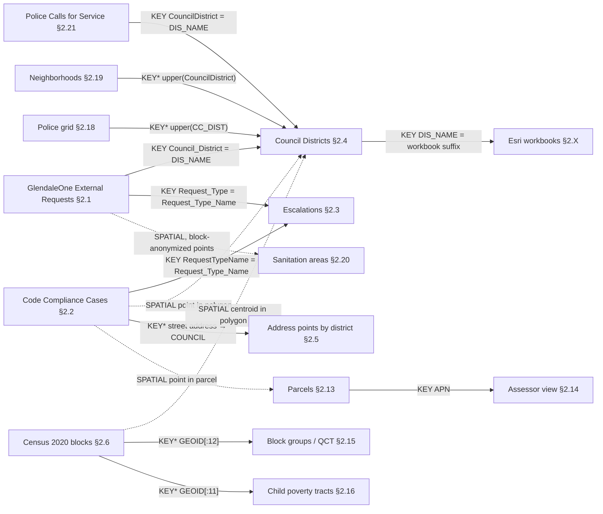

<!--HEADER-->
# Glendale Data Landscape

An inventory of every dataset the City of Glendale publishes that the GlendaleOne equity project could use, with schemas read from metadata endpoints only. No rows were downloaded.

- **Harvested:** 2026-09-16, by [`src/harvest_metadata.py`](src/harvest_metadata.py). Running `python3 src/harvest_metadata.py` regenerates the Section 1 table, the Section 2 field tables and the join checks into `src/.cache/landscape_fragments.md`. `--offline` rebuilds them from the cache with byte-identical output. The prose, Sections 3–5 and the non-REST entries are hand-written in [`src/landscape_authored.md`](src/landscape_authored.md), and `python3 src/build_landscape.py` merges them into this file.
- **Companion files:**
  - [`PROJECT.md`](PROJECT.md) (brief, gotchas)
  - [`DATA_DICTIONARY.md`](DATA_DICTIONARY.md) (the two local CSV extracts and the 12 Esri workbooks)
  - [`PORTAL_RECON.md`](PORTAL_RECON.md) (OpenBook and the GIS app gallery)

  None of what those files already document is repeated here; this document points to them instead.
- **Scope:** datasets that bear on service requests, demographics, geography, property, public safety or infrastructure. Survey123 artifacts, test layers and basemaps get one grouped line each, under "Excluded as noise" at the end of Section 1.

### Sources and harvest log

| Source | What was read | Result |
|---|---|---|
| ArcGIS Online org `9fVTQQSiODPjLUTa` (`cog-gis.maps.arcgis.com`) | Search API, all Feature and Map Services | ✅ 253 datasets cataloged, 184 fields documented |
| Open Data Hub `opendata.glendaleaz.com` | Catalog API: which AGOL items the public portal lists | ✅ 34 items cataloged (33 datasets and the Hub site), used as a cross-reference |
| ArcGIS Enterprise `gismaps.glendaleaz.com/gisserver` | Services directory, all folders | ✅ 147 datasets cataloged, 790 fields documented. FeatureServer/MapServer twins are collapsed into one dataset; 2 geocoding services were skipped. 12 folders are token-secured. |
| ArcGIS Enterprise `gismaps.glendaleaz.com/cseam` | Services directory, all folders | ✅ 7 datasets cataloged, 0 fields documented (none rated High or Medium); 5 folders token-secured |
| OpenBook `glendaleaz.openbook.questica.com` | Not re-harvested; rows carried from `PORTAL_RECON.md` | ⚠️ blocked: JavaScript app with an undocumented API, already covered by `PORTAL_RECON.md`. Its numbers are tagged `[unverified]`. |
| Power BI reports (GlendaleOne Public and Council Report, Code Compliance Public Dashboard) | Not opened | ⚠️ blocked: Power BI embeds with no metadata API |

The Enterprise REST services that `PORTAL_RECON.md` found through the GIS app gallery all appear in the Section 1 table. One exception: `School_Districts_Current`, a service from a different ArcGIS org, which was not harvested.

### How to read the evidence

- **Numbers from the API trace to a cached response.**
  - Row counts, date ranges, null counts, value lists and sums come from a raw response under `src/.cache/raw/`.
  - Section 2 prints the cache file next to each figure. [`src/.cache/index.tsv`](src/.cache/index.tsv) maps every cache file to its URL and fetch time.
  - Errors are cached too. Deterministic errors (400/404/499) sit beside successful responses. Timeouts and other server errors are saved as `*.transient.json`.
- **Metadata calls only.** Every `/query` call carries `returnCountOnly=true` or `outStatistics`, and the script refuses anything else before sending it.
  - The log `src/.cache/fetch_log.jsonl` holds 2,213 fetches, including 1,322 `/query` calls: 970 counts and 352 statistics.
  - The largest response was a 4.8 MB layer schema, under the script's 5 MB stop.
- **Tags:**
  - `[unverified]`: not checked with a tool call in this harvest. `[unverified: FILE]` means the figure is carried from that project file.
  - `[inferred]`: my reading, not a publisher statement. Every field description without the tag is quoted from the publisher's layer schema or item metadata.
- **Empty strings are counted separately from nulls.** Several City layers store blank text as `''`, which ArcGIS's non-null count treats as populated. Section 2 reports "populated" only for values that are neither null nor empty.

### Relevance tiers

Tiers rate usefulness against the sponsor's five questions (Q1–Q5, `PROJECT.md` §2).

- **High:** needed to answer Q1–Q4 directly: the request populations, the district geography, population denominators and the request-type configuration. Copies of these on other hosts are also High, marked "mirror".
- **Medium:** a join key, covariate or finer geography that Q1–Q5 can use.
- **Low:** context for Q5, or a duplicate or broken copy of a relevant dataset.
- **None:** unrelated to the five questions.

### Corrections to the existing project docs, found by this harvest

`PROJECT.md` was updated with these on 2026-09-16; `DATA_DICTIONARY.md` was not.

- **Live Code Compliance count.** The live service has **56,431** cases through `RequestDate` 2026-09-09 (§2.2). The local extract has 56,294 through 2026-09-03 [unverified: DATA_DICTIONARY.md]. The live requests count still equals the extract, 107,646 (§2.1).
- **Unassigned requests are `'N/A'`, not null.** The 2,225 requests without a district hold the string `'N/A'` in the live service (§2.1). `DATA_DICTIONARY.md` records them as null.
- **Code Compliance `District` is empty strings.** It holds `''` on all 56,431 rows rather than NULL (§2.2).
- **The Census items in `PROJECT.md` §10 are dead.** The Census Tracts, Block Groups and Blocks items return `404 Service not found` (Section 1). A live Census 2020 block layer exists on the Enterprise server instead (§2.6).
- **The two request datasets look like one system.**
  - The publisher's field description calls `CodeCaseNumber` "the GlendaleOne Request ID" (§2.2).
  - 16 of the 24 Code Compliance request types appear in the GlendaleOne escalation table, covering 54,711 of 56,431 cases, while none appear in External Requests (Section 3 join checks).
  - This suggests both datasets are slices of one GlendaleOne request stream [inferred], which qualifies `PROJECT.md` §6.3 ("separate systems"). The IDs still cannot be joined.

<!--S2_HIGH_MANUAL-->
### 2.X Local extract `data/GlendaleOne_External_Requests.csv` — High

- **Host / access:** local file, pulled 2026-09-05 from AGOL item `37a2cb9c` (the live source is documented in §2.1).
- **Relevance:** High (Q1–Q5). This is the working copy of the request population.
- **Field list:** the 16 attribute columns of §2.1 (no geometry column). Column-level profiling is in `DATA_DICTIONARY.md` §1 and is not repeated here.
- **Drift against the live service on 2026-09-16:**
  - The row count is identical: 107,646 live (§2.1) vs 107,646 in the extract [unverified: DATA_DICTIONARY.md].
  - The live `Request_Date` range (2019-12-02 → 2026-08-05) matches the extract.
  - Unassigned districts are `'N/A'` live but null in the CSV.

### 2.X Local extract `data/Code_Compliance_Cases_GlendaleOne.csv` — High

- **Host / access:** local file, pulled 2026-09-05 from AGOL item `8026de93` (live source in §2.2).
- **Relevance:** High (Q1–Q5).
- **Field list:** the 51 columns of §2.2. Profiling is in `DATA_DICTIONARY.md` §2.
- **Drift against the live service on 2026-09-16:**
  - The live service has 56,431 rows through `RequestDate` 2026-09-09 (§2.2); the extract has 56,294 through 2026-09-03 [unverified: DATA_DICTIONARY.md].
  - The extract's end date also differs from the requests extract's (`PROJECT.md` §6.4).

### 2.X Esri Business Analyst `ACS_Population_Summary_<DISTRICT>.xlsx` (×6) — High

- **Host / access:** local `data/`, attachments to the sponsor's email. No API.
- **Relevance:** High (Q1, Q5). ACS 2020–2024 denominators and covariates per district [unverified: DATA_DICTIONARY.md].
- **Field list:** a formatted report, not a table. The row map and parsing recipe are in `DATA_DICTIONARY.md` §3.2.
- **Joins:** the filename suffix and sheet name equal `DIS_NAME` (Section 3, R2).

### 2.X Esri Business Analyst `Demographic_and_Income_Profile_<DISTRICT>.xlsx` (×6) — High

- **Host / access:** local `data/`, sponsor email. No API.
- **Relevance:** High (Q1, Q5). Census 2020, Esri 2026 and Esri 2031 population and income per district [unverified: DATA_DICTIONARY.md].
- **Field list:** formatted report. See `DATA_DICTIONARY.md` §3.1.

<!--S2_MEDIUM_MANUAL-->
### 2.X GlendaleOne Public and Council Report (Power BI) — Medium

- **Host / access:** Power BI (`app.powerbigov.us`), listed in the City's GIS app gallery [unverified: PORTAL_RECON.md]. Not opened; there is no metadata API.
- **Relevance:** Medium (Q1–Q5). The gallery describes it as statistics and performance metrics on GlendaleOne requests [unverified: PORTAL_RECON.md]. Its district-level metrics are what the Council already sees.
- **Field list:** not available. Row count, date range and district fields are all `[unverified]`.

### 2.X Code Compliance Public Dashboard (Power BI) — Medium

- **Host / access:** Power BI (`app.powerbigov.us`) [unverified: PORTAL_RECON.md]. Not opened.
- **Relevance:** Medium (Q2, Q4). The gallery describes it as public statistics on cases created and resolved [unverified: PORTAL_RECON.md].
- **Field list:** not available `[unverified]`.

<!--S3-->
## 3. Relationship map

**Join types:**
- **KEY:** an exact attribute match.
- **KEY\*:** an attribute match that needs normalization first (case, text parsing or derived substrings).
- **SPATIAL:** needs a geometry operation (point-in-polygon or polygon overlay) and cannot be done with a key.

Numbers in the Evidence column come from the join checks table at the end of this section or from the Section 2 entry cited.

| # | Link | Key (left ↔ right) | Type | Evidence | Caveats |
|---|---|---|---|---|---|
| R1 | Requests → Council Districts | `Council_District` ↔ `DIS_NAME` | KEY | Both value lists in §2.1 and §2.4 | Requests also hold `'N/A'` (2,225) and `NONE` (142). The `NONE` polygon exists only in the hosted layer (7 features); the Enterprise `AdminAreas` copy has 6 (§2.10). |
| R2 | Council Districts → Esri workbooks | `DIS_NAME` ↔ filename suffix `_<DISTRICT>.xlsx` and sheet name | KEY | `DATA_DICTIONARY.md` §3 [unverified] | No workbook exists for `NONE`. |
| R3 | Council Districts, internal | `DIS_NAME` ↔ `HANSEN_DISTRICT` | KEY | §2.4 | `NONE` ↔ `MC`. |
| R4 | Code cases → Council Districts | (`Latitude`, `Longitude`) → district polygon | **SPATIAL** | 324 cases fall outside a lat 33–34 / lon −113 – −111.5 envelope (join check) | `District` cannot be used (all empty strings, §2.2). |
| R5 | Code cases → address points → district | `StreetNum` + `StreetName` ↔ `HOUSE_NUM` + `STREET_PRE` + `STREET_NAM` + `STREET_TYP` (or `ADDRESS`), then `COUNCIL` | KEY\* | 782 cases lack a street number (join check); 406 have an empty `StreetName` (§2.2) | Street components on the address layers are upper-case coded domains (§2.5). The by-district layer was last edited 2024-08-29 and has 109,404 points; `LN_ADDRESS_PT_APN_JOIN` was edited 2026-09-07 and has 125,686, including 12,957 `NONE` (§2.12). |
| R6 | Code cases → city parcels | Case point → parcel polygon → `DIS_NAME`, `APN`, `LUCODE`, `ZONING` | **SPATIAL** | 237 of 88,762 parcels have a null or empty `DIS_NAME` (join check) | The server refuses statistics on some parcel fields (§2.13). |
| R7 | Parcels / address points → Assessor view | `APN` ↔ `APN` (also `CLARITI_ID` ↔ `CLARITI_ID`) | KEY | Field lists §2.12–§2.14 | Key formats could not be compared without reading rows [unverified]. `APN_DASH` holds a dashed form. |
| R8 | Requests → escalation table | `Request_Type` ↔ `Request_Type_Name`; `Request_Type_Group` ↔ `Request_Group`; `Responsible_Department_Name` ↔ `Department_Name` | KEY | Types: 132 of 155 names shared, covering 98,586 of 107,646 requests. Groups cover 107,608 requests. Departments cover all 107,646 (join checks). | `Library Services` has no escalation row. One escalation type name contains mis-encoded characters (`–`). |
| R9 | Code cases → escalation table | `RequestTypeName` ↔ `Request_Type_Name` | KEY | 16 of 24 types shared, covering 54,711 of 56,431 cases (join check) | The 8 unmatched types include `Repeat Offender`, `Code Compliance - Referral` and `Animal Complaint - Noise`. |
| R10 | Requests ↔ code cases | none published | — | 0 of 24 code types appear among request types (join check) | See the corrections list in the header. No shared case/request key is published. |
| R11 | Requests → 100-block points | `FULL_ADDRESS` / `ANON_BLOCK` ↔ `HOUSE_NUM` + street fields | KEY\* | 95,678 `FULL_ADDRESS` values contain " BLOCK "; `ANON_BLOCK` is null on 11,968 rows (join checks) | The 100-block layer has only 2,703 points and 5 street types, and includes 476 `MARICOPA COUNTY` and 173 `PHOENIX` points (§2.11). How much of the request address set it covers is [unverified]. |
| R12 | Requests → any polygon layer (block groups, sanitation areas, grids, neighborhoods) | Anonymized (`Latitude`, `Longitude`) → polygon | **SPATIAL** | Coordinates are block-anonymized [unverified: DATA_DICTIONARY.md] | Points sit on block locations, not parcels, so points near a boundary can land in the wrong polygon. |
| R13 | Census blocks → Council Districts | Block centroid point → district polygon | **SPATIAL** | 3,471 block points; `P0010001` sums to 294,866 (§2.6) | That sum exceeds the Census 2020 population of the six districts (248,643 [unverified: PROJECT.md §5]), so the layer includes blocks outside the districts and an unclipped sum overcounts them. |
| R14 | Census blocks → block groups and tracts | `GEOID[:12]` → block group; `GEOID[:11]` → tract (or the `TRACT`, `BLKGRP` fields) | KEY\* | All 3,471 block GEOIDs are 15 characters (join check) | — |
| R15 | Block groups (QCT layer) → blocks / districts | `GEOID` ↔ block `GEOID[:12]`; polygon → district | KEY\* / **SPATIAL** | All 222 `GEOID`s are 12 characters (join check) | Block groups can straddle district lines [inferred], so a block group does not map to a single district. |
| R16 | Child-poverty polygons → tracts | `FIPS` ↔ block `GEOID[:11]` | KEY\* | All 88 `FIPS` values are 11 characters, i.e. tracts (join check) | `POPULATION` sums to 437,008 (§2.16), so these tracts extend past the city and do not nest in districts. |
| R17 | Police calls → Council Districts | `CouncilDistrict` ↔ `DIS_NAME` | KEY | 7 values shared, identical spelling (join check) | 11,902 null and 30,433 `NONE` (§2.21). The table has no geometry. |
| R18 | Neighborhoods → Council Districts | `upper(CouncilDistrict)` ↔ `DIS_NAME` | KEY\* | 0 exact matches: the values are title case (join check) | 7 neighborhoods have a null district (§2.19). |
| R19 | Police grid → Council Districts / beats | `upper(CC_DIST)` ↔ `DIS_NAME`; `BEAT` ↔ police `Beat` | KEY\* | 0 exact matches (title case); 365 of 650 cells are `Outside Glendale` (§2.18) | Whether beat values overlap with the calls table was not checked [unverified]. |
| R20 | Code Compliance Grids → districts | `GRID` ↔ `DIS_NAME` | KEY | The six `GRID` values are the district names (join check) | `CASES`, `STAFF` and `ADOPTED` are populated on 0 of the 6 grids (join checks). |
| R21 | Code Compliance Sub Grid → Grids / cases | `GRID` (numeric) ↔ `GRID` (names): no match; zone polygon ← case point | **SPATIAL** | 0 shared values (join check) | Sub-grid dates are empty, so time-bounded joins are not possible (§2.17). |
| R22 | Requests / cases → sanitation day and route areas | Point → polygon | **SPATIAL** | §2.20 | Requests are block-anonymized (see R12). |
| R23 | Parks work requests → requests | `glendale_one_request` ↔ `Request_Number` | KEY (published, empty) | 0 of 565 rows populated (join check) | The key exists in the schema but carries no values. |
| R24 | Water Distribution Survey123 requests → districts | Survey point → polygon, or address text → address points | **SPATIAL** / KEY\* | §2.22 | Whether survey points carry real locations was not checked [unverified]. |
| R25 | OpenBook capital spending → CIP polygons → districts | Project number parsed from `Project` text ↔ `Munis_no` / `a_project`, then polygon → district | KEY\* + **SPATIAL** | `PORTAL_RECON.md` [unverified] | OpenBook carries no geography of its own. |

<!--JOINCHECKS-->

<!--S4-->
## 4. Granularity matrix

**Legend:** ● native field or geometry · ◐ by key or derived code · ◇ spatial join needed · ◇ᵃ spatial join on block-anonymized points · — not supported

| Source | District | Tract | Block group | Block | Parcel | Address | Point |
|---|---|---|---|---|---|---|---|
| GlendaleOne External Requests (§2.1, §2.7, local CSV) | ● `Council_District` | ◇ᵃ | ◇ᵃ | ◇ᵃ | — | 100-block text only | ● anonymized |
| Code Compliance Cases (§2.2, local CSV) | ◇ or ◐ via address | ◇ | ◇ | ◇ | ◇ | ● `StreetNum` + `StreetName` | ● |
| GlendaleOne Escalations (§2.3) | — | — | — | — | — | — | — (keyed by request type) |
| Council Districts (§2.4, §2.10) | ● | — | — | — | — | — | polygon |
| Esri workbooks (§2.X) | ● (one file per district) | — | — | — | — | — | — |
| Address Points by Council District (§2.5) | ● `COUNCIL` | ◇ | ◇ | ◇ | ◇ | ● | ● |
| Address points joined to APN (§2.12) | ● `COUNCIL` | ◇ | ◇ | ◇ | ◐ `APN` | ● | ● |
| 100-block address points (§2.11) | ◇ | ◇ | ◇ | ◇ | — | ● 100-block | ● |
| Census 2020 blocks (§2.6) | ◇ | ◐ `GEOID[:11]` | ◐ `GEOID[:12]` | ● | — | — | ● centroid |
| Block groups with QCT fields (§2.15) | ◇ apportioned | ◐ | ● | — | — | — | polygon |
| Child-poverty tracts (§2.16) | ◇ apportioned | ● | — | — | — | — | polygon |
| City parcels (§2.13) | ● `DIS_NAME` | ◇ | ◇ | ◇ | ● | ● `ADDRESS` | polygon |
| Assessor parcel view (§2.14) | ◇ | ◇ | ◇ | ◇ | ● | ● situs and mailing | polygon |
| Code Compliance Sub Grid (§2.17) | ◇ | — | — | — | — | — | own 72 zones |
| Police grid (§2.18) | ● `CC_DIST` (needs uppercasing) | — | — | — | — | — | own 650 cells |
| Registered neighborhoods (§2.19) | ● `CouncilDistrict` (needs uppercasing) | — | — | — | — | — | own 255 polygons |
| Sanitation areas (§2.20) | ◇ | — | — | — | — | — | own day/route/inspection polygons |
| Police Calls for Service (§2.21) | ● `CouncilDistrict` | — | — | — | — | 100-block text (`Location`) | — (table only) |
| Water Distribution Survey123 requests (§2.22) | ◇ [unverified] | ◇ | ◇ | ◇ | — | free-text address | survey point [unverified] |
| OpenBook (Section 1) | — | — | — | — | — | — | — (fund, department, project) |
| Power BI reports (§2.X) | [unverified] | [unverified] | [unverified] | [unverified] | [unverified] | [unverified] | [unverified] |

**Where mismatched resolution makes sources non-comparable:**

1. **Requests vs code cases below the district.** Request coordinates are anonymized to the block [unverified: DATA_DICTIONARY.md], while code cases carry parcel-precise coordinates (R4, R12). The two can be compared at district level only, and any finer comparison mixes precision error with real difference (`PROJECT.md` §6.2).
2. **Census 2020 blocks vs the Esri workbooks.** Block counts are 2020 enumerations (§2.6). Blocks summed within a district can be checked against the workbook's Census 2020 column, but not against its Esri 2026 or 2031 estimates [unverified: DATA_DICTIONARY.md]. Assigning whole blocks by centroid adds boundary error [inferred].
3. **Block-group covariates vs the district ACS workbooks.** Going by its field names, the QCT layer's ACS fields are 2016–2018 vintages (§2.15). The workbooks are ACS 2020–2024 [unverified: DATA_DICTIONARY.md]. The child-poverty tracts were last edited 2021-12-29 (§2.16).
4. **Tracts and block groups vs districts.** Whether they nest inside Council Districts was not checked [unverified], and the child-poverty tracts extend past the city (R16). A per-district figure built from them depends on how straddling units are split.
5. **Police calls vs spatially joined code cases.** The calls table carries a district assigned by the source system with no geometry (§2.21). Code cases would get districts from today's polygons (R4). Whether both use the same boundary vintage is [unverified].
6. **City operating geographies.** The police grid, neighborhoods, sanitation areas and code sub-zones are City-drawn polygons with no Census geography code. Only the police grid and the neighborhoods carry a district attribute (§2.18, §2.19), and whether the others nest inside districts was not checked [unverified]. 365 of the 650 police grid cells are labelled `Outside Glendale` (§2.18). Rates on these units have no published census denominator.
7. **Request types vs geography.** The escalation table joins on request type only (R8, R9), so it can describe per-type targets but not where they were met.

<!--S5-->
## 5. Gaps and asks

### Not published anywhere found

- **No link between a GlendaleOne request and a Code Compliance case.** No shared key exists (R10).
- **No sub-district geography on requests** beyond block-anonymized points and 100-block text (R11, R12).
- **No per-request service-level target or met/missed flag.** Only a type-level Level-1 escalation timer is published (§2.3).
- **No intake channel on requests** (phone, web, app) and **no resolution outcome.** The live field list in §2.1 has neither.
- **No historical Council District boundaries.** The hosted layer was last edited 2024-12-09 (§2.4), while requests start 2019-12-02 (§2.1).
- **No current ACS covariates below the district.** Going by its field names, the QCT layer holds 2016–2018 ACS fields (§2.15). The child-poverty tracts were last edited 2021-12-29 (§2.16).
- **No working rental registry.** The `Rental_Facilities` service returns "not started" (Section 1).
- **No spending by district.** OpenBook has no location field (`PORTAL_RECON.md`).
- **No published update frequency.** Of the 9 High/Medium portal items whose full description and metadata were read, none sets a maintenance frequency in its metadata. Only Police Calls for Service states a refresh cycle in its description ("refreshed daily", §2.21).

Still open from `PROJECT.md` §11 and not repeated below: the 2025 Code Compliance dip (Q1), the definition of "proactive" (Q5), and what the City has already analysed (Q7).

### Questions for Stephen Gushue

**How the two request datasets relate**

1. The Code Compliance layer describes `CodeCaseNumber` as "the GlendaleOne Request ID". 16 of its 24 request types also appear in the GlendaleOne escalation table, and none appear in the External Requests dataset. Are the two published datasets two filters of one GlendaleOne request stream? If so, does External Requests plus Code Compliance equal every public GlendaleOne request, or are some request types published in neither?
2. The escalation table has 155 rows, but 23 of the 155 request types in External Requests have no exact-name match in it (join checks). They include `Roadside, Alley, or Median Landscape`, `Street or Sidewalk - Damage` and `Rent Assistance (Rent, Mortgage, Eviction)`, and the `Library Services` group has no escalation row at all. Some mismatches may only be formatting: `Park Maintenance ` carries a trailing space [inferred]. Is `Escalate_Time1` + `Escalates_in_` the service-level target that departments are measured against? Are escalation levels beyond `Route1` available?

**District assignment**

3. Code Compliance `District` is an empty string on all 56,431 rows, while requests carry `Council_District`. Can the nightly load fill `District` using the same rule the requests feed uses?
4. Is a request's `Council_District` assigned at intake against the boundaries in force at the time, or recomputed against the current layer (last edited 2024-12-09)? Is a boundary file covering December 2019 onward available?
5. What do requests' `'N/A'` (2,225 rows) and `NONE` (142) mean? Does the same answer apply to police calls' `NONE` (30,433) and null (11,902): outside the city, county islands, or addresses that failed to match?
6. Which layers are authoritative?
   - **District polygons:** the hosted `Glendale_Council_Districts` (7 features, including `NONE`) or the Enterprise `AdminAreas/Council_Districts` (6)?
   - **Address crosswalk:** `Address_Points_By_Council_Districts` (109,404 points, last edited 2024-08-29) or `LN_ADDRESS_PT_APN_JOIN` (125,686 points, edited 2026-09-07)?

**Geography finer than the district**

7. Requests are anonymized to the 100 block. Could the public extract (or a project-only extract) add a Census block or block-group GEOID, with no address, so requests can be set against 2020 block population?
8. Is `ADDRESS_100BLOCK` (2,703 points, 5 street types) the reference used for anonymization? If not, is there a complete 100-block table?
9. What is `PopDensity/block_pop`? Its metadata request timed out on 2026-09-16. And which area does `Census_Block_2020_pts` cover? Its population sums to 294,866, more than the six districts.
10. The portal items "Glendale Census Tracts", "Block Groups" and "Blocks" point at a removed `Glendale_Services/Census` service. Is there a replacement, and is a newer version of `Glendale_qct_rates` (ACS 2016–2018 fields) available?

**Request streams outside the two datasets**

11. The Survey123 forms for Water Distribution (10,081 submissions), Wastewater Collections (2,370) and Environmental Resources (436) all stop at the end of May or on 2 June 2025. Were these channels folded into GlendaleOne then? Should earlier submissions count as service requests for Q1 and Q2?
12. Parks work requests have a `glendale_one_request` field, but it is empty on all 565 rows. Is the link recorded elsewhere? Do other work-order systems (the token-secured CentralSquare Transportation service, Lucity) store GlendaleOne request numbers?

**Access**

13. These Enterprise folders require a token:
    - `gisserver`: `SmartGov`, `Building_Safety`, `Finance`, `EMS`, `EOC`, `CUES`, `Fiber`, `Risk`, `Test`, `The_Maps`, `Utilities`, `Well_Data`
    - `cseam`: `Facilities`, `Fire`, `Test`, `Utilities`, `Water`

    Could the team get read access to `SmartGov` (permitting and code enforcement [inferred from the name]) or a derived extract?
14. The `Rental_Facilities` service is "not started". Is a current rental-property list available? It bears on Residential Rental Violation cases.
15. Could the team see the datasets behind the GlendaleOne Public and Council Report and the Code Compliance Public Dashboard, so it does not re-deliver metrics the Council already receives?

**Refresh and catalog quality**

16. External Requests was last loaded 2026-08-06, with data through 2026-08-05 (§2.1). Code Compliance and Escalations were loaded 2026-09-10 (§2.2, §2.3). Is the External Requests feed paused? What refresh schedule should the team assume for each dataset?
17. Several portal items register a layer whose name does not match the item title (Section 1):

    | Portal item title | Layer it registers |
    |---|---|
    | "Glendale Garbage Pickup" | "Recycling Pickup" |
    | "Glendale Recycling" | "Trash Pickup" |
    | "Glendale Hospitals" | "DMV" |
    | "Glendale Fire Stations" | "Post Offices" |
    | "Glendale Post Offices" | "Fire Stations" |
    | "Glendale DMV" | "Council District" |

    Which layer should be used for trash and recycling collection areas?
18. The `Code_Compliance_Grids` service description reads "Displays road centerlines with names and address ranges" (`src/.cache/raw/gismaps.glendaleaz.com/gisserver_rest_services_Code_Compliance_Code_Compliance_Grids_FeatureServer__53afe75d415f.json`), and its `CASES`, `STAFF` and `ADOPTED` fields are empty on all 6 grids (join checks). The Sub Grid's date and completion fields are also empty. Which layer, if any, records current inspector coverage and proactive sweep dates?

**Personal data (a heads-up, not a request)**

19. Some anonymously queryable layers include requester or representative contact fields in their schemas:
    - Water Distribution Service Requests: `requesters_name`, email
    - Parks request layers: `pocfirstname`, `pocphone`, `pocemail`
    - `NEIGHBORHOOD_P_w_MgmtCompany`: representative name, phone, email

    The team read no rows from any of them. Is public query access to these layers intended?
